<p align="center">
  
</p>

<div align="center">

# <span style="color:red">**Universidad Peruana de Ciencias Aplicadas**</span>
## Carrera de Ingeniería de Software

Ciclo: 2025 - 10

Curso: 1ASI0572 Desarrollo de Soluciones IoT

NRC: 2968

Profesor: León Baca, Marco Antonio

“Informe de Trabajo Final"

Startup: AgroTech

Producto: AgroCuy

Grupo: 4

|          Integrantes          |      Código      |
|:-----------------------------:|:-------------------:|
|   Cuadros Rodriguez, Juan Alejandro    |    u20221a359    |
|   Fiorella Jarama Peñaloza    |   u202120418  |
|  Lucas Coronel, Nadia Alessandra   |    U202120430    |
|   Moreno Vergara, Johan Raúl  |    u20201c105    |
|  Ramirez Mendez, Sebastian Andre   |    u20191e575    |

Abril 2025 

</div>

---

## Registro de Versiones Del Informe

<table>
  <tr>
    <th>Versión</th>
    <th>Fecha</th>
    <th>Autores</th>
    <th>Descripción de modificación</th>
  </tr>
  <tr>
    <td rowspan="5">TB1</td>
    <td rowspan="5">04/10/2025</td>
    <td>Cuadros Rodriguez, Juan Alejandro</td>
    <td rowspan="5">
      <strong>Capítulo I</strong>: Introducción<br>
      <strong>Capítulo II</strong>: Requirements Elicitation & Analysis<br>
      <strong>Capítulo III</strong>: Requirements Specification<br>
      <strong>Capítulo IV</strong>: Solution Software Design
    </td>
  </tr>
  <tr>
    <td>Fiorella Jarama Peñaloza</td>
  </tr>
  <tr>
    <td>Lucas Coronel, Nadia Alessandra</td>
  </tr>
  <tr>
    <td>Moreno Vergara, Johan Raúl</td>
  </tr>
  <tr>
    <td>Ramirez Mendez, Sebastian Andre</td>
  </tr>
</table>


## Project Report Collaboration Insights

### **Reporte de colaboración de la entrega del TB1:**

------

# Contenido
## Student Outcome

<table border="1" cellpadding="8" cellspacing="0">
  <tr>
    <th>Criterio específico</th>
    <th>Acciones realizadas</th>
    <th>Conclusiones</th>
  </tr>
  <tr>
    <td>Trabaja en equipo para proporcionar liderazgo en forma conjunta</td>
    <td>
      <strong>Moreno Vergara, Johan</strong><br>
      <em>TB1</em><br>
      Para esta entrega nos pusimos de acuerdo para tener reuniones para elegir el tema de nuestro proyecto y delegar responsabilidades. Además de una reunión para corroborar el correcto avance de cada uno de los miembros de nuestro equipo.<br>
      <br>
      <strong>Apellidos, Nombre</strong><br>
      <em>TB1</em><br>
      …  
    </td>
    <td>
      Conclusiones Generales...<br>
    </td>
  </tr>
  <tr>
    <td>Crea un entorno colaborativo e inclusivo, establece metas, planifica tareas y cumple objetivos.</td>
    <td>
      <strong>Moreno Vergara, Johan</strong><br>
      <em>TB1</em><br>
      Se establecieron fechas de entrega para cada tarea delegada, de esa forma aseguramos que se cumpla el objetivo de cada miembro de equipo y poder tener el trabajo en fechas específicas antes de la entrega.<br>
      <br>
      <strong>Apellidos, Nombre</strong><br>
      <em>TB1</em><br>
      …  
    </td>
    <td>
       Conclusiones Generales...<br>
    </td>
  </tr>
</table>


## Capítulo V: Solution UI/UX Design 

## 5.1. Style Guidelines

La importancia del estilo de un producto radica en la creación de una experiencia visual armoniosa y atractiva para los usuarios. A continuación, se presentará una descripción detallada de las pautas de estilo de nuestro proyecto.

# 5.1.1. General Sytle Guidelines 

**Consistencia Visual**

Garantizar una apariencia uniforme en todos los aspectos del producto, desde la disposición de la interfaz de usuario hasta los elementos visuales. Esto implica seleccionar colores coherentes, tipografía adecuada, estilos consistentes y una navegación web intuitiva.

<p align="center">
  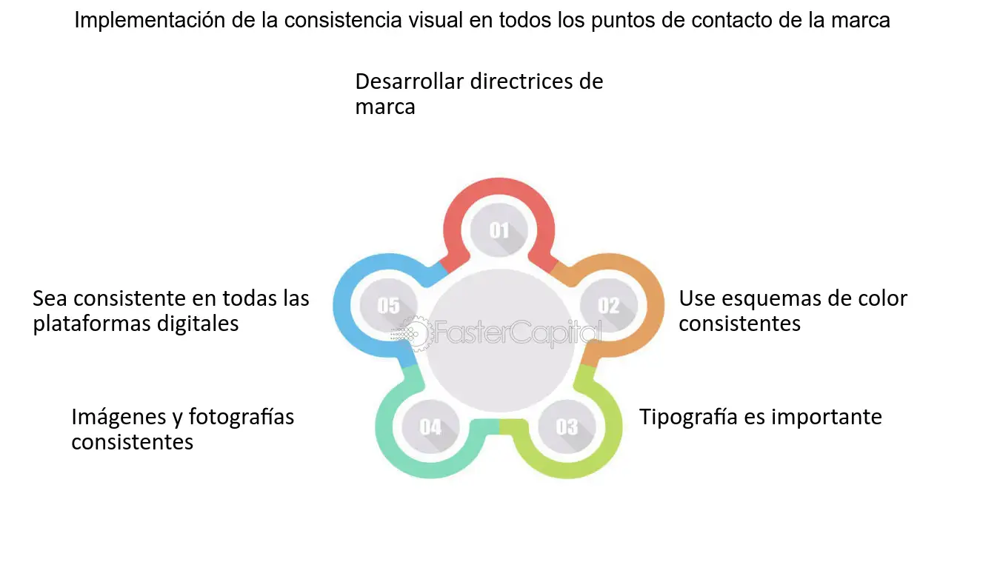
</p>

_Imagen 23. Ejemplo de consistencia visual_

**Simplicidad**

Enfatizar la simplicidad en el diseño para una experiencia de usuario intuitiva y evitar el uso excesivo de elementos que puedan hacer perder el foco de atención al usuario.

<p align="center">
  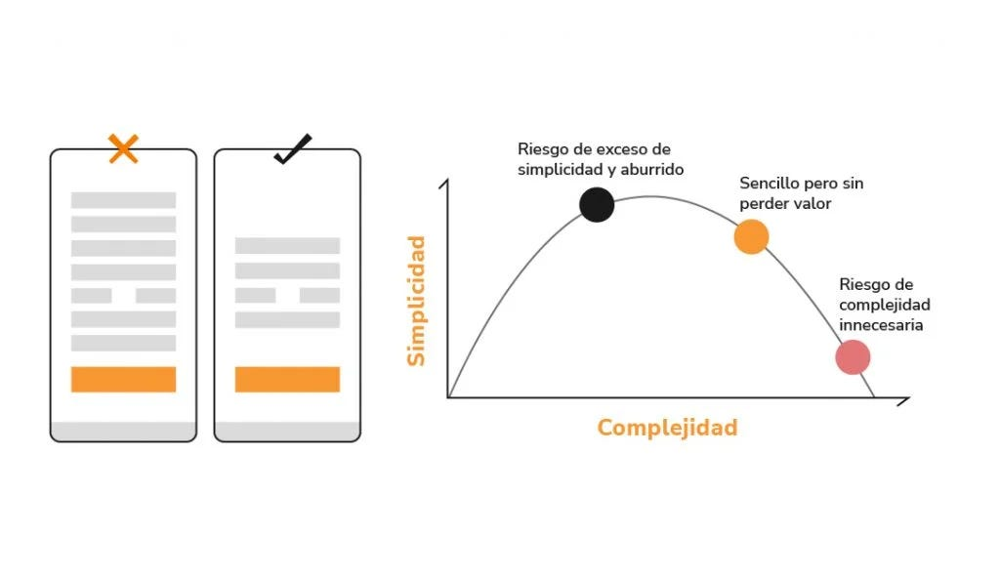
</p>

_Imagen 24. Ejemplo de simplicidad_

**Branding**

El logotipo de AgroConnect se presenta en forma de un círculo, que simboliza la unidad y la conexión dentro de las comunidades agrícolas peruanas. En el centro del círculo se encuentra un cuy, animal característico de las granjas peruanas y un símbolo de la agricultura local. El cuy está representado de manera amigable y sonriente, transmitiendo la naturaleza acogedora y cercana de la plataforma. El cuy lleva un pequeño gorro de granjero como un guiño a la laboriosa comunidad agrícola.

<p align="center">
  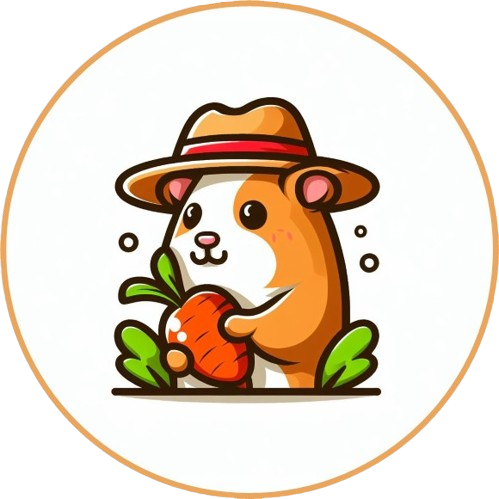
</p>

_Imagen 25. Logo de AgroConnect_

**Typography**

La tipografía elegida para AgroConnect es "Inter", una fuente sans-serif moderna y altamente legible. Este tipo de letra se destaca por su estilo limpio y contemporáneo, lo que comunica profesionalismo y actualización. La elección de Inter asegura que el texto en las interfaces de usuario sea fácilmente legible y tenga una apariencia moderna y uniforme. Además, Inter es una fuente versátil que ofrece una amplia variedad de pesos y estilos, lo que permite una adaptación flexible a diferentes contextos y tamaños de texto en la aplicación.

<p align="center">
  
</p>

_Imagen 26. Fuentes_

**Colors**

AgroConnect ha seleccionado una paleta de colores que comunica confiabilidad y eficiencia en la contratación de asesores especializados y en el uso de herramientas avanzadas. Los tonos predominantes, como los marrones, amarillos y anaranjados, transmiten una sensación cálida que evoca la calidez y la energía de la naturaleza presente en las granjas peruanas. Esta elección de colores no solo refleja la conexión con la tierra y las raíces agrícolas, sino que también sugiere un ambiente acogedor y estimulante para los usuarios de la plataforma.

**Spacing**

El spacing garantiza una distribución uniforme y un equilibrio visual en la interfaz. Se han establecido las siguientes medidas.

````
 - Botones: padding de 16px vertical y 32px horizontal 
 - Margin entre texto 16px 
 - Margin entre elementos 24px 
 - Margin entre secciones 72px
````

**Diseño Visual con Patrón Z**

 Vamos a incorporar el conocido Patrón Z en nuestro diseño visual, el cual dirige de manera intuitiva la atención del usuario a través de la interfaz. Este enfoque implica estratégicamente ubicar los elementos clave en las esquinas superior e inferior izquierdas, mientras que los elementos secundarios se colocan en las esquinas superior e inferior derechas. Este diseño genera un flujo visual eficaz y atractivo que mejora la experiencia del usuario.

<p align="center">
  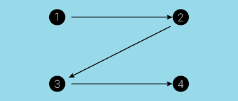
</p>

_Imagen 27. Ejemplo de Patron Z_

### 5.1.2. Web Style Guidelines

**Colors**

AgroConnect ha seleccionado cuidadosamente una paleta de colores que refleja los valores y la identidad de la plataforma. Los tonos elegidos comunican confiabilidad y eficiencia en la contratación de asesores especializados y en el uso de herramientas avanzadas.

<p align="center">
  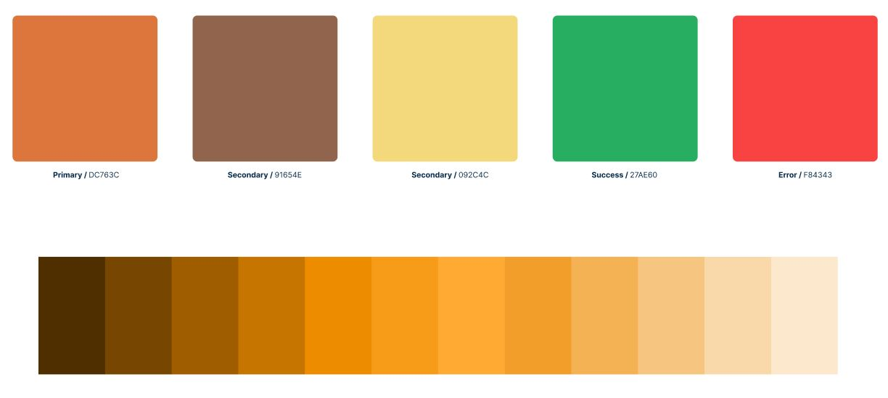
</p>

_Imagen 28. Colores de AgroConnect_

**Typography**

La tipografía desempeña un papel fundamental en la apariencia y la legibilidad de AgroConnect. Hemos seleccionado cuidadosamente la fuente "Inter", una fuente sans-serif moderna y altamente legible.

<p align="center">
  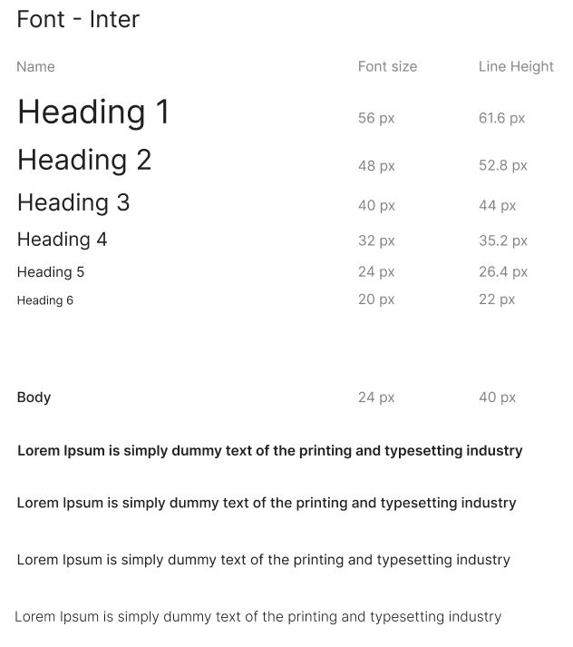
</p>

_Imagen 29. Tipografia de AgroConnect_

**Icons**

Los íconos desempeñan un papel importante en la experiencia del usuario al proporcionar una representación visual rápida y reconocible de diversas funciones y características dentro de AgroConnect. Hemos seleccionado una colección de íconos que son consistentes con la identidad visual de la plataforma y que refuerzan su propósito y temática agrícola.

<p align="center">
  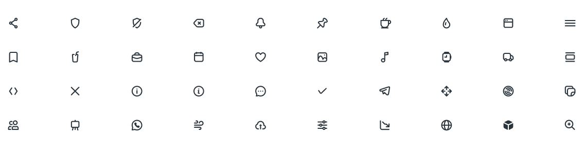
</p>

_Imagen 30. Iconos de AgroConnect_

**Spacing**

El espaciado adecuado entre elementos es esencial para lograr una apariencia equilibrada y una experiencia de usuario cómoda en AgroConnect. Hemos establecido pautas claras de espaciado que garantizan coherencia y claridad en toda la plataforma.

<p align="center">
  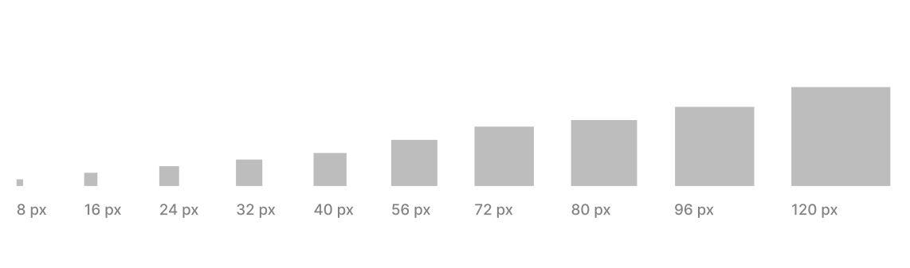
</p>

_Imagen 31. Spacing de AgroConnect_

**Grid System**

El grid system es una herramienta esencial en el diseño y la organización de la interfaz de usuario de AgroConnect. Proporciona una estructura visual que ayuda a distribuir y alinear los elementos de la página de manera consistente y armoniosa en diferentes tamaños de pantalla.

<p align="center">
  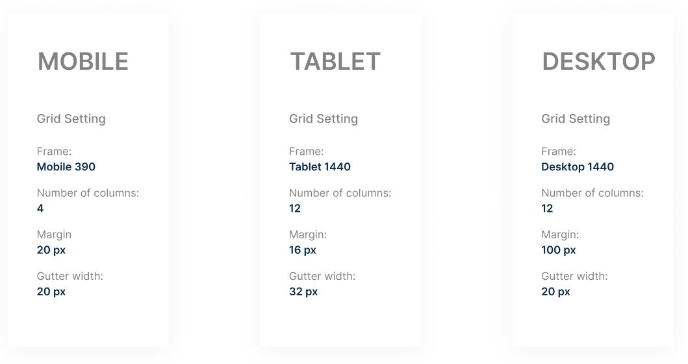
</p>

_Imagen 32. Grid System de AgroConnect_

**Button**

Los botones son elementos importantes en la interfaz de usuario de AgroConnect, ya que proporcionan una forma clara y visualmente destacada para que los usuarios realicen acciones importantes. Hemos definido un estilo de botón consistente que refleja la identidad visual de la plataforma y promueve una experiencia de usuario intuitiva y coherente.

<p align="center">
  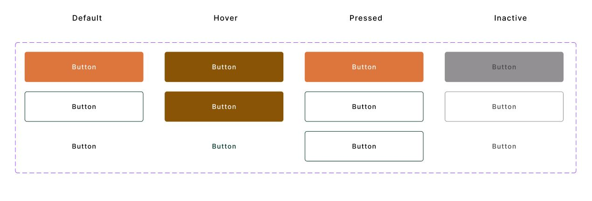
</p>

_Imagen 33. Button de AgroConnect_

**Input System**

El input system es fundamental en la experiencia del usuario en AgroConnect, ya que proporciona formas para que los usuarios ingresen datos y realicen acciones dentro de la plataforma. Hemos definido un sistema de entrada consistente que garantiza una experiencia de usuario intuitiva y coherente en toda la interfaz.

<p align="center">
  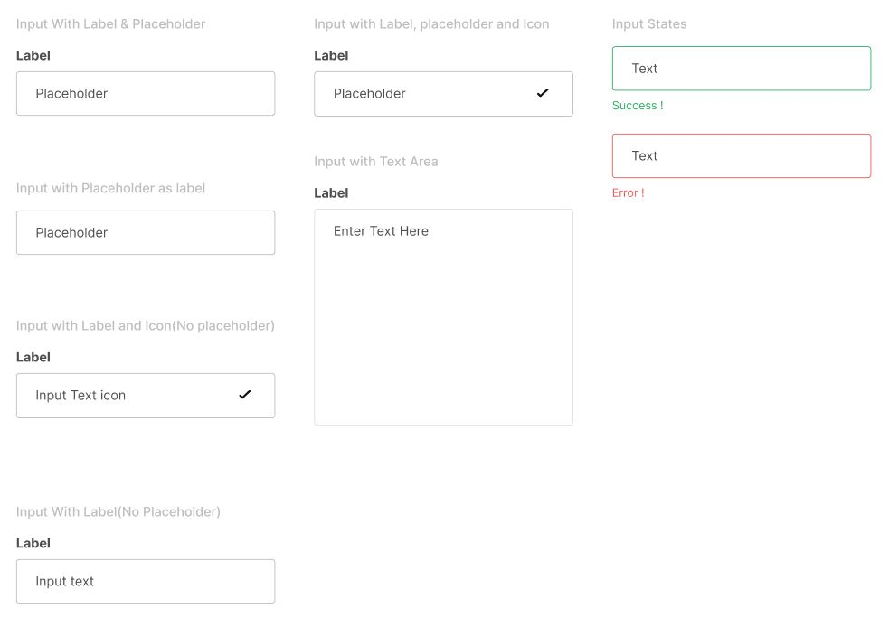
</p>

_Imagen 34. Input System de AgroConnect_


## 5.2. Information Architecture

La arquitectura de información desempeña un papel fundamental en la organización y estructuración del contenido para garantizar su accesibilidad y comprensión por parte de los usuarios. En este apartado, se detallarán los sistemas de organización, etiquetado, etiquetas SEO y metaetiquetas, sistema de búsqueda y sistemas de navegación que componen la arquitectura de la información de nuestro producto.

### 5.2.1. Organization Systems

En AgroConnect, aplicamos un sistema de jerarquía visual para resaltar la información esencial y relevante, garantizando que los usuarios encuentren fácilmente lo que necesitan. Utilizamos una organización secuencial para guiar intuitivamente a los usuarios a través del proceso de registro y búsqueda de asesores o asesoría. En lo que respecta a la categorización de contenido, está organizado según audiencia (Criadores y Asesores)

### 5.2.2. Labeling Systems

En el proyecto AgroConnect se eligió implementar un sistema de etiquetado breve y fácil de comprender para los usuarios. Las etiquetas que se utilizarán son las siguientes:


**Vista de Criador:**

<table>
  <tbody>
  <tr>
      <th>My Farm - Mi Granja</th>
      <td>Se implementará un botón que permitirá a los usuarios gestionar su inventario, que incluirá medicamentos, producción de carne, fertilizante y otros elementos relacionados.</td>
  </tr>
  <tr>
      <th>Advisors - Mis asesores</th>
      <td>Se implementará un botón que permitirá a los usuarios contactar con asesores.</td>
  </tr>
  <tr>
      <th>My animals - Mis animales</th>
      <td>Se implementará un botón que permitirá al usuario llevar un registro y seguimiento de los animales en la granja.</td>
  </tr>
  <tr>
      <th>Calendar - Calendario</th>
      <td>Se implementará un botón que permitirá visualizar un calendario con las citas registradas.</td>
  </tr>
  <tr>
      <th>Registry - Registro</th>
      <td>Se implementará un botón que permitirá al usuario registrar información de nuevos animales, datos de la gastos y recursos.</td>
  </tr>
  <tr>
      <th>Notifications - Notificaciones</th>
      <td>Se implementará un botón que permitirá visualizar notificaciones respecto a las solicitudes de las ofertas de empleo.</td>
  </tr>
  <tr>
      <th>Logout</th>
      <td>Se implementará un botón que permitirá al usuario desvincularse de su cuenta.</td>
  </tr>
  </tbody>
</table>

<br></br>
**Vista de Asesor:**

<table>
  <tbody>
  <tr>
      <th>Home - Inicio</th>
      <td>Se implementará un botón que permitirá al usuario ver publicaciones de clientes y poder ofertar.</td>
  </tr>
  <tr>
      <th>My clients - Mis clientes</th>
      <td>Se implementará un botón que permitirá a los usuarios ver su clientes.</td>
  </tr>
  <tr>
      <th>My publications - Mis publicaciones</th>
      <td>Se implementará un botón que permitirá al usuario ver el historial de sus publicaciones de ofertas de trabajo.</td>
  </tr>
  <tr>
      <th>Notifications - Notificaciones</th>
      <td>Se implementará un botón que permitirá visualizar notificaciones respecto a las solicitudes de las ofertas de empleo y recordatorios de citas pendientes.</td>
  </tr>
    <tr>
      <th>Calendar - Calendario</th>
      <td>Se implementará un botón que permitirá visualizar un calendario con las citas registradas.</td>
  </tr>
  <tr>
      <th>Logout</th>
      <td>Se implementará un botón que permitirá al usuario desvincularse de su cuenta.</td>
  </tr>
</table>

### 5.2.3. SEO Tags and Meta Tags

Las Search Engine Optimization (Etiquetas SEO) y las Meta Tags (Meta Etiquetas) juegan un papel vital en la visibilidad y el posicionamiento del contenido en los motores de búsqueda. Existen varios tipos de etiquetas SEO y metaetiquetas, y a continuación se destacan algunas de las más relevantes para la empresa:

- **Metaetiqueta de Descripción (Meta Description Tag):** Esta etiqueta ofrece una breve   descripción del contenido de la página. Aunque no influye directamente en el ranking de búsqueda, una meta descripción bien redactada puede aumentar la tasa de clics (CTR) al proporcionar a los usuarios una visión clara del contenido de la página.

````
<meta name="description" content="AgroTech ofrece soluciones tecnológicas innovadoras para mejorar la gestión de granjas de cuyes. Nuestra misión es empoderar a los granjeros con herramientas inteligentes y eficientes.">
````

**Metaetiqueta de Autor (Meta Autor Tag):** Esta etiqueta especifica el autor del contenido de la página. Esto puede ser útil para atribuir la propiedad intelectual o identificar la fuente del contenido.

````
<meta name="author" content="AgroTech">
````

**Etiqueta de Título (Title Tag):** Esta etiqueta es esencial para el SEO, ya que define el título de una página web y aparece como el título principal en los resultados de búsqueda. 

````
<title>AgroConnect</title>
````

**Etiqueta de Idioma (Language Tag):** Esta etiqueta especifica el idioma principal del contenido de la página. Es útil para la clasificación en búsquedas locales y ayuda a los motores de búsqueda a comprender el idioma del contenido.

````
<html lang="en">
````

**Metaetiqueta de Robots (Meta Robots Tag):** Esta etiqueta indica a los motores de búsqueda cómo indexar y rastrear la página. Puede especificar si la página debe ser indexada, si deben seguirse los enlaces o si se deben seguir ciertas instrucciones específicas.

````
<meta name="robots" content="index, follow"> 
````

<p align="center">
  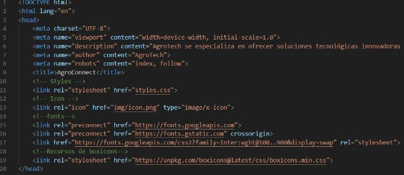
</p>

_Imagen 35. SEO tags de AgroConnect_

### 5.2.4. Searching Systems

La aplicación AgroConnect desarrollará un sistema de búsqueda intuitivo, diseñado para que los usuarios encuentren rápidamente la información que necesitan. Este sistema se basará en filtros inteligentes que simplificarán la búsqueda de asesores, evitando así que los usuarios se vean abrumados por la cantidad de información disponible. Con esta mejora, nuestra aplicación garantizará una experiencia de usuario más fluida y satisfactoria al buscar información relevante.

<table>
  <tbody>
  <tr>
      <th>Ubicación</th>
      <td>Permite al usuario buscar asesores o recibir solicitudes de asesoramiento basadas en su ubicación actual o en una ubicación específica.</td>
  </tr>
  <tr>
      <th>Tipo de Asesoría</th>
      <td>Permite al usuario buscar según el tipo de asesoría ofrecida.</td>
  </tr>
  <tr>
      <th>Presupuesto</th>
      <td>Permite al usuario buscar asesores que se ajusten a su presupuesto.</td>
  </tr>
  <tr>
      <th>Experiencia</th>
      <td>Permite al usuario buscar asesores con un nivel de experiencia específico.</td>
  </tr>
  <tr>
      <th>Reputación</th>
      <td>Permite al usuario buscar asesores según las calificaciones obtenidas.</td>
  </tr>
  <tr>
      <th>Idioma</th>
      <td>Permite al usuario buscar según el idioma.</td>
  </tr>
  <tr>
      <th>Palabras Clave</th>
      <td>Proporciona un cuadro de búsqueda donde los usuarios pueden ingresar palabras clave específicas relacionadas con el tipo de asesoría que necesitan.</td>
  </tr>
  </tbody>
</table>

### 5.2.5. Navigation Systems

La página de inicio de AgroConnect ha sido diseñada para una experiencia fácil y completa, ofreciendo las siguientes características:

 - ***Menús de Navegación:*** Los menús de navegación son una estructura estándar que se utiliza para organizar y presentar las diversas secciones y páginas de un producto. Estos menús pueden adoptar diferentes formas, como menús desplegables, ubicados en la parte superior o lateral de una página, e incluso enlaces de navegación en el pie de página.

 - ***Navegación por Pestañas:*** Es un sistema que emplea pestañas para organizar el contenido en secciones o categorías. Esto permite a los usuarios cambiar entre las distintas secciones de contenido simplemente haciendo clic en las pestañas correspondientes, sin necesidad de cargar nuevas páginas.

## 5.3. Landing Page UI Design

En este apartado, nos enfocaremos en el diseño de la interfaz de usuario (UI) de nuestra landing page. Es crucial que los usuarios que visiten nuestra página comprendan rápidamente de qué se trata nuestro producto y qué beneficios principales ofrecemos.

### 5.3.1. Landing Page Wireframe

**Wireframe - sección de ‘Inicio’ de AgroConnect:** la sección tendrá una imagen de fondo llamativa con un mensaje que refleja el objetivo de la startup para llamar la atención de posibles usuarios.

<p align="center">
  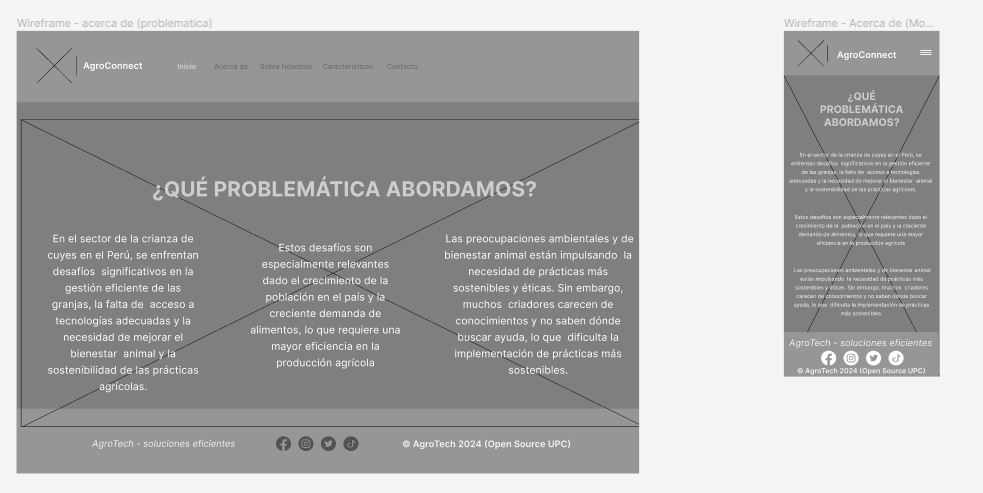
</p>

_Imagen 36. Pagina Acerca de_

**Wireframe - sección de ‘Sobre Nosotros’:** la sección tendrá una imagen de fondo y tendrá información sobre la startup Agrotech junto con nuestra misión y visión.

<p align="center">
  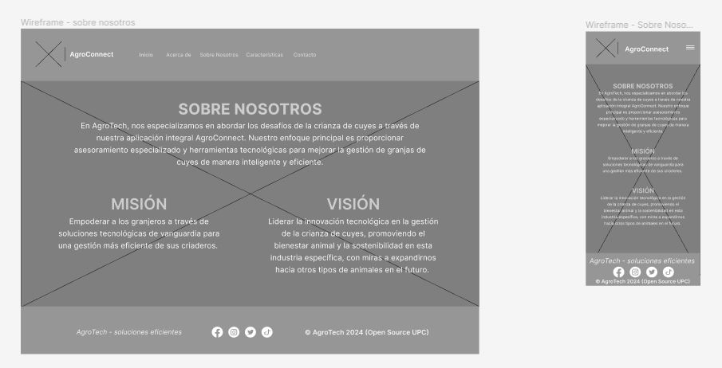
</p>

_Imagen 37. Pagina Sobre Nosotros_

**Wireframe - sección de ‘Características’:** la sección tendrá una imagen de fondo y tendrá información sobre los servicios que ofrecemos con nuestra aplicación AgroConnect.

<p align="center">
  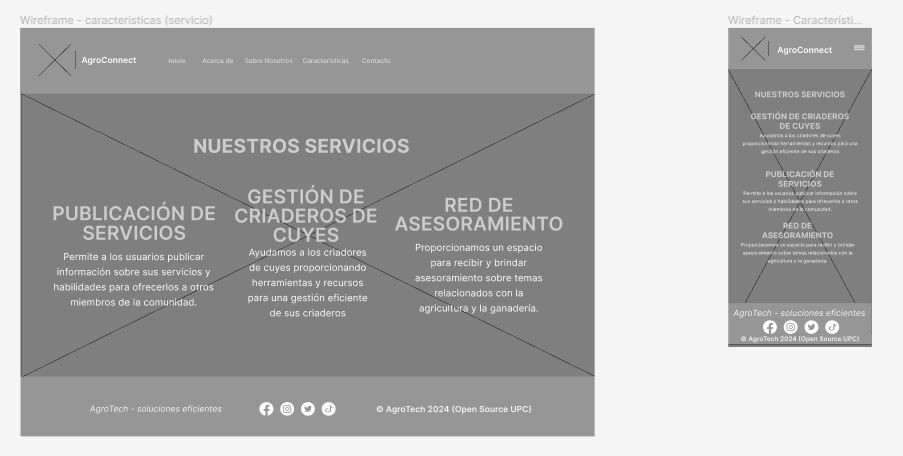
</p>

_Imagen 38. Pagina Características_

**Wireframe - sección de ‘Contacto’:** la sección tendrá una imagen de fondo y tendrá un formulario donde los usuarios potenciales puedan escribir consultas para que sean respondidas en un correo por un miembro de AgroTech.

<p align="center">
  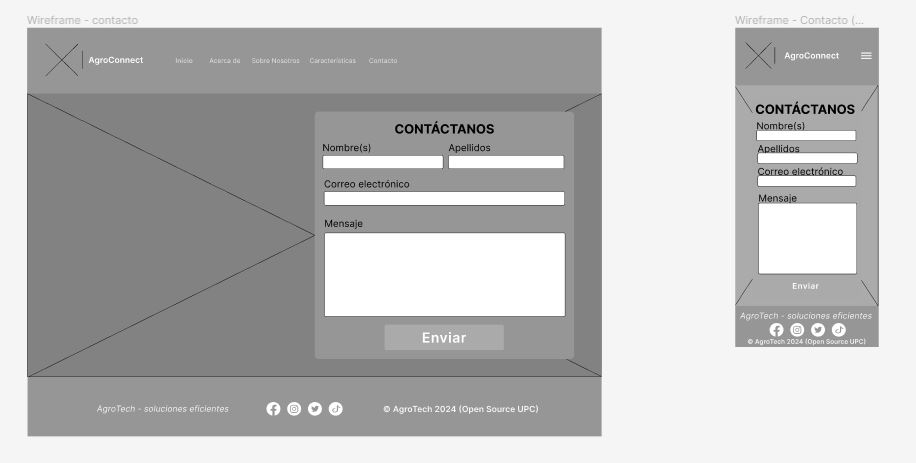
</p>

_Imagen 39. Pagina Contacto_

### 5.3.2. Landing Page Mock-up
**Mockup - sección de ‘Inicio’ de AgroConnect:** la sección tiene una imagen de fondo llamativa con un mensaje que refleja el objetivo de la startup para llamar la atención de posibles usuarios.

<p align="center">
  
</p>

_Imagen 40. Mockup Pagina Inicio_

**Mockup - sección de ‘Acerca de’:** la sección tiene una imagen de fondo y tiene información sobre la problemática que queremos resolver.

<p align="center">
  
</p>

_Imagen 41. Mockup Pagina Acerca de_

**Mockup - sección de ‘Sobre Nosotros’:** la sección tiene una imagen de fondo y tiene información sobre la startup Agrotech junto con nuestra misión y visión.

<p align="center">
  
</p>

_Imagen 42. Mockup Pagina Sobre Nosotros_

**Mockup - sección de ‘Características’:** la sección tiene una imagen de fondo y tiene información sobre los servicios que ofrecemos con nuestra aplicación AgroConnect.

<p align="center">
  
</p>

_Imagen 43. Mockup Pagina de Características_

**Mockup - sección de ‘Contacto’:** la sección tiene una imagen de fondo y tiene un formulario donde los usuarios potenciales pueden escribir consultas para que sean respondidas en un correo por un miembro de AgroTech.

<p align="center">
  
</p>

_Imagen 44. Mockup Pagina de Contacto_

