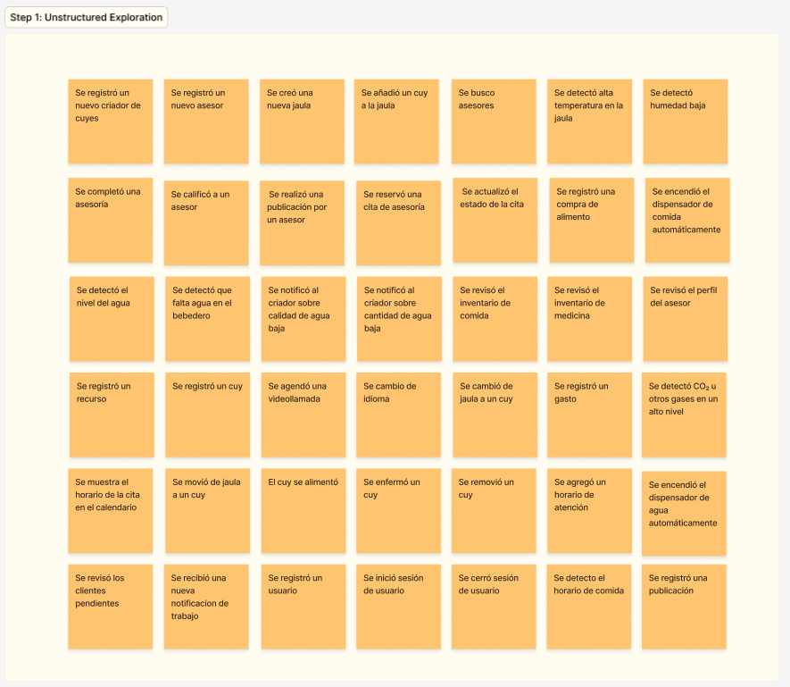
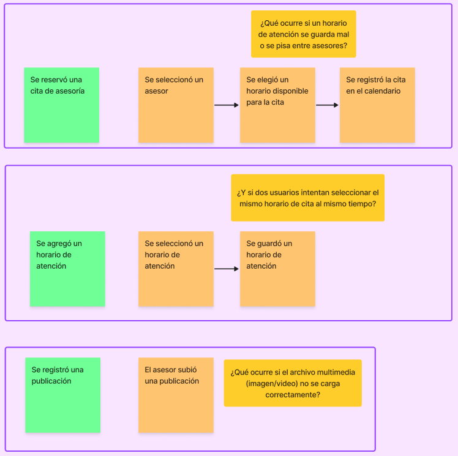
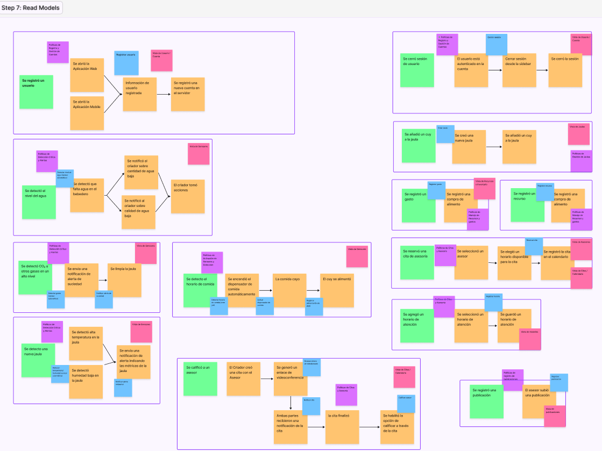
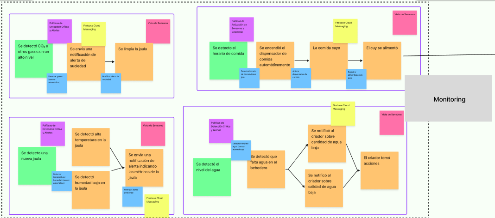

  

# **Universidad Peruana de Ciencias Aplicadas**
## Carrera de Ingeniería de Software

Ciclo: 2025 - 10

Curso: 1ASI0572 Desarrollo de Soluciones IoT

NRC: 2968

Profesor: León Baca, Marco Antonio

“Informe de Trabajo Final"

Startup: AgroTech

Producto: AgroCuy

Grupo: 4

|          Integrantes          |      Código      |
|:-----------------------------:|:-------------------:|
|   Cuadros Rodriguez, Juan Alejandro    |    u20221a359    |
|   Fiorella Jarama Peñaloza    |   u202120418  |
|  Lucas Coronel, Nadia Alessandra   |    U202120430    |
|   Moreno Vergara, Johan Raúl  |    u20201c105    |
|  Ramirez Mendez, Sebastian Andre   |    u20191e575    |

Abril 2025 

---

## Registro de Versiones Del Informe

<table>
  <tr>
    <th>Versión</th>
    <th>Fecha</th>
    <th>Autores</th>
    <th>Descripción de modificación</th>
  </tr>
  <tr>
    <td rowspan="5">TB1</td>
    <td rowspan="5">04/10/2025</td>
    <td>Cuadros Rodriguez, Juan Alejandro</td>
    <td rowspan="5">
      <strong>Capítulo I</strong>: Introducción 
      <strong>Capítulo II</strong>: Requirements Elicitation & Analysis 
      <strong>Capítulo III</strong>: Requirements Specification 
      <strong>Capítulo IV</strong>: Solution Software Design
    </td>
  </tr>
  <tr>
    <td>Fiorella Jarama Peñaloza</td>
  </tr>
  <tr>
    <td>Lucas Coronel, Nadia Alessandra</td>
  </tr>
  <tr>
    <td>Moreno Vergara, Johan Raúl</td>
  </tr>
  <tr>
    <td>Ramirez Mendez, Sebastian Andre</td>
  </tr>
</table>

## Project Report Collaboration Insights

### **Reporte de colaboración de la entrega del TB1:**

------

# Contenido
## Student Outcome

<table border="1" cellpadding="8" cellspacing="0">
  <tr>
    <th>Criterio específico</th>
    <th>Acciones realizadas</th>
    <th>Conclusiones</th>
  </tr>
  <tr>
    <td>Trabaja en equipo para proporcionar liderazgo en forma conjunta</td>
    <td>
      <strong>Moreno Vergara, Johan</strong> 
      <em>TB1</em> 
      Para esta entrega nos pusimos de acuerdo para tener reuniones para elegir el tema de nuestro proyecto y delegar responsabilidades. Además de una reunión para corroborar el correcto avance de cada uno de los miembros de nuestro equipo. 
       
      <strong>Apellidos, Nombre</strong> 
      <em>TB1</em> 
      …  
    </td>
    <td>
      Conclusiones Generales... 
    </td>
  </tr>
  <tr>
    <td>Crea un entorno colaborativo e inclusivo, establece metas, planifica tareas y cumple objetivos.</td>
    <td>
      <strong>Moreno Vergara, Johan</strong> 
      <em>TB1</em> 
      Se establecieron fechas de entrega para cada tarea delegada, de esa forma aseguramos que se cumpla el objetivo de cada miembro de equipo y poder tener el trabajo en fechas específicas antes de la entrega. 
       
      <strong>Apellidos, Nombre</strong> 
      <em>TB1</em> 
      …  
    </td>
    <td>
       Conclusiones Generales... 
    </td>
  </tr>
</table>

## Capítulo I: Introducción 

## 1.1. Startup Profile

### 1.1.1. Descripción de la Startup

AgroTech nace con el objetivo de facilitar y modernizar la crianza de cuyes en el Perú, mediante la implementación de tecnologías IoT que automatizan y optimizan los procesos clave dentro de los criaderos. A través de nuestra aplicación AgroCuy, brindamos a los pequeños y medianos criadores una herramienta tecnológica que les permite gestionar, monitorear y controlar su producción desde cualquier lugar y en tiempo real, utilizando sus dispositivos móviles o computadoras.

La solución propuesta por AgroTech integra funcionalidades como alimentación automatizada, monitoreo ambiental con sensores de temperatura, humedad y gases, control de calidad del agua y riego automatizado. Esto permite a los usuarios garantizar un entorno saludable para los cuyes, mejorar su bienestar, reducir riesgos y aumentar la eficiencia operativa de sus granjas.

**Misión:**

Optimizar la crianza de cuyes en el Perú mediante herramientas avanzadas de automatización y monitoreo. De esta manera, contribuir al desarrollo sostenible de la producción ganadera y al bienestar animal a través de soluciones tecnológicas accesibles.

**Visión:**

Ser la plataforma tecnológica más utilizada por criadores de cuyes en el país, promoviendo la innovación, eficiencia y sostenibilidad en el sector ganadero. Asimismo, consolidarnos como referentes en el uso de IoT en la crianza animal y expandirnos hacia otras especies en el futuro.

  

_Imagen 1. Logo de la aplicación AgroCuy_

### 1.1.2. Perfiles de integrantes del equipo

<table>
  <tr>
    <th>
      
    </th>
    <td valign="top">
      
<b>Ramírez Méndez, Sebastián André</b>

      

        Soy una persona entusiasta que disfruta colaborar en equipo, y me caracterizo por ser transparente en mis objetivos y en mi enfoque de trabajo. Me enorgullece la capacidad que tengo para complementar a mi equipo en áreas donde puedan necesitar apoyo. Mi pasión por mi carrera me impulsa a desafiar mis habilidades y aspirar a alcanzar todo su potencial.
      

    </td>
  </tr>
  <tr>
    <th>
      
    </th>
    <td valign="top">
      
<b>Apellidos, Nombres</b>

      

        Descripcion
      

    </td>
  </tr>
  <tr>
    <th>
      
    </th>
    <td valign="top">
      
<b>Lucas Coronel, Nadia Alessandra</b>

      

        Mi nombre es Nadia Alessandra Lucas Coronel y soy estudiante de octavo ciclo de la carrera de Ingeniería de Software. Me considero una persona entusiasta, perseverante y responsable. Cuento con conocimientos en SQL, C++, Python, HTML, CSS, JavaScript, despligue y metodologías ágiles. Me comprometo a aplicar mis conocimientos de manera efectiva para contribuir al desarrollo de soluciones de software de alta calidad.
      

    </td>
  </tr>
  <tr>
    <th>
      
    </th>
    <td valign="top">
      
<b>Moreno Vergara, Johan Raúl</b>

      

        Me llamo Johan y soy estudiante de la carrera de Ingeniería de Software. Soy una persona bastante optimista y responsable. Me apasionan los temas de ciberseguridad e inteligencia artificial. Cuento con conocimientos en Python, SQL, ciberseguridad, entrenamiento de modelos de IA y algunos frameworks de desarrollo web.Dentro de mis hobbies está practicar artes marciales como el boxeo, Muay Thai y MMA. Me comprometo a apoyar a mi equipo y poner en práctica mis conocimientos.
      

    </td>
  </tr>
  <tr>
    <th>
      
    </th>
    <td valign="top">
      
<b>Apellidos, Nombres</b>

      

        Descripcion
      

    </td>
  </tr>
</table>

 

## 1.2. Solution Profile

### 1.2.1 Antecedentes y problemática

- **What:** El sector de la crianza de cuyes enfrenta desafíos en la gestión eficiente de las granjas, la falta de acceso a tecnologías adecuadas y la necesidad de mejorar el bienestar animal y la sostenibilidad de las prácticas agrícolas. 
- **Where:** Nos enfocaremos en todo el territorio nacional del Perú, especialmente en los departamentos donde se concentra la mayor parte del comercio y la actividad económica del país, y donde la crianza de cuyes es más prevalente
- **When:** Actualmente, el sector agropecuario se enfrenta a estos desafíos en la gestión de la crianza de cuyes. Con el crecimiento de la población en el país y la demanda de alimentos en aumento, se requiere una mayor eficiencia en la producción agrícola. Además, las preocupaciones ambientales y de bienestar animal están impulsando la necesidad de adoptar prácticas agrícolas más sostenibles y éticas.
- **Who:** AgroTech, como empresa líder en tecnología aplicada a la agricultura, asume la responsabilidad de liderar la innovación en la gestión de la crianza de cuyes. En este proceso, trabajamos en estrecha colaboración con expertos y asesores en la crianza de cuyes, quienes aportan su conocimiento especializado para desarrollar soluciones tecnológicas específicas y efectivas. Además, involucramos activamente a los criadores de cuyes, quienes son los beneficiarios directos de estas soluciones, asegurando que se adapten a sus necesidades y realidades específicas.
- **Why:** Para abordar estos desafíos y mejorar la gestión y productividad en la crianza de cuyes, garantizando el bienestar animal y promoviendo prácticas sostenibles en la industria agropecuaria. Además, se busca mejorar la rentabilidad de los agricultores y contribuir a la seguridad alimentaria peruana.
- **How:** Mediante el desarrollo de AgroCuy, una aplicación integral que combina asesoría especializada con herramientas IoT de automatización y monitoreo en tiempo real. Esta solución incluye: Sistemas de alimentación automatizada, con dispensadores controlados por horarios. Sensores ambientales IoT, que monitorean temperatura, humedad y gases como amoníaco y CO₂, garantizando un ambiente saludable. Sensores de calidad del agua, para asegurar una hidratación adecuada. Riego automatizado, que optimiza el uso de agua en función de las necesidades del entorno. Alertas y análisis predictivo, que permiten prevenir enfermedades y mejorar la toma de decisiones. Todo esto se controla desde dispositivos móviles o computadoras, permitiendo una gestión remota, inteligente y eficiente.
- **How much:** Se espera que AgroCuy tenga un impacto significativo en la optimización de las granjas de cuyes, elevando la productividad, reduciendo pérdidas por enfermedades y mejorando las condiciones de crianza. Esta innovación se alinea con los esfuerzos del Ministerio de Desarrollo Agrario y Riego (Midagri), que reportó un incremento del 20% en las crianzas de cuyes gracias a la adopción de nuevas tecnologías. Además, según datos del Midagri (2023), entre 2020 y 2021 se observó un crecimiento de 116 mil cuyes a nivel nacional, lo que evidencia una tendencia al alza en la producción. (Revisar [Anexo N°1: Gráfico de evolución de población de cuyes](#anexo-n1-gráfico-de-evolución-de-población-de-cuyes)). Nuestra aplicación busca responder a problemas comunes en el sector como la malnutrición, la falta de control sanitario y las malas condiciones ambientales, que afectan directamente la productividad de las granjas. (Revisar [Anexo N°2: Diagrama de problemas en la crianza de cuyes](#anexo-n2-diagrama-de-problemas-en-la-crianza-de-cuyes))

### 1.2.2 Lean UX Process.

#### 1.2.2.1. Lean UX Problem Statements.

***Problem Statement 1***

|Nuestro producto tiene como objetivo mejorar la gestión de granjas de cuyes en el Perú mediante soluciones IoT.|
| - |
|Hemos observado que los criadores de cuyes en Perú enfrentan dificultades para gestionar eficientemente sus granjas, debido a la falta de herramientas tecnológicas que les permitan monitorear variables críticas como temperatura, humedad o niveles de alimentación en tiempo real. Esto impacta negativamente en su productividad y en el bienestar de los animales|
|¿Podría nuestra aplicación AgroCuy, equipada con sensores IoT y sistemas de automatización, ayudar a los criadores de cuyes a mejorar la gestión de sus granjas y aumentar su productividad?|

***Problem Statement 2***

|Nuestro producto tiene como objetivo aumentar la rentabilidad de los criadores de cuyes en Perú a través del uso de tecnologías IoT.|
| - |
|Hemos observado que muchos criadores enfrentan pérdidas económicas por el mal uso de recursos como agua o alimento, y por la falta de detección temprana de enfermedades en sus animales.|
|¿Podría AgroCuy, mediante el uso de sensores inteligentes y alertas en tiempo real, ayudar a reducir costos operativos y mejorar la eficiencia, contribuyendo así a una mayor rentabilidad?|

***Problem Statement 3***

|Nuestro producto tiene como objetivo facilitar el acceso a mercados y mejorar la comercialización de los productos de cuy en Perú, apoyándose en tecnología IoT.|
| - |
|Hemos observado que muchos criadores de cuyes tienen poca trazabilidad de sus procesos de producción, lo que limita la confianza de los compradores y reduce sus oportunidades en el mercado formal.|
|¿Podría AgroCuy, al recopilar datos automatizados sobre las condiciones de crianza mediante sensores IoT, generar reportes que validen la calidad del producto y así ayudar a los criadores a acceder a nuevos mercados y mejorar su comercialización?|

#### 1.2.2.2. Lean UX Assumptions.

1. **¿Quién es el usuario?** 

   El usuario principal de nuestro producto es el criador de cuyes en Perú, particularmente aquellos que buscan modernizar sus métodos de crianza mediante la adopción de tecnologías innovadoras como el Internet de las Cosas (IoT). También forman parte del ecosistema otros actores clave como los trabajadores de las granjas que interactúan con los dispositivos IoT, los compradores que valoran la trazabilidad del producto, y los consumidores finales interesados en alimentos producidos bajo estándares de bienestar animal y sostenibilidad.

1. **¿Dónde encaja nuestro producto en su trabajo o vida?**

   AgroCuy se integra directamente en las actividades diarias del criador de cuyes, permitiéndole gestionar su granja de forma remota y automatizada gracias al uso de sensores y dispositivos IoT. Estos sensores monitorean en tiempo real parámetros vitales como temperatura, humedad, calidad del agua, y niveles de alimentación, enviando alertas y recomendaciones a través de la aplicación. Así, AgroCuy se convierte en un aliado constante del criador, brindándole mayor control, eficiencia y tranquilidad.

1. **¿Qué problemas tiene nuestro producto? ¿Resolver?**

   Actualmente, el producto está enfocado únicamente en la crianza de cuyes y aún no está adaptado para otros tipos de ganado. Sin embargo, AgroCuy aborda de forma precisa varios problemas comunes en la crianza de cuyes: 
   - Falta de monitoreo en tiempo real. 
   - Ineficiente uso de recursos como agua y alimento. 
   - Dificultad en la detección temprana de enfermedades. 
   - Gestión manual de registros de salud y reproducción. 
   - Bajo acceso a mercados y falta de trazabilidad. 
   Gracias al uso de IoT, nuestro producto ofrece una solución tecnológica completa que automatiza la supervisión de las granjas, mejora el bienestar animal, optimiza los recursos y reduce el impacto ambiental, mejorando así la rentabilidad y sostenibilidad del negocio.

1. **¿Cuándo y cómo es nuestro producto? ¿Usado?** 

   AgroCuy será utilizado diariamente por los criadores de cuyes a través de sus dispositivos móviles o computadoras. Los sensores instalados en las granjas estarán en funcionamiento continuo, recolectando datos y enviándolos a la plataforma en tiempo real. De esta manera, el usuario podrá recibir notificaciones instantáneas, visualizar reportes gráficos, y tomar decisiones informadas en cualquier momento y desde cualquier lugar con conexión a internet.

1. **¿Qué características son importantes?**

   Monitoreo ambiental con IoT: Sensores que registran condiciones como temperatura, humedad, y calidad del agua, esenciales para la salud de los cuyes.

   Alertas inteligentes: Notificaciones automáticas en caso de condiciones anómalas o necesidades de intervención.

   Análisis predictivo: Algoritmos que, con base en los datos recolectados por sensores, brindan recomendaciones personalizadas para optimizar la nutrición, salud y reproducción de los cuyes.

   Gestión automatizada: Herramientas para registrar automáticamente eventos como alimentación, vacunación, o mortalidad, evitando el uso de formatos físicos.

   Conexión con mercados: Trazabilidad basada en datos, que mejora la confianza del consumidor y abre nuevas oportunidades comerciales.

1. **¿Cómo debe verse nuestro producto y cómo comportarse?**

   AgroCuy debe tener una interfaz intuitiva y adaptable a distintos niveles de alfabetización digital, con visualizaciones claras de los datos que recogen los sensores IoT. El diseño debe ser limpio, atractivo y centrado en la experiencia del usuario. El sistema debe comportarse de forma fluida, con actualizaciones en tiempo real, alertas precisas y navegación sencilla. Además, debe garantizar altos estándares de seguridad para proteger tanto los datos de los usuarios como la información recopilada por los sensores.

#### 1.2.2.3. Lean UX Hypothesis Statements.

**Hypothesis Statement 1**

|Creemos que al proporcionar a los criadores de cuyes en Perú acceso a tecnologías avanzadas de Internet de las Cosas (IoT) y asesoramiento especializado a través de nuestra plataforma AgroCuy, mejorarán la eficiencia y la rentabilidad de sus granjas al optimizar el monitoreo ambiental y la salud animal.|
| - |
|Sabremos que esto es cierto…|
|Cuando se aprecie un incremento del 20% en la cantidad de solicitudes de asesorías relacionadas con el uso de sensores IoT y sistemas automatizados de alimentación durante los primeros 6 meses de lanzamiento.|

**Hypothesis Statement 2**

|Creemos que al promover prácticas agrícolas sostenibles y éticas en la crianza de cuyes en Perú mediante el monitoreo constante de los recursos a través de IoT, los criadores adoptarán un enfoque más responsable con el medio ambiente y mejorarán la calidad de vida de los cuyes.|
| - |
|Sabremos que esto es cierto…|
|Cuando proporcionemos recursos específicos sobre prácticas sostenibles apoyadas por el análisis de datos en tiempo real proporcionados por los sensores IoT, y evaluemos la adopción de estas prácticas por parte de los criadores, viendo un aumento del 15% en la implementación de prácticas sostenibles en el uso de agua, alimentación automatizada y calidad del aire dentro de los primeros 6 meses de lanzamiento.|

**Hypothesis Statement 3**

|Creemos que al facilitar el acceso a mercados y mejorar la comercialización de los productos de cuy en Perú, mediante la trazabilidad y calidad certificada proporcionada por el monitoreo IoT, los criadores aumentarán sus ventas y expandirán sus negocios.|
| - |
|Sabremos que esto es cierto…|
|Cuando los datos de trazabilidad y calidad de los productos de cuy generados a través de los dispositivos IoT sean utilizados para establecer conexiones con compradores y mercados, y evaluemos el impacto en las ventas de los criadores mediante un aumento del 25% en las ventas en los primeros 6 meses de uso de la aplicación.|

**Hypothesis Statement 4**

|Creemos que al ofrecer soluciones IoT que mejoren la gestión diaria de las granjas, los criadores podrán monitorear en tiempo real el estado de sus operaciones y obtener asesorías más personalizadas, lo que les permitirá aumentar la productividad y eficiencia.|
| - |
|Sabremos que esto es cierto…|
|Cuando se observe un aumento del 20% en el número de criadores que implementan sistemas de monitoreo IoT, como sensores de temperatura, humedad y salud animal, dentro de los primeros tres meses tras el lanzamiento. Además, mediremos la retroalimentación de los usuarios mediante encuestas regulares, y consideraremos que hemos tenido éxito si al menos el 70% de las respuestas son positivas en relación con la experiencia de uso y la mejora en la gestión de la granja.|

#### 1.2.2.4. Lean UX Canvas.

_Imagen 2. Lean UX Canvas_

## 1.3. Segmentos objetivo

Por el lado de los asesores, hemos considerado que estos tendrán experiencia en el campo y/o estudios universitarios en carreras como ingeniería agrónoma, medicina veterinaria, zootecnia, etc. Debido a que el plan de estudios de estas carreras es de mínimo 5 años a más, y necesitan cierto grado de experiencia para dar recomendaciones y planes de acción confiables, hemos decidido que el rango de edad será de 25 años hasta 65 años.

Los asesores tendrán el conocimiento necesario para implementar y utilizar tecnologías avanzadas como sensores IoT, sistemas automatizados de alimentación y monitoreo de salud animal, así como plataformas de gestión de datos. Ellos proporcionarán a los criadores de cuyes las herramientas para analizar información en tiempo real y realizar recomendaciones basadas en datos IoT, mejorando la productividad y eficiencia de las granjas.

Según el Ministerio de Desarrollo Agrario y Riego (2023), la crianza de cuyes es una alternativa para la generación de ingresos monetarios para más de 800,000 familias agrarias en el Perú, las cuales se ubican en su mayoría en la sierra del país. El consumo de carne de cuy se ha mantenido en el tiempo e incluso ha trascendido al mercado externo. Esta información destaca la importancia de los asesores en la crianza de cuyes, ya que su conocimiento y orientación, apoyados por tecnologías como el IoT, pueden ser fundamentales para el éxito y la sostenibilidad de los productores en este sector.

|**Segmento objetivo**|Asesores |
| :- | :- |
|**Edad**|25-65 años|
|**Ubicación**|Perú|
|**Sexo**|Masculino y Femenino|
|**Formación educativa**|Universitario o cualquier educación superior|
|**Poder adquisitivo**|Bajo, medio y alto|
|**Tecnologia Utilizada**|Uso de plataformas IoT para monitoreo y análisis de datos, sensores inteligentes para salud animal y gestión eficiente de recursos, asesoramiento basado en datos recolectados en tiempo real.|

Para delimitar el segmento objetivo de criadores de cuyes, nos basamos en el diagnóstico situacional de la crianza de cuyes en Cajamarca realizado en julio de 2004. Dicho diagnóstico menciona que el 44.6% de los productores tenían más de 50 años, sus esposas que conducían la crianza de cuyes tenían entre 31 a 50 años. Además, los hijos que vivían con los padres tenían entre 6 a 17 años. Por lo tanto, para el rango de edad de los criadores decidimos seleccionar desde los 18 años de edad hasta los 60 años para abarcar tanto a los padres que manejan la crianza como a los hijos mayores de edad que la apoyan.

El mismo diagnóstico señala que el grado de instrucción predominante en la familia es de educación primaria con un 65.6%, lo cual tomaremos en cuenta.

Los criadores de cuyes estarán cada vez más dispuestos a integrar tecnologías avanzadas como el Internet de las Cosas (IoT) para optimizar la gestión de sus granjas. A través de sensores IoT, podrán monitorear en tiempo real aspectos como la calidad del agua, la temperatura y la humedad dentro de las instalaciones, lo que les permitirá hacer ajustes automáticos para mejorar el ambiente y el bienestar de los cuyes. Esto, junto con el uso de dispositivos para controlar la alimentación y otros parámetros, les dará herramientas efectivas para aumentar su eficiencia y rentabilidad.

|**Segmento objetivo**|Criadores de cuyes|
| :- | :- |
|**Edad**|18-60 años|
|**Ubicación**|Perú|
|**Sexo**|Masculino y Femenino|
|**Formación educativa**|Educación primaria|
|**Poder adquisitivo**|Bajo y medio|
|**Tecnologia Utilizada**|Sensores IoT para monitoreo ambiental (temperatura, humedad, calidad del aire), dispositivos automatizados para alimentación, control remoto de las operaciones y plataformas móviles para gestionar la granja de manera eficiente.|

## Capítulo II: Requirements Elicitation & Analysis
## Capítulo III: Requirements Specification
## Capítulo IV: Solution Software Design
## 4.1. Strategic-Level Domain-Driven Design. 
### 4.1.1. EventStorming. 

Realizamos nuestro proceso de event storming a través de la herramienta Figma, donde trazamos todo el recorrido del sistema. Iniciamos con la fase inicial de Unstructured Exploration, en la cual discutimos y contrastamos nuestras ideas respecto a los eventos clave del dominio, guiándonos por las sugerencias recomendadas y centrandonos en el objetivo numero uno de nuestro proyecto. Asimismo, tomamos en cuenta diversos aspectos al elegir los eventos, tales como su importancia, recurrencia y momento de ocurrencia.

🔗 [Ver Figma](https://www.figma.com/design/bBQCiFvraA0jM3SFmloKWi/Event-Storming---IoT?node-id=0-1&t=uHqde6eWHW5RX70z-1)

 

**Step 1: Unstructured Exploration**

Iniciamos con una exploración libre del dominio, donde cada integrante propuso eventos clave desde su perspectiva. Esta etapa nos permitió intercambiar ideas, descubrir puntos relevantes y construir una comprensión compartida del proceso. Para seleccionar los eventos, consideramos criterios como relevancia, frecuencia y temporalidad.

 
 
 
 

**Step 2: Timelines**

En esta fase organizamos los eventos del dominio de forma cronológica. Esto nos permitió visualizar el flujo completo del sistema, identificar el orden natural de los eventos y comprender mejor cómo interactúan los actores dentro del proceso de crianza de cuyes.

 
 
 
 

**Step 3: Paint Points**

Detectamos los puntos críticos o problemáticos que enfrentan tanto los criadores como el sistema actual. Estos incluían desde la falta de alertas oportunas sobre condiciones ambientales, hasta la dificultad de acceso a asesoría en tiempo real para criadores principiantes.

 
 
 
 

**Step 4: Pivotal Points**

Identificamos los momentos clave que marcan cambios importantes dentro del proceso, como el momento en que se detecta un problema ambiental o cuando se solicita ayuda a un experto. Estos puntos nos ayudaron a definir posibles mejoras de alto impacto.

 
 
 
 

**Step 5: Commands**

Aquí definimos las acciones que los usuarios o el sistema pueden ejecutar, como "Registrar Alerta", "Consultar Experto", o "Actualizar Condiciones de Jaula". Cada comando representa una intención concreta que da lugar a eventos en el dominio.

 
 
 
 

**Step 6: Policies**

Establecimos las reglas de negocio que deben ejecutarse de forma automática ante ciertos eventos. Por ejemplo, si se detecta una temperatura fuera del rango, se activa una política que genera y envía una alerta al criador correspondiente.

 
 
 
 

**Step 7: Read Models**

Diseñamos los modelos de lectura que permitirán consultar el estado de la jaula, historial de alertas, perfiles de expertos y más. Estos modelos están optimizados para las necesidades de visualización de los usuarios dentro de la app.

 
 
 
 

**Step 8: External Systems**

Identificamos los sistemas externos que interactúan con AgroCuy, como servicios de notificación (por ejemplo, Firebase para el envío de alertas), APIs de sensores, o incluso plataformas externas para aprendizaje y asesoramiento remoto.

 
 
 
 

**Step 9: Aggregates**

Por último, definimos los aggregates, que representan los límites consistentes del dominio. Un ejemplo claro fue el aggregate de AlertaDeMonitoreoDeJaula, que encapsula la lógica de generación y notificación de alertas por condiciones anómalas en las jaulas. Este aggregate centraliza todo el comportamiento relacionado con el monitoreo ambiental, siendo clave para garantizar una crianza automatizada y segura.

#### 4.1.1.1 Candidate Context Discovery.

**Identificación de Valores del Negocio:**  

Analizamos los aspectos fundamentales del negocio: el monitoreo automatizado de variables ambientales, el control de dispensadores de comida en horarios definidos, la detección de condiciones del agua, la gestión de jaulas y distribución de cuyes, y la comunicación entre criadores y asesores técnicos. Estos valores permiten una crianza más eficiente, segura y con acompañamiento personalizado, promoviendo buenas prácticas en la comunidad agropecuaria.

**Identificación de Funcionalidades Clave:**  

A partir de estos valores, identificamos funcionalidades esenciales para el sistema:

- Gestión de alertas ambientales (temperatura, humedad, calidad del agua).
- Control de dispensadores de comida por horario.
- Gestión de jaulas y cantidad de cuyes por jaula.
- Notificación de agua insuficiente o en mal estado.
- Videollamadas entre criadores y asesores técnicos.
- Calendario de disponibilidad de asesores y solicitud de citas.
- Confirmación y gestión de citas por parte de los asesores.
- Gestión de cuentas para criadores y asesores.
- Reportes visuales y estado en tiempo real.
- Publicaciones.

**Priorización de Contextos:**  

La priorización de bounded contexts nos ayudó a enfocar el diseño del sistema en torno a lo que realmente sostiene el valor de AgroCuy. Al distinguir los núcleos del dominio, pudimos aislar lógicas críticas que deben evolucionar de forma independiente y con alta cohesión.

**Contextos Identificados:**

1. **Security:** gestiona la autenticación y perfiles de criadores y asesores técnicos.  
2. **Monitoring:** monitorea las condiciones dentro de las jaulas y emite alertas cuando se detectan situaciones críticas.  
3. **Breeding:** permite gestionar la cantidad de cuyes por jaula, el estado del agua y el uso de dispensadores automáticos de comida.  
4. **Consulting:** facilita la interacción entre criadores y asesores mediante videollamadas, programación de citas y gestión de disponibilidad.  
5. **Publication:** facilita que los asesores técnicos publiquen contenido relacionado a su experiencia o conocimientos, permitiendo visibilizar su perfil y atraer a potenciales criadores interesados en su asesoría.

**Bounded Context Security**
  

**Bounded Context Monitoring**
    

**Bounded Context Breeding**
    

**Bounded Context Consulting**
    

**Bounded Context Publication**
    

#### 4.1.1.2 Domain Message Flows Modeling.

Este gráfico muestra cómo el usuario interactúa con el sistema para monitorear a sus cuyes. A través de la interfaz web/app, se solicita información del criadero y los parámetros medidos, la cual es obtenida desde sensores IoT. Si se detecta un valor fuera de rango, se activa una alerta y se notifica al usuario en tiempo real.
 

[Enlace de la imagen aquí](https://i.postimg.cc/J4LXYMxV/Domain-Message-Flow-drawio.png)

#### 4.1.1.3 Bounded Context Canvases. 

En este canvas definimos el Bounded Context del sistema de monitoreo para criaderos de cuyes, donde detallamos su propósito, comunicaciones, decisiones clave y lenguaje ubicuo. Representa cómo interactúan sensores, usuarios y alertas dentro del sistema.
 

[Enlace de la imagen aquí](https://i.postimg.cc/HjDFXV1L/Bounded-Context-Canvases.png)

### **4.1.2. Context Mapping**

Una vez definidos nuestros Bounded Contexts, realizamos el mapeo de sus relaciones para comprender cómo se comunican dentro del sistema de AgroCuy y asignar los patrones adecuados según su interacción.

– <strong>Security</strong> provee autenticación y manejo de perfiles tanto para criadores como para asesores técnicos. Es utilizado por los demás contextos, pero no depende de ninguno. Esta relación fue clasificada como <strong>Shared Kernel</strong>, ya que su lógica y entidades clave deben ser consistentes y compartidas de forma controlada.

– <strong>Monitoring</strong> detecta situaciones como falta de agua o comida, y genera alertas críticas. Esta información es consumida por <strong>Breeding</strong> para tomar decisiones sobre el manejo de jaulas. Dado que Breeding depende del lenguaje de eventos generado por Monitoring, aplicamos el patrón <strong>Conformist</strong>.

– <strong>Consulting</strong> se encarga de la programación de citas, videollamadas y disponibilidad de asesores. Su interacción con <strong>Security</strong> (para acceder al perfil del asesor o criador) sigue el patrón <strong>Customer–Supplier</strong>, ya que Consulting consume datos que Security expone.

– <strong>Publication</strong> se encargar de la gestion de publicaciones de asesores para mayor visibilidad. Su interacción con <strong>Security</strong> (para acceder al perfil del asesor o criador) sigue el patrón <strong>Customer–Supplier</strong>, ya que Consulting consume datos que Security expone.

– Además, la comunicación entre <strong>Breeding</strong> y <strong>Monitoring</strong> también puede considerarse como <strong>Published Language</strong> en algunos escenarios, cuando ambos deben interpretar eventos de forma coherente (por ejemplo, para emitir alertas o automatizar los dispensadores).

Este mapeo nos ayuda a establecer relaciones claras entre los contextos, identificar dependencias y definir una arquitectura que mantenga separadas las responsabilidades de cada módulo en AgroCuy.

**Bounded Context All - Vista Completa**
    

## 4.1.3. Software Architecture
### 4.1.3.1. Software Architecture System Landscape Diagram
### 4.1.3.1. Software Architecture Context Level Diagrams
### 4.1.3.1. Software Architecture Container Level Diagrams
### 4.1.3.1. Software Architecture Deploymeny Diagrams

 

## 4.2. Tactical-Level Domain-Driven Design

  

### 4.2.1. Bounded Context: Security
### 4.2.1.1. Domain Layer
A continuación, se presenta la organización del Domain Layer siguiendo la estructura: Aggregate, Value Objects, Domain Services y Repositories, con todos los elementos organizados en tablas independientes.
 

## Aggregate

<table>
  <thead>
    <tr><th>Entidad</th><th>Atributos Clave</th><th>Métodos</th></tr>
  </thead>
  <tbody>
    <tr>
      <td>Usuario</td>
      <td>
        id, nombre, email, contraseña, 
        tipoPerfil (CRIADOR, ASESOR_TECNICO), 
        roles, granjas
      </td>
      <td>
        autenticarUsuario(), 
        asignarRol(), 
        agregarGranja(), 
        definirTipoPerfil(), 
        obtenerPerfil()
      </td>
    </tr>
  </tbody>
</table>

---

## Value Objects

<table>
  <thead>
    <tr><th>VO</th><th>Atributos</th><th>Descripción</th></tr>
  </thead>
  <tbody>
    <tr>
      <td>Rol</td>
      <td>id, nombre, permisos</td>
      <td>Define conjunto de permisos asignables a un usuario</td>
    </tr>
    <tr>
      <td>Permiso</td>
      <td>id, nombre, descripcion</td>
      <td>Acción específica que puede ejecutar un usuario</td>
    </tr>
    <tr>
      <td>Perfil</td>
      <td>nombre, email, tipoPerfil, especialidad, ubicacion</td>
      <td>Datos públicos del usuario expuestos a otros contextos</td>
    </tr>
  </tbody>
</table>

---

## Domain Services

<table>
  <thead>
    <tr><th>Servicio</th><th>Métodos</th><th>Responsabilidad</th></tr>
  </thead>
  <tbody>
    <tr>
      <td>SecurityManagementService</td>
      <td>
        autenticarUsuario(), 
        registrarUsuario(), 
        asignarRol(), 
        validarPermiso(), 
        obtenerPerfil(), 
        listarUsuariosPorTipo()
      </td>
      <td>Orquestación de operaciones de seguridad</td>
    </tr>
  </tbody>
</table>

---

## Repositories

<table>
  <thead>
    <tr><th>Repositorio</th><th>Métodos</th><th>Entidad</th></tr>
  </thead>
  <tbody>
    <tr>
      <td>UserRepository</td>
      <td>
        findById(), 
        findByEmail(), 
        findByTipoPerfil(), 
        save(), 
        deleteById()
      </td>
      <td>Usuario</td>
    </tr>
    <tr>
      <td>RolRepository</td>
      <td>
        findByNombre(), 
        save(), 
        deleteById()
      </td>
      <td>Rol</td>
    </tr>
    <tr>
      <td>PermisoRepository</td>
      <td>
        findByNombre(), 
        save(), 
        deleteById()
      </td>
      <td>Permiso</td>
    </tr>
  </tbody>
</table>

### 4.2.1.2. Interface Layer

En esta sección, presentamos la Capa de Interfaz de nuestra plataforma de AgroConnect para la gestión de seguridad. Representa el punto de entrada para las interacciones entre los usuarios (criadores y asesores técnicos) y el sistema. Está compuesta por una serie de controladores que manejan las peticiones entrantes de los usuarios y devuelven las respuestas adecuadas, permitiendo una comunicación efectiva entre la plataforma y sus usuarios o bounded contexts consumidores.

El contexto de esta capa incluye cuatro controladores principales: `UserController`, `SensorController`, `PermissionController` y `GranjaController`. Estos controladores son responsables de gestionar operaciones sobre usuarios, autenticación, sensores, permisos y granjas vinculadas.

## Controladores

<table border="1" style="width:100%; text-align:left;">
  <tr>
    <th style="width:50%;">UserController</th>
    <th style="width:50%;">PermissionController</th>
  </tr>
  <tr>
    <td>
      + authenticateUser(email, password): TokenDto 
      + registerUser(usuarioDto): ResponseEntity 
      + getAllUsers(): List&lt;UsuarioDto&gt; 
      + updateUser(id, usuarioDto): UsuarioDto 
      + deleteUser(id): ResponseEntity 
      + getPerfilUsuario(id): PerfilDto 
      + getUsuariosPorTipo(tipoPerfil): List&lt;UsuarioDto&gt;
    </td>
    <td>
      + getAllPermissions(): List&lt;PermisoDto&gt; 
      + assignPermissionToUser(userId, permisoId): ResponseEntity 
      + removePermissionFromUser(userId, permisoId): ResponseEntity
    </td>
  </tr>
</table>

 

<table border="1" style="width:100%; text-align:left;">
  <tr>
    <th style="width:50%;">SensorController</th>
    <th style="width:50%;">GranjaController</th>
  </tr>
  <tr>
    <td>
      + getAllSensors(): List&lt;SensorDto&gt; 
      + addSensor(sensorDto): ResponseEntity 
      + updateSensor(id, sensorDto): SensorDto 
      + deleteSensor(id): ResponseEntity
    </td>
    <td>
      + getGranjasByUsuario(usuarioId): List&lt;GranjaDto&gt; 
      + addGranja(granjaDto): ResponseEntity 
      + updateGranja(id, granjaDto): GranjaDto 
      + deleteGranja(id): ResponseEntity
    </td>
  </tr>
</table>

### 4.2.1.3. Application Layer

En esta sección, se presenta la Capa de Aplicación (Application Layer) del contexto de Seguridad de AgroConnect. Esta capa actúa como intermediaria entre la lógica de dominio y la infraestructura, orquestando el flujo de datos para realizar operaciones como el registro, autenticación y manejo de perfiles.

Se definen tanto Command Handlers como Event Handlers, los cuales coordinan los servicios relevantes para ejecutar acciones específicas del sistema, como asignar roles, generar perfiles o responder a eventos de login/logout.

---

## Handlers

<table border="1" style="width:100%; text-align:left; background-color:#ffffe0;">
  <tr>
    <th style="width:50%;">UserRegistrationCommandHandler</th>
    <th style="width:50%;">AssignRoleCommandHandler</th>
  </tr>
  <tr>
    <td>
      + userService: UserService 
      + handle(RegisterUserCommand command): Usuario
    </td>
    <td>
      + userService: UserService 
      + handle(AssignRoleCommand command): void
    </td>
  </tr>
</table>

 

<table border="1" style="width:100%; text-align:left; background-color:#ffffe0;">
  <tr>
    <th style="width:50%;">ProfileRequestedEventHandler</th>
    <th style="width:50%;">UserLogoutEventHandler</th>
  </tr>
  <tr>
    <td>
      + userService: UserService 
      + handle(ProfileRequestedEvent event): Perfil
    </td>
    <td>
      + authService: AuthService 
      + handle(UserLoggedOutEvent event): void
    </td>
  </tr>
</table>

### 4.2.1.4. Infrastructure Layer

En esta sección, se presenta la Capa de Infraestructura (Infrastructure Layer) dentro del contexto de Seguridad de AgroConnect. Esta capa proporciona los componentes técnicos y de soporte que permiten la interacción con bases de datos, servicios de autenticación y almacenamiento de perfiles. 

Su función principal es implementar los contratos definidos en el dominio y permitir la persistencia de los datos relacionados con usuarios, roles, permisos y sensores. Además, se asegura de que la lógica de seguridad y autenticación funcione correctamente en conjunto con tecnologías como Spring Security y OAuth 2.0.

Los repositorios definidos en esta capa utilizan frameworks como Spring Data JPA para la persistencia, y representan un puente entre la lógica de negocio y el almacenamiento físico de datos.
 
## Repositorios

<table border="1" style="width:100%; text-align:left;">
  <tr>
    <th style="width:50%;">UserRepository</th>
    <th style="width:50%;">RoleRepository</th>
  </tr>
  <tr>
    <td>
      + findById(userId: UUID): Usuario 
      + findByEmail(email: String): Usuario 
      + findByTipoPerfil(tipoPerfil: Enum): List&lt;Usuario&gt; 
      + save(usuario: Usuario): void 
      + deleteById(userId: UUID): void
    </td>
    <td>
      + findByNombre(nombre: String): Rol 
      + save(rol: Rol): void 
      + deleteById(rolId: UUID): void
    </td>
  </tr>
</table>

 

<table border="1" style="width:100%; text-align:left;">
  <tr>
    <th style="width:50%;">PermisoRepository</th>
    <th style="width:50%;">SensorRepository</th>
  </tr>
  <tr>
    <td>
      + findByNombre(nombre: String): Permiso 
      + save(permiso: Permiso): void 
      + deleteById(permisoId: UUID): void
    </td>
    <td>
      + findById(sensorId: UUID): Sensor 
      + findByTipo(tipo: String): List&lt;Sensor&gt; 
      + save(sensor: Sensor): void 
      + deleteById(sensorId: UUID): void
    </td>
  </tr>
</table>

### 4.2.1.5. Bounded Context Software Architecture Component Level Diagrams
### 4.2.1.6. Bounded Context Software Architecture Code Level Diagrams

En esta sección se presenta el diagrama de diseño de base de datos del contexto de seguridad. El modelo de datos refleja la estructura de las entidades y sus relaciones a través de claves primarias y foráneas. Este diseño asegura la integridad referencial entre los usuarios, roles, permisos y sensores.

### 4.2.1.6.1. Bounded Context Domain Layer Class Diagrams

El sistema diferencia principalmente entre dos tipos de usuarios: **criadores** y **asesores técnicos**, cada uno con **niveles de acceso diferenciados**. Los criadores están vinculados directamente con las **granjas**, las cuales agrupan sensores físicos que recolectan información clave sobre las condiciones de crianza de los cuyes. Por su parte, los asesores técnicos pueden acceder a información crítica a través de permisos específicos y validaciones de seguridad.

### 4.2.1.6.2. Bounded Context Database Design Diagram
  

### 4.2.X. Bounded Context: <Bounded Context Name>
### 4.2.X.1. Domain Layer
### 4.2.X.2. Interface Layer
### 4.2.X.3. Application Layer
### 4.2.X.4. Infrastructure Layer
### 4.2.X.5. Bounded Context Software Architecture Component Level Diagrams
### 4.2.X.6. Bounded Context Software Architecture Code Level Diagrams
### 4.2.X.6.1. Bounded Context Domain Layer Class Diagrams
### 4.2.X.6.2. Bounded Context Database Design Diagram

  

### 4.2.3. Bounded Context: Consulting <Bounded Context Consulting>
### 4.2.3.1. Domain Layer
A continuación, se presenta la organización del Domain Layer siguiendo la estructura: Aggregate, Value Objects, Domain Services y Repositories, con todos los elementos organizados en tablas independientes.

## Aggregate

<table>
  <thead>
    <tr><th>Entidad</th><th>Atributos Clave</th><th>Métodos</th></tr>
  </thead>
  <tbody>
    <tr>
      <td> Asesoria </td>
      <td>
        id, date, status, title, breederId, advisor_id
      </td>
      <td>
        getAppointment(),
        updateAppointment()
      </td>
    </tr>
  </tbody>
</table>

---

## Value Objects

<table>
  <thead>
    <tr>
      <th>VO</th>
      <th>Atributos</th>
      <th>Descripción</th>
    </tr>
  </thead>
  <tbody>
    <tr>
      <td><code>DateAppointment.java</code></td>
      <td><code>date</code></td>
      <td>Define la fecha de cada cita</td>
    </tr>
    <tr>
      <td><code>Status.java</code></td>
      <td><code>PENDIENTE, TERMINADO</code></td>
      <td>Define el estatus de cada cita</td>
    </tr>
  </tbody>
</table>

---

## Domain Services

<table>
  <thead>
    <tr><th>Servicio</th><th>Métodos</th><th>Responsabilidad</th></tr>
  </thead>
  <tbody>
    <tr>
      <td>ConsultingCommandService</td>
      <td>
        CreateConsultingCommand(), 
        UpdateConsultingCommand (), 
        DeleteConsultingCommand()
      </td>
      <td>Este servicio define la lógica para crear, actualizar y eliminar publicaciones a partir de comandos específicos, siguiendo el patrón Command Handler en una arquitectura orientada al dominio (DDD)</td>
    </tr>
    <tr>
      <td>ConsultingQueryService</td>
      <td>
        GetAllConsultingQuery(), 
        GetConsultingByIdQuery(), 
        GetConsultingByAdvisorIdQuery()
      </td>
      <td>Este servicio representa el módulo de consultas (Query Service) del patrón CQRS, y se encarga de recuperar publicaciones mediante distintos criterios (todas, por ID o por asesor), sin modificar el estado del sistema.</td>
    </tr>
  </tbody>
</table>

---

## Repositories

<table> <thead> <tr> <th>Repositorio</th> <th>Métodos</th> <th>Entidad</th> </tr> </thead> <tbody> <tr> <td>ConsultingRepository</td> <td> save(Consulting consulting),  findById(Long id),  findAll(),  deleteById(Long id),  findAllByAdvisorId(Long advisorId),  findAllByBreederId(Long farmerId) </td> <td>Consulting</td> </tr> </tbody> </table>

### 4.2.3.2. Interface Layer
Esta capa expone las funcionalidades del contexto Assessment a través de un controlador principal. Este controlador gestiona las operaciones CRUD y las consultas disponibles.

<table border="1" style="width:100%; text-align:left;"> <tr> <th style="width:50%;">ConsultingController</th> </tr> <tr> <td> + createConsulting(resource): ResponseEntity&lt;ConsultingResource&gt;  + getAllConsultings(): ResponseEntity&lt;List&lt;ConsultingResource&gt;&gt;  + getConsultingById(consultingId): ResponseEntity&lt;ConsultingResource&gt;  + getConsultingsByAdvisorId(advisorId): ResponseEntity&lt;List&lt;ConsultingResource&gt;&gt;  + getConsultingsByFarmerId(farmerId): ResponseEntity&lt;List&lt;ConsultingResource&gt;&gt;  + updateConsulting(consultingId, resource): ResponseEntity&lt;ConsultingResource&gt;  + deleteConsulting(consultingId): ResponseEntity&lt;Void&gt; </td> </tr> </table>

### 4.2.3.3. Application Layer

La Capa de Aplicación se encarga de orquestar la ejecución de los casos de uso definidos en el dominio. En esta sección se describen los servicios de comandos y consultas (handlers) que procesan los distintos flujos relacionados con la gestión de consultorías.

<table border="1" style="width:100%; text-align:left;"> <tr> <th style="width:50%;">ConsultingCommandServiceImpl</th> </tr> <tr> <td> + handle(CreateConsultingCommand command): Long </td> <td> Crea una nueva consultoría entre un asesor técnico y un criador, y la guarda en la base de datos. </td> </tr> <tr> <td> + handle(UpdateConsultingCommand command): Long </td> <td> Actualiza el contenido, fecha o detalles de una consultoría existente. </td> </tr> <tr> <td> + handle(DeleteConsultingCommand command): void </td> <td> Elimina una consultoría del sistema si existe. </td> </tr> </table>   <table border="1" style="width:100%; text-align:left;"> <tr> <th style="width:50%;">ConsultingQueryServiceImpl</th> </tr> <tr> <td> + handle(GetAllConsultingsQuery query): List&lt;Consulting&gt; </td> <td> Recupera la lista completa de consultorías registradas. </td> </tr> <tr> <td> + handle(GetConsultingByIdQuery query): Optional&lt;Consulting&gt; </td> <td> Obtiene una consultoría específica según su identificador único. </td> </tr> <tr> <td> + handle(GetConsultingsByAdvisorIdQuery query): List&lt;Consulting&gt; </td> <td> Devuelve todas las consultorías asociadas a un asesor técnico específico. </td> </tr> <tr> <td> + handle(GetConsultingsByFarmerIdQuery query): List&lt;Consulting&gt; </td> <td> Devuelve todas las consultorías asociadas a un criador específico. </td> </tr> </table>

### 4.2.3.4. Infrastructure Layer
<table> <thead> <tr><th>Repositorio</th><th>Métodos</th><th>Entidad</th></tr> </thead> <tbody> <tr> <td>ConsultingRepository</td> <td> findAllByAdvisorId()  findAllByFarmerId() </td> <td>Consulting</td> </tr> </tbody> </table>

### 4.2.3.5. Bounded Context Software Architecture Component Level Diagrams

### 4.2.3.6. Bounded Context Software Architecture Code Level Diagrams

### 4.2.3.6.1. Bounded Context Domain Layer Class Diagrams

### 4.2.3.6.2. Bounded Context Database Design Diagram

  

### 4.2.X. Bounded Context: <Bounded Context Name>
### 4.2.X.1. Domain Layer
### 4.2.X.2. Interface Layer
### 4.2.X.3. Application Layer
### 4.2.X.4. Infrastructure Layer
### 4.2.X.5. Bounded Context Software Architecture Component Level Diagrams
### 4.2.X.6. Bounded Context Software Architecture Code Level Diagrams
### 4.2.X.6.1. Bounded Context Domain Layer Class Diagrams
### 4.2.X.6.2. Bounded Context Database Design Diagram
  

### 4.2.5. Bounded Context: Publication

### 4.2.5.1. Domain Layer

A continuación, se presenta la organización del Domain Layer siguiendo la estructura: Aggregate, Value Objects, Domain Services y Repositories, con todos los elementos organizados en tablas independientes.

 

## Aggregate

<table>
  <thead>
    <tr><th>Entidad</th><th>Atributos Clave</th><th>Métodos</th></tr>
  </thead>
  <tbody>
    <tr>
      <td> Publication </td>
      <td>
        title, description, image, advisor_id
      </td>
      <td>
        updatePublicationContent()
      </td>
    </tr>
  </tbody>
</table>

---

## Value Objects

<table>
  <thead>
    <tr><th>VO</th><th>Atributos</th><th>Descripción</th></tr>
  </thead>
  <tbody>
    <tr>
      <td>PublicationContent.java</td>
      <td>title, descrition, image</td>
      <td>Define el contenido de cada publicación</td>
    </tr>
  </tbody>
</table>

---

## Domain Services

<table>
  <thead>
    <tr><th>Servicio</th><th>Métodos</th><th>Responsabilidad</th></tr>
  </thead>
  <tbody>
    <tr>
      <td>PublicationCommandService</td>
      <td>
        CreatePublicationCommand(), 
        UpdatePublicationCommand (), 
        DeletePublicationCommand()
      </td>
      <td>Este servicio define la lógica para crear, actualizar y eliminar publicaciones a partir de comandos específicos, siguiendo el patrón Command Handler en una arquitectura orientada al dominio (DDD)</td>
    </tr>
    <tr>
      <td>PublicationQueryService</td>
      <td>
        GetAllPublicationsQuery(), 
        GetPublicationByIdQuery(), 
        GetPublicationsByAdvisorIdQuery()
      </td>
      <td>Este servicio representa el módulo de consultas (Query Service) del patrón CQRS, y se encarga de recuperar publicaciones mediante distintos criterios (todas, por ID o por asesor), sin modificar el estado del sistema.</td>
    </tr>
  </tbody>
</table>

### 4.2.5.2. Interface Layer

En esta sección se describe la Capa de Interfaz de la plataforma AgroConnect, específicamente para la gestión de publicaciones. Se destaca el controlador PublicationsController, que permite a los asesores técnicos publicar contenido relacionado a su experiencia o conocimientos, lo cual contribuye a visibilizar su perfil profesional y atraer a potenciales criadores interesados en sus servicios.

El contexto de esta capa incluye un controlador principal: `PublicationsController`

## Controladores

<table border="1" style="width:100%; text-align:left;">
  <tr>
    <th style="width:50%;">PublicationsController</th>
  </tr>
  <tr>
    <td>
      + createPublication(resource): ResponseEntity<-PublicationResource> 
      + getAllPublications(): ResponseEntity<-List<-PublicationResource>> 
      + getPublicationById(publicationId): ResponseEntity<-PublicationResource> 
      + updatePublication(publicationId, resource): ResponseEntity<-PublicationResource> 
      + deletePublication(publicationId): ResponseEntity 
    </td>
  </tr>
</table>

### 4.2.5.3. Application Layer

La Capa de Aplicación se encarga de orquestar la ejecución de los casos de uso definidos en el dominio. En esta sección se describen los servicios de comandos y consultas (handlers) que procesan los distintos flujos relacionados con la gestión de publicaciones.

---

## Handlers

<table border="1" style="width:100%; text-align:left;">
  <tr>
    <th style="width:50%;">PublicationCommandServiceImpl</th>
  </tr>
  <tr>
    <td>
      + handle(CreatePublicationCommand command): Long
    </td>
    <td>
      Crea una nueva publicación asociada a un asesor y la guarda en la base de datos.
    </td>
  </tr>
  <tr>
    <td>
      + handle(UpdatePublicationCommand command): Long
    </td>
    <td>
      Actualiza el contenido, título o imagen de una publicación existente.
    </td>
  </tr>
  <tr>
    <td>
      + handle(DeletePublicationCommand command): void
    </td>
    <td>
      Elimina una publicación del repositorio si existe.
    </td>
  </tr>
</table>

 

<table border="1" style="width:100%; text-align:left;">
  <tr>
    <th style="width:50%;">PublicationQueryServiceImpl</th>
  </tr>
  <tr>
    <td>
      + handle(GetAllPublicationsQuery query): List&lt;Publication&gt;
    </td>
    <td>
      Recupera la lista completa de publicaciones registradas.
    </td>
  </tr>
  <tr>
    <td>
      + handle(GetPublicationByIdQuery query): Optional&lt;Publication&gt;
    </td>
    <td>
      Obtiene una publicación específica según su identificador único.
    </td>
  </tr>
  <tr>
    <td>
      + handle(GetPublicationsByAdvisorIdQuery query): List&lt;Publication&gt;
    </td>
    <td>
      Devuelve todas las publicaciones asociadas a un asesor técnico específico.
    </td>
  </tr>
</table>

### 4.2.5.4. Infrastructure Layer

En esta sección se describe la Capa de Infraestructura de la funcionalidad de publicaciones en la plataforma AgroConnect. Esta capa se encarga de la persistencia de datos, es decir, de comunicar el dominio con el sistema de almacenamiento (base de datos). Aquí se encuentran los repositorios JPA, que permiten ejecutar operaciones CRUD de forma declarativa sobre las entidades del dominio.

#### Repositories

<table>
  <thead>
    <tr><th>Repositorio</th><th>Métodos</th><th>Entidad</th></tr>
  </thead>
  <tbody>
    <tr>
      <td>PublicationRepository</td>
      <td>
        findAllByAdvisorId()
      </td>
      <td>Repository</td>
    </tr>
  </tbody>
</table>

### 4.2.5.5. Bounded Context Software Architecture Component Level Diagrams

### 4.2.5.6. Bounded Context Software Architecture Code Level Diagrams

### 4.2.5.6.1. Bounded Context Domain Layer Class Diagrams

### 4.2.5.6.2. Bounded Context Database Design Diagram

