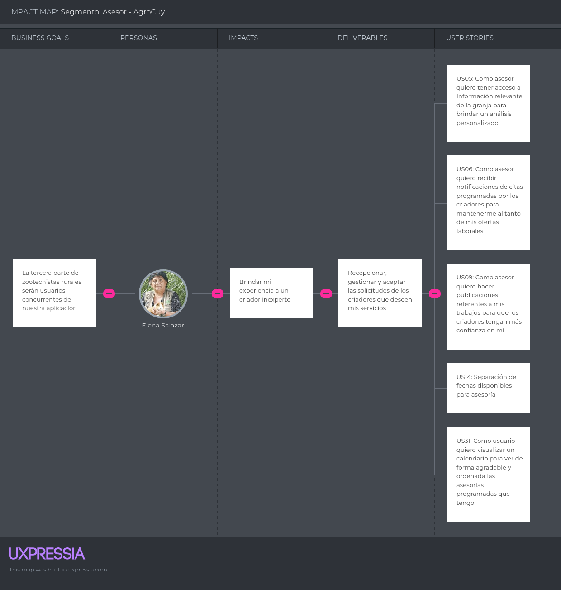

  

# **Universidad Peruana de Ciencias Aplicadas**
## Carrera de Ingeniería de Software

Ciclo: 2025 - 10

Curso: 1ASI0572 Desarrollo de Soluciones IoT

NRC: 2968

Profesor: León Baca, Marco Antonio

“Informe de Trabajo Final"

Startup: AgroTech

Producto: AgroCuy

Grupo: 4

|          Integrantes          |      Código      |
|:-----------------------------:|:-------------------:|
|   Cuadros Rodriguez, Juan Alejandro    |    u20221a359    |
|   Fiorella Jarama Peñaloza    |   u202120418  |
|  Lucas Coronel, Nadia Alessandra   |    U202120430    |
|   Moreno Vergara, Johan Raúl  |    u20201c105    |
|  Ramirez Mendez, Sebastian Andre   |    u20191e575    |

Abril 2025 

---

## Registro de Versiones Del Informe

## Project Report Collaboration Insights

### **Reporte de colaboración de la entrega del TB1:**

------

# Contenido
## Capítulo I: Introducción 

## 1.1. Startup Profile

### 1.1.1. Descripción de la Startup

AgroTech nace con el objetivo de facilitar y modernizar la crianza de cuyes en el Perú, mediante la implementación de tecnologías IoT que automatizan y optimizan los procesos clave dentro de los criaderos. A través de nuestra aplicación AgroCuy, brindamos a los pequeños y medianos criadores una herramienta tecnológica que les permite gestionar, monitorear y controlar su producción desde cualquier lugar y en tiempo real, utilizando sus dispositivos móviles o computadoras.

La solución propuesta por AgroTech integra funcionalidades como alimentación automatizada, monitoreo ambiental con sensores de temperatura, humedad y gases, control de calidad del agua y riego automatizado. Esto permite a los usuarios garantizar un entorno saludable para los cuyes, mejorar su bienestar, reducir riesgos y aumentar la eficiencia operativa de sus granjas.

**Misión:**

Optimizar la crianza de cuyes en el Perú mediante herramientas avanzadas de automatización y monitoreo. De esta manera, contribuir al desarrollo sostenible de la producción ganadera y al bienestar animal a través de soluciones tecnológicas accesibles.

**Visión:**

Ser la plataforma tecnológica más utilizada por criadores de cuyes en el país, promoviendo la innovación, eficiencia y sostenibilidad en el sector ganadero. Asimismo, consolidarnos como referentes en el uso de IoT en la crianza animal y expandirnos hacia otras especies en el futuro.

  

_Imagen 1. Logo de la aplicación AgroCuy_

### 1.1.2. Perfiles de integrantes del equipo

<table>
  <tr>
    <th>
      
    </th>
    <td valign="top">
      
<b>Ramírez Méndez, Sebastián André</b>

      

        Soy una persona entusiasta que disfruta colaborar en equipo, y me caracterizo por ser transparente en mis objetivos y en mi enfoque de trabajo. Me enorgullece la capacidad que tengo para complementar a mi equipo en áreas donde puedan necesitar apoyo. Mi pasión por mi carrera me impulsa a desafiar mis habilidades y aspirar a alcanzar todo su potencial.
      

    </td>
  </tr>
  <tr>
    <th>
      
    </th>
    <td valign="top">
      
<b>Apellidos, Nombres</b>

      

        Descripcion
      

    </td>
  </tr>
  <tr>
    <th>
      
    </th>
    <td valign="top">
      
<b>Lucas Coronel, Nadia Alessandra</b>

      

        Mi nombre es Nadia Alessandra Lucas Coronel y soy estudiante del sexto ciclo de la carrera de Ingeniería de Software. Me considero una persona entusiasta, perseverante y responsable. Cuento con conocimientos en SQL, C++, Python, HTML, CSS, JavaScript y metodologías ágiles. Me comprometo a aplicar mis conocimientos de manera efectiva para contribuir al desarrollo de soluciones de software de alta calidad.
      

    </td>
  </tr>
  <tr>
    <th>
      
    </th>
    <td valign="top">
      
<b>Apellidos, Nombres</b>

      

        Descripcion
      

    </td>
  </tr>
  <tr>
    <th>
      
    </th>
    <td valign="top">
      
<b>Apellidos, Nombres</b>

      

        Descripcion
      

    </td>
  </tr>
</table>

 

## 1.2. Solution Profile

### 1.2.1 Antecedentes y problemática

- **What:** El sector de la crianza de cuyes enfrenta desafíos en la gestión eficiente de las granjas, la falta de acceso a tecnologías adecuadas y la necesidad de mejorar el bienestar animal y la sostenibilidad de las prácticas agrícolas. 
- **Where:** Nos enfocaremos en todo el territorio nacional del Perú, especialmente en los departamentos donde se concentra la mayor parte del comercio y la actividad económica del país, y donde la crianza de cuyes es más prevalente
- **When:** Actualmente, el sector agropecuario se enfrenta a estos desafíos en la gestión de la crianza de cuyes. Con el crecimiento de la población en el país y la demanda de alimentos en aumento, se requiere una mayor eficiencia en la producción agrícola. Además, las preocupaciones ambientales y de bienestar animal están impulsando la necesidad de adoptar prácticas agrícolas más sostenibles y éticas.
- **Who:** AgroTech, como empresa líder en tecnología aplicada a la agricultura, asume la responsabilidad de liderar la innovación en la gestión de la crianza de cuyes. En este proceso, trabajamos en estrecha colaboración con expertos y asesores en la crianza de cuyes, quienes aportan su conocimiento especializado para desarrollar soluciones tecnológicas específicas y efectivas. Además, involucramos activamente a los criadores de cuyes, quienes son los beneficiarios directos de estas soluciones, asegurando que se adapten a sus necesidades y realidades específicas.
- **Why:** Para abordar estos desafíos y mejorar la gestión y productividad en la crianza de cuyes, garantizando el bienestar animal y promoviendo prácticas sostenibles en la industria agropecuaria. Además, se busca mejorar la rentabilidad de los agricultores y contribuir a la seguridad alimentaria peruana.
- **How:** Mediante el desarrollo de AgroCuy, una aplicación integral que combina asesoría especializada con herramientas IoT de automatización y monitoreo en tiempo real. Esta solución incluye: Sistemas de alimentación automatizada, con dispensadores controlados por horarios. Sensores ambientales IoT, que monitorean temperatura, humedad y gases como amoníaco y CO₂, garantizando un ambiente saludable. Sensores de calidad del agua, para asegurar una hidratación adecuada. Riego automatizado, que optimiza el uso de agua en función de las necesidades del entorno. Alertas y análisis predictivo, que permiten prevenir enfermedades y mejorar la toma de decisiones. Todo esto se controla desde dispositivos móviles o computadoras, permitiendo una gestión remota, inteligente y eficiente.
- **How much:** Se espera que AgroCuy tenga un impacto significativo en la optimización de las granjas de cuyes, elevando la productividad, reduciendo pérdidas por enfermedades y mejorando las condiciones de crianza. Esta innovación se alinea con los esfuerzos del Ministerio de Desarrollo Agrario y Riego (Midagri), que reportó un incremento del 20% en las crianzas de cuyes gracias a la adopción de nuevas tecnologías. Además, según datos del Midagri (2023), entre 2020 y 2021 se observó un crecimiento de 116 mil cuyes a nivel nacional, lo que evidencia una tendencia al alza en la producción. (Revisar [Anexo N°1: Gráfico de evolución de población de cuyes](#anexo-n1-gráfico-de-evolución-de-población-de-cuyes)). Nuestra aplicación busca responder a problemas comunes en el sector como la malnutrición, la falta de control sanitario y las malas condiciones ambientales, que afectan directamente la productividad de las granjas. (Revisar [Anexo N°2: Diagrama de problemas en la crianza de cuyes](#anexo-n2-diagrama-de-problemas-en-la-crianza-de-cuyes))

### 1.2.2 Lean UX Process.

#### 1.2.2.1. Lean UX Problem Statements.

***Problem Statement 1***

|Nuestro producto tiene como objetivo mejorar la gestión de granjas de cuyes en el Perú mediante soluciones IoT.|
| - |
|Hemos observado que los criadores de cuyes en Perú enfrentan dificultades para gestionar eficientemente sus granjas, debido a la falta de herramientas tecnológicas que les permitan monitorear variables críticas como temperatura, humedad o niveles de alimentación en tiempo real. Esto impacta negativamente en su productividad y en el bienestar de los animales|
|¿Podría nuestra aplicación AgroCuy, equipada con sensores IoT y sistemas de automatización, ayudar a los criadores de cuyes a mejorar la gestión de sus granjas y aumentar su productividad?|

***Problem Statement 2***

|Nuestro producto tiene como objetivo aumentar la rentabilidad de los criadores de cuyes en Perú a través del uso de tecnologías IoT.|
| - |
|Hemos observado que muchos criadores enfrentan pérdidas económicas por el mal uso de recursos como agua o alimento, y por la falta de detección temprana de enfermedades en sus animales.|
|¿Podría AgroCuy, mediante el uso de sensores inteligentes y alertas en tiempo real, ayudar a reducir costos operativos y mejorar la eficiencia, contribuyendo así a una mayor rentabilidad?|

***Problem Statement 3***

|Nuestro producto tiene como objetivo facilitar el acceso a mercados y mejorar la comercialización de los productos de cuy en Perú, apoyándose en tecnología IoT.|
| - |
|Hemos observado que muchos criadores de cuyes tienen poca trazabilidad de sus procesos de producción, lo que limita la confianza de los compradores y reduce sus oportunidades en el mercado formal.|
|¿Podría AgroCuy, al recopilar datos automatizados sobre las condiciones de crianza mediante sensores IoT, generar reportes que validen la calidad del producto y así ayudar a los criadores a acceder a nuevos mercados y mejorar su comercialización?|

#### 1.2.2.2. Lean UX Assumptions.

1. **¿Quién es el usuario?** 

   El usuario principal de nuestro producto es el criador de cuyes en Perú, particularmente aquellos que buscan modernizar sus métodos de crianza mediante la adopción de tecnologías innovadoras como el Internet de las Cosas (IoT). También forman parte del ecosistema otros actores clave como los trabajadores de las granjas que interactúan con los dispositivos IoT, los compradores que valoran la trazabilidad del producto, y los consumidores finales interesados en alimentos producidos bajo estándares de bienestar animal y sostenibilidad.

1. **¿Dónde encaja nuestro producto en su trabajo o vida?**

   AgroCuy se integra directamente en las actividades diarias del criador de cuyes, permitiéndole gestionar su granja de forma remota y automatizada gracias al uso de sensores y dispositivos IoT. Estos sensores monitorean en tiempo real parámetros vitales como temperatura, humedad, calidad del agua, y niveles de alimentación, enviando alertas y recomendaciones a través de la aplicación. Así, AgroCuy se convierte en un aliado constante del criador, brindándole mayor control, eficiencia y tranquilidad.

1. **¿Qué problemas tiene nuestro producto? ¿Resolver?**

   Actualmente, el producto está enfocado únicamente en la crianza de cuyes y aún no está adaptado para otros tipos de ganado. Sin embargo, AgroCuy aborda de forma precisa varios problemas comunes en la crianza de cuyes: 
   - Falta de monitoreo en tiempo real. 
   - Ineficiente uso de recursos como agua y alimento. 
   - Dificultad en la detección temprana de enfermedades. 
   - Gestión manual de registros de salud y reproducción. 
   - Bajo acceso a mercados y falta de trazabilidad. 
   Gracias al uso de IoT, nuestro producto ofrece una solución tecnológica completa que automatiza la supervisión de las granjas, mejora el bienestar animal, optimiza los recursos y reduce el impacto ambiental, mejorando así la rentabilidad y sostenibilidad del negocio.

1. **¿Cuándo y cómo es nuestro producto? ¿Usado?** 

   AgroCuy será utilizado diariamente por los criadores de cuyes a través de sus dispositivos móviles o computadoras. Los sensores instalados en las granjas estarán en funcionamiento continuo, recolectando datos y enviándolos a la plataforma en tiempo real. De esta manera, el usuario podrá recibir notificaciones instantáneas, visualizar reportes gráficos, y tomar decisiones informadas en cualquier momento y desde cualquier lugar con conexión a internet.

1. **¿Qué características son importantes?**

   Monitoreo ambiental con IoT: Sensores que registran condiciones como temperatura, humedad, y calidad del agua, esenciales para la salud de los cuyes.

   Alertas inteligentes: Notificaciones automáticas en caso de condiciones anómalas o necesidades de intervención.

   Análisis predictivo: Algoritmos que, con base en los datos recolectados por sensores, brindan recomendaciones personalizadas para optimizar la nutrición, salud y reproducción de los cuyes.

   Gestión automatizada: Herramientas para registrar automáticamente eventos como alimentación, vacunación, o mortalidad, evitando el uso de formatos físicos.

   Conexión con mercados: Trazabilidad basada en datos, que mejora la confianza del consumidor y abre nuevas oportunidades comerciales.

1. **¿Cómo debe verse nuestro producto y cómo comportarse?**

   AgroCuy debe tener una interfaz intuitiva y adaptable a distintos niveles de alfabetización digital, con visualizaciones claras de los datos que recogen los sensores IoT. El diseño debe ser limpio, atractivo y centrado en la experiencia del usuario. El sistema debe comportarse de forma fluida, con actualizaciones en tiempo real, alertas precisas y navegación sencilla. Además, debe garantizar altos estándares de seguridad para proteger tanto los datos de los usuarios como la información recopilada por los sensores.

#### 1.2.2.3. Lean UX Hypothesis Statements.

**Hypothesis Statement 1**

|Creemos que al proporcionar a los criadores de cuyes en Perú acceso a tecnologías avanzadas de Internet de las Cosas (IoT) y asesoramiento especializado a través de nuestra plataforma AgroCuy, mejorarán la eficiencia y la rentabilidad de sus granjas al optimizar el monitoreo ambiental y la salud animal.|
| - |
|Sabremos que esto es cierto…|
|Cuando se aprecie un incremento del 20% en la cantidad de solicitudes de asesorías relacionadas con el uso de sensores IoT y sistemas automatizados de alimentación durante los primeros 6 meses de lanzamiento.|

**Hypothesis Statement 2**

|Creemos que al promover prácticas agrícolas sostenibles y éticas en la crianza de cuyes en Perú mediante el monitoreo constante de los recursos a través de IoT, los criadores adoptarán un enfoque más responsable con el medio ambiente y mejorarán la calidad de vida de los cuyes.|
| - |
|Sabremos que esto es cierto…|
|Cuando proporcionemos recursos específicos sobre prácticas sostenibles apoyadas por el análisis de datos en tiempo real proporcionados por los sensores IoT, y evaluemos la adopción de estas prácticas por parte de los criadores, viendo un aumento del 15% en la implementación de prácticas sostenibles en el uso de agua, alimentación automatizada y calidad del aire dentro de los primeros 6 meses de lanzamiento.|

**Hypothesis Statement 3**

|Creemos que al facilitar el acceso a mercados y mejorar la comercialización de los productos de cuy en Perú, mediante la trazabilidad y calidad certificada proporcionada por el monitoreo IoT, los criadores aumentarán sus ventas y expandirán sus negocios.|
| - |
|Sabremos que esto es cierto…|
|Cuando los datos de trazabilidad y calidad de los productos de cuy generados a través de los dispositivos IoT sean utilizados para establecer conexiones con compradores y mercados, y evaluemos el impacto en las ventas de los criadores mediante un aumento del 25% en las ventas en los primeros 6 meses de uso de la aplicación.|

**Hypothesis Statement 4**

|Creemos que al ofrecer soluciones IoT que mejoren la gestión diaria de las granjas, los criadores podrán monitorear en tiempo real el estado de sus operaciones y obtener asesorías más personalizadas, lo que les permitirá aumentar la productividad y eficiencia.|
| - |
|Sabremos que esto es cierto…|
|Cuando se observe un aumento del 20% en el número de criadores que implementan sistemas de monitoreo IoT, como sensores de temperatura, humedad y salud animal, dentro de los primeros tres meses tras el lanzamiento. Además, mediremos la retroalimentación de los usuarios mediante encuestas regulares, y consideraremos que hemos tenido éxito si al menos el 70% de las respuestas son positivas en relación con la experiencia de uso y la mejora en la gestión de la granja.|

#### 1.2.2.4. Lean UX Canvas.

_Imagen 2. Lean UX Canvas_

## 1.3. Segmentos objetivo

Por el lado de los asesores, hemos considerado que estos tendrán experiencia en el campo y/o estudios universitarios en carreras como ingeniería agrónoma, medicina veterinaria, zootecnia, etc. Debido a que el plan de estudios de estas carreras es de mínimo 5 años a más, y necesitan cierto grado de experiencia para dar recomendaciones y planes de acción confiables, hemos decidido que el rango de edad será de 25 años hasta 65 años.

Los asesores tendrán el conocimiento necesario para implementar y utilizar tecnologías avanzadas como sensores IoT, sistemas automatizados de alimentación y monitoreo de salud animal, así como plataformas de gestión de datos. Ellos proporcionarán a los criadores de cuyes las herramientas para analizar información en tiempo real y realizar recomendaciones basadas en datos IoT, mejorando la productividad y eficiencia de las granjas.

Según el Ministerio de Desarrollo Agrario y Riego (2023), la crianza de cuyes es una alternativa para la generación de ingresos monetarios para más de 800,000 familias agrarias en el Perú, las cuales se ubican en su mayoría en la sierra del país. El consumo de carne de cuy se ha mantenido en el tiempo e incluso ha trascendido al mercado externo. Esta información destaca la importancia de los asesores en la crianza de cuyes, ya que su conocimiento y orientación, apoyados por tecnologías como el IoT, pueden ser fundamentales para el éxito y la sostenibilidad de los productores en este sector.

|**Segmento objetivo**|Asesores |
| :- | :- |
|**Edad**|25-65 años|
|**Ubicación**|Perú|
|**Sexo**|Masculino y Femenino|
|**Formación educativa**|Universitario o cualquier educación superior|
|**Poder adquisitivo**|Bajo, medio y alto|
|**Tecnologia Utilizada**|Uso de plataformas IoT para monitoreo y análisis de datos, sensores inteligentes para salud animal y gestión eficiente de recursos, asesoramiento basado en datos recolectados en tiempo real.|

Para delimitar el segmento objetivo de criadores de cuyes, nos basamos en el diagnóstico situacional de la crianza de cuyes en Cajamarca realizado en julio de 2004. Dicho diagnóstico menciona que el 44.6% de los productores tenían más de 50 años, sus esposas que conducían la crianza de cuyes tenían entre 31 a 50 años. Además, los hijos que vivían con los padres tenían entre 6 a 17 años. Por lo tanto, para el rango de edad de los criadores decidimos seleccionar desde los 18 años de edad hasta los 60 años para abarcar tanto a los padres que manejan la crianza como a los hijos mayores de edad que la apoyan.

El mismo diagnóstico señala que el grado de instrucción predominante en la familia es de educación primaria con un 65.6%, lo cual tomaremos en cuenta.

Los criadores de cuyes estarán cada vez más dispuestos a integrar tecnologías avanzadas como el Internet de las Cosas (IoT) para optimizar la gestión de sus granjas. A través de sensores IoT, podrán monitorear en tiempo real aspectos como la calidad del agua, la temperatura y la humedad dentro de las instalaciones, lo que les permitirá hacer ajustes automáticos para mejorar el ambiente y el bienestar de los cuyes. Esto, junto con el uso de dispositivos para controlar la alimentación y otros parámetros, les dará herramientas efectivas para aumentar su eficiencia y rentabilidad.

|**Segmento objetivo**|Criadores de cuyes|
| :- | :- |
|**Edad**|18-60 años|
|**Ubicación**|Perú|
|**Sexo**|Masculino y Femenino|
|**Formación educativa**|Educación primaria|
|**Poder adquisitivo**|Bajo y medio|
|**Tecnologia Utilizada**|Sensores IoT para monitoreo ambiental (temperatura, humedad, calidad del aire), dispositivos automatizados para alimentación, control remoto de las operaciones y plataformas móviles para gestionar la granja de manera eficiente.|

## Capítulo II: Requirements Elicitation & Analysis
## Capítulo III: Requirements Specification

### 3.1. To-Be Scenario Mapping  
**Segmento: Asesor**  
 

| **Phases** | **Registro y personalización del perfil** | **Revisión del estado de la granja** | **Comunicación con el criador** | **Asesoramiento remoto** |
| :- | :- | :- | :- | :- |
| **Doing** | - Ingreso a la app “AgroCuy” y me registro como asesor especializado. - Personalizo mi perfil con experiencia, especialidades y horarios disponibles para asesorías. | - Accedo al dashboard del criador para revisar en tiempo real el estado del agua, temperatura, humedad y dispensadores de comida en cada jaula. - Verifico alertas activas generadas por el sistema de monitoreo. | - Recibo una solicitud de asesoría del criador junto a las alertas y el estado de su granja. - Le escribo dentro de la misma app para coordinar una videollamada. | - Realizo la videollamada programada directamente desde AgroCuy. - Le doy recomendaciones con base en los datos que observé previamente. - Sugiero acciones para mejorar la crianza según lo monitoreado. |
| **Thinking** | "Qué útil que pueda mostrar mi experiencia desde el inicio." | "Puedo tener una visión clara de lo que pasa en la granja sin estar presente." | "Todo lo que necesito para comunicarme con el criador está en la misma app." | "El monitoreo en tiempo real me permite dar asesorías más precisas y útiles." |
| **Feeling** | 
- Seguro de que los criadores verán mi perfil y querrán contactarme.

- Orgulloso de mostrar mis logros en el área.
 | 
- Confiado por poder detectar problemas sin tener que estar físicamente en la granja.

- Tranquilo gracias a los datos que ya están organizados.
 | 
- Cómodo porque la app me facilita la coordinación.

- Satisfecho al ver que el criador puede explicarme su situación con datos.
 | 
- Orgulloso de brindar soluciones efectivas desde cualquier lugar.

- Inspirado al ver cómo la tecnología mejora mi labor como asesor.
 |

## 3.1. To-Be Scenario Mapping  
**Segmento: Criadores**  
 

| **Phases** | **Instalación y Configuración Inicial** | **Monitoreo del estado de la granja** | **Consulta con el asesor** | **Seguimiento continuo** |
| :- | :- | :- | :- | :- |
| **Doing** | - Instalo la app “AgroCuy” y configuro los sensores en cada jaula. - Registro las jaulas, cuyes por jaula, tipo de alimentación y horarios de dispensadores. | - Reviso en tiempo real desde la app el estado del agua, temperatura y comida de cada jaula. - Recibo alertas si falta agua, está contaminada o si hay condiciones fuera del rango ideal. | - Solicito asesoría con un técnico disponible desde la sección de “Consultas”. - Envío automáticamente los datos recolectados por los sensores al asesor. | - Aplico las recomendaciones dadas por el asesor. - Continúo revisando el estado diario de mi granja desde la app. - Reprogramo videollamadas si vuelven a surgir alertas. |
| **Thinking** | "Qué útil que la app me ayude desde el inicio a organizar mis jaulas y sensores." | "Es genial ver todo el estado de mi granja desde el celular, sin tener que estar entrando a cada jaula." | "Puedo obtener ayuda personalizada y rápida gracias a que el asesor ve lo mismo que yo." | "Con esta app puedo llevar un control constante y profesional sin ser un experto." |
| **Feeling** | 
- Motivado al ver que puedo automatizar partes importantes de mi granja.

- Seguro al configurar sensores correctamente.
 | 
- Tranquilo al ver que todo está bajo control o cuando se me alerta a tiempo.

- Confiado en que tengo visibilidad de lo que pasa con mis cuyes.
 | 
- Satisfecho de poder contactar a un asesor y recibir consejos sin salir de casa.

- Agradecido por el soporte que tengo en tiempo real.
 | 
- Comprometido a seguir mejorando mi crianza.

- Contento de ver resultados positivos gracias al monitoreo y el acompañamiento técnico.
 |

## 3.2. User Stories

Se identificaron las siguientes épicas que se componen de las historias de usuario, ahora con foco en el monitoreo de la granja de cuyes.

<table> <tr><th><b>Epic ID</b></th><th><b>Epic</b></th><th><b>User story ID</b></th><th><b>User stories</b></th></tr> <tr><td rowspan="10"><b>E01</b></td><td rowspan="10">Sistema de búsqueda y programación de citas con asesores y calificaciones</td><td>US01</td><td>Visualización del catálogo de asesores</td></tr> <tr><td>US02</td><td>Visualización de información de un asesor</td></tr> <tr><td>US03</td><td>Visualización de horarios de asesores</td></tr> <tr><td>US04</td><td>Programación de citas con asesores</td></tr> <tr><td>US05</td><td>Visualización de información del criador de cuyes</td></tr> <tr><td>US06</td><td>Notificación de citas al asesor</td></tr> <tr><td>US07</td><td>Notificación de citas al criador</td></tr> <tr><td>US08</td><td>Calificación al asesor luego de una cita</td></tr> <tr><td>US14</td><td>Separación de fechas disponibles para asesoría</td></tr> <tr><td>US31</td><td>Visualización de calendario</td></tr><tr><td rowspan="2"><b>E02</b></td><td rowspan="2">Publicaciones en la aplicación</td><td>US09</td><td>Gestión de publicaciones de asesores</td></tr> <tr><td>US10</td><td>Visualización de publicaciones de los asesores</td></tr><tr><td rowspan="3"><b>E03</b></td><td rowspan="3">Sistema integral de registro y seguimiento animal</td><td>US11</td><td>Gestión de jaulas de cuyes</td></tr> <tr><td>US12</td><td>Registro de información de animales</td></tr> <tr><td>US13</td><td>Visualización y edición de información de animales</td></tr> <tr><td rowspan="2"><b>E04</b></td><td rowspan="2">Gestión de granja</td><td>US15</td><td>Gestión de recursos de la granja</td></tr> <tr><td>US16</td><td>Gestión de gastos realizados</td></tr> <tr><td rowspan="2"><b>E05</b></td><td rowspan="2">Eficiencia y seguridad de aplicación</td><td>US17</td><td>Seguridad de información</td></tr> <tr><td>US18</td><td>Disponibilidad y confiabilidad</td></tr> <tr><td rowspan="3"><b>E06</b></td><td rowspan="3">Registro, acceso a la aplicación y datos personales</td><td>US19</td><td>Registro de un usuario nuevo</td></tr> <tr><td>US20</td><td>Inicio de sesión</td></tr> <tr><td>US21</td><td>Recuperación de contraseña</td></tr> <tr><td rowspan="6"><b>E07</b></td><td rowspan="6">Visualización de una Landing Page estática</td><td>US22</td><td>Visualización de Navbar y Footer</td></tr> <tr><td>US23</td><td>Visualización de sección de inicio</td></tr> <tr><td>US24</td><td>Visualización de sección “Acerca De”</td></tr> <tr><td>US25</td><td>Visualización de sección “Sobre Nosotros”</td></tr> <tr><td>US26</td><td>Visualización de sección “Características”</td></tr> <tr><td>US27</td><td>Visualización de sección “Contacto”</td></tr> <tr><td rowspan="7"><b>E08</b></td><td rowspan="7">Funcionalidades con APIs</td><td>US28</td><td>Uso de un API para videollamadas</td></tr> <tr><td>US29</td><td>Uso de un API para alojar imágenes</td></tr> <tr><td>US32</td><td>Uso de nuestra API para gestionar usuarios</td></tr> <tr><td>US33</td><td>Uso de nuestra API para manejar recursos y gastos</td></tr> <tr><td>US34</td><td>Uso de nuestra API para manejar la reserva de citas entre asesores y criadores</td></tr> <tr><td>US35</td><td>Uso de nuestra API para manejar las jaulas y animales</td></tr> <tr><td>US36</td><td>Integración con API para monitorear sensores de granja (IoT)</td></tr> <tr><td rowspan="7"><b>E09</b></td><td rowspan="7">Monitoreo inteligente mediante IoT</td><td>US37</td><td>Recepción de alertas cuando los parámetros ambientales (temperatura, humedad, CO₂, agua) exceden los rangos aceptables.</td></tr> <tr><td>US38</td><td>Visualización de gráficas históricas de parámetros ambientales para análisis de comportamiento.</td></tr> <tr><td>US39</td><td>Configuración personalizada por el criador de los rangos aceptables de temperatura, humedad, nivel de CO₂ y estado del agua.</td></tr><tr><td>US40</td><td>Detección automática de agua en mal estado o escasez, con alertas para el criador.</td></tr> <tr><td>US41</td><td>Activación y programación de dispensación automática de alimento en horarios establecidos.</td></tr>
<tr><td>US42</td><td>Alerta de necesidad de limpieza cuando se detecta un nivel alto de CO₂ o condiciones desfavorables.</td></tr> </table>

|**Epic / Story ID**|**Título**|**Descripción**|**Criterios de Aceptación**|**Relacionado con (Epic ID)**|
| :- | :- | :- | :- | :- |
|US01|Visualización del catálogo de asesores|**Como** criador de cuyes **quiero** explorar un catálogo de asesores **para** conocer quiénes me pueden apoyar con asesorías|
**Escenario 1: Explorar catálogo de asesores**

**Given** el criador quiere explorar el catálogo de asesores.

**And** se encuentra en el apartado de “Asesores”.

**When** seleccione el botón “Catálogo de asesores”.

**Then** el sistema le mostrará una lista de todos los asesores disponibles en la aplicación.

**Escenario 2: Filtrar búsqueda de asesores**

**Given** el criador quiere personalizar su búsqueda.

**And** se encuentra en el apartado de “Asesores”.

**When** seleccione el botón de filtros.

**Then** el sistema** le permitirá filtrar el catálogo de asesores por ubicación, experiencia o reputación.

**Escenario 3: Ver mis asesores**

**Given** el criador desea ver los asesores a los que les solicitó un servicio para recibir una mentoría.

**And** se encuentra en el apartado de “Asesores”.

**When** haga clic en el botón “Mis Asesores”

**Then** el sistema le mostrará una lista de todos los asesores a los que ha solicitado una cita.
|E01|
|US02|Visualización de información de un asesor|**Como** criador de cuyes **quiero** ver la información de un asesor **para** tomar una decisión informada antes de separar una cita|
**Escenario 1: Ver información de un asesor** 

**Given** el criador quiere ver información de un asesor.

**And se** encuentra en el apartado de “Asesores”.

**When** seleccione al cuadro de un asesor.

**Then** el sistema le mostrará la información del asesor como nombre, experiencia, calificación y reseñas.

**Escenario 2: Fallar al visualizar la información del asesor**

**Given** el criador quiere ver información relevante del asesor.

**And se** encuentra en el apartado de “Asesores”

**When** seleccione al cuadro de un asesor.

**And** se encuentre con un error al cargar la información.

**Then** el sistema le mostrará un mensaje de error de carga.
|E01|
|US03|Visualización de horarios de asesores|**Como** criador de cuyes **quiero** ver los horarios disponibles de los asesores **para** seleccionar un horario que se ajuste a mi agenda.|
**Escenario 1: Visualizar horarios disponibles**

**Given** el criador desea visualizar los horarios disponibles de un asesor elegido.

**And** se encuentra viendo la información del perfil de un asesor.

**When** haga clic en el botón “Reservar Cita”

**Then** el sistema le mostrará una interfaz con los horarios disponibles del asesor

**Escenario 2: Fallar al intentar visualizar horarios.**

**Given** el criador desea visualizar los horarios disponibles del asesor elegido.

**And** se encuentra viendo la información del perfil de un asesor.

**When** haga clic en el botón “Reservar Cita”

**And** el asesor no tenga horarios disponibles

**Then** el sistema le mostrará un mensaje de error “El asesor no tiene horarios disponibles”.
|E01|
|US04|Programación de citas con asesores|**Como** criador de cuyes **quiero** programar una cita con un asesor **para** recibir orientación personalizada sobre la crianza de cuyes|
**Escenario 1: Programar cita**

**Given** el criador desea programar una cita.

**And** se encuentra en el apartado de “Horarios Disponibles” del perfil de un asesor.

**When** seleccione un horario disponible

**And** complete los campos solicitados.

**And** haga clic en el botón “Reservar Cita”

**Then** el sistema le mostrará un mensaje de confirmación.

**Escenario 2: Fallar al programar cita**

**Given** el criador desea programar una cita.

**And** se encuentra en el apartado de “Horarios Disponibles” del perfil de un asesor.

**When** seleccione un horario disponible

**And** se encuentra un error técnico o de conexión que impide completar la programación.

**Then** el sistema le mostrará un mensaje de error sugiriendo contactar con soporte.
|E01|
|US05|Visualización de información del criador de cuyes|**Como** asesor **quiero** tener información de la granja del criador de cuyes **para** planificar los temas de la asesoría|
**Escenario 1: Ver información del criador**

**Given** el asesor desea ver información del criador de cuyes con el que tendrá una asesoría

**And** se encuentra en la sección de “Mis Citas” .

**And** observa que tiene una cita programada con un criador.

**When** haga clic en la card de la cita.

**Then** el sistema le permitirá ver información de la granja del criador como número de jaulas y número de cuyes, como también información del criador como nombre, edad y localización.

**Escenario 2: Fallar al acceder a la información del criador**

**Given** el asesor desea ver información del criador de cuyes con el que tendrá una asesoría

**And** se encuentra en la sección de “Mis Citas” .

**And** observa que tiene una cita programada con un criador.

**When** haga clic en la card de la cita.

**And** se encuentre con un error al cargar la información.

**Then** el sistema le mostrará un mensaje de error indicando que hubo un error de carga.
|E01|
|US06|Notificación de citas al asesor|**Como** asesor**, quiero** recibir notificaciones de citas programadas por los criadores **para** mantenerme al tanto de mis ofertas laborales.|
**Escenario 1: Ver notificaciones de cita programadas por criadores**

**Given** el asesor desea ver sus notificaciones de citas programadas.

**When** se encuentre en el apartado de “Notificaciones”

**Then** el sistema le mostrará un mensaje que describe brevemente la solicitud.

**Scenario 2: Aceptar notificación de cita programada con el criador**

**Given** que el asesor decide cerrar la notificación para liberar espacio y permitir la visualización de otras notificaciones.

**And** se encuentra en la sección de "Notificaciones" del sistema.

**When** haga clic en el botón "Aceptar" dentro de la notificación correspondiente a la cita programada con el criador.

**Then** el sistema eliminará la notificación de la lista.
|E03|
|US07|Notificación de citas al criador|**Como** criador de cuyes **quiero** recibir notificaciones referentes al estado de mis citas **para** mantenerme al tanto de las asesorías que he solicitado.|
**Escenario 1: Ver notificaciones de cita programadas con los asesores**

**Given** el criador desea ver sus notificaciones de citas programadas.

**When** se encuentre en el apartado de “Notificaciones”

**Then** el sistema le mostrará un mensaje que describe brevemente la solicitud.

**Scenario 2: Aceptar notificación de cita programada con el asesor**

**Given** que el criador decide cerrar la notificación para liberar espacio y permitir la visualización de otras notificaciones.

**And** se encuentra en la sección de "Notificaciones" del sistema.

**When** haga clic en el botón "Aceptar" dentro de la notificación correspondiente a la cita programada con el asesor.

**Then** el sistema eliminará la notificación de la lista de notificaciones.

|E01|
|US08|Calificación del asesor luego de una cita|**Como** criador de cuyes **quiero** calificar al asesor luego de la consulta **para** ayudar a otros criadores a tomar una decisión informada antes de separar una cita.|
**Escenario 1: Calificar al asesor**

**Given** el criador desea hacer un feedback referente al servicio del asesor.

**And** se encuentra en la vista de calificación del servicio.

**When** haga clic en el botón “Calificar Servicio”

**Then** el sistema le permitirá asignarle un número de estrellas y reseñar el servicio del asesor.

**Escenario 2: Omitir Calificación**

**Given** el criador no desea dar feedback al asesor referente al servicio.

**And** se encuentra en la vista de calificación del servicio.

**When** haga clic en el botón “Omitir calificación”

**Then** el sistema le permitirá omitir la reseña.
|E01|
|US09|Gestión de publicaciones de asesores|**Como** asesor **quiero** hacer publicaciones referentes a mis trabajos **para** que los criadores tengan más confianza en mí.|
**Escenario 1: Crear una nueva publicación**

**Given** el asesor desea crear una publicación.

**And** está en el apartado de "Mis Publicaciones".

**When** hace clic en el botón "Crear Publicación" de la Sidebar.

**Then** se le redirige a un formulario donde puede ingresar el contenido de su nueva publicación.

**And** después de completar el contenido, hace clic en el botón "Publicar".

**Then** el sistema le mostrará un mensaje de confirmación.

**Escenario 2: Editar una publicación existente**

**Given** el asesor desea editar una publicación existente.

**And** está en el apartado de "Mis Publicaciones" de la Sidebar.

**And** tiene una publicación previamente creada.

**When** selecciona la opción de editar en la publicación que desea modificar.

**Then** se le redirige al formulario de edición donde puede modificar el contenido de la publicación.

**And** después de realizar los cambios deseados, hace clic en el botón "Guardar Cambios".

**Then** el sistema le mostrará un mensaje de confirmación y los cambios se reflejan en la publicación actualizada.

**Escenario 3: Eliminar una publicación existente**

**Given** el asesor desea eliminar una publicación existente.

**And** está en el apartado de "Mis Publicaciones" de la Sidebar.

**And** tiene una publicación previamente creada.

**When** selecciona la opción de eliminar en la publicación que desea borrar.

**Then** el sistema le mostrará un mensaje de confirmación solicitando la confirmación de la eliminación.

**And** después de confirmar, la publicación se elimina de su perfil y ya no está disponible para los criadores.
|E02|
|US10|Visualización de publicaciones de los asesores|**Como** criador de cuyes **quiero** poder ver las publicaciones de la comunidad de asesores **para** obtener información útil y, si es necesario, solicitar asesoramiento en base a esas publicaciones.|
**Escenario 1: Visualizar publicaciones de asesores**

**Given** el criador desea ver las publicaciones de la comunidad

**When** haga clic en el botón “Publicaciones” de la Sidebar.

**Then** el sistema le mostrará una lista de las últimas publicaciones de la comunidad de asesores.
|E02|
|US11|Gestión de jaulas de cuyes|**Como** criador de cuyes **quiero** poder registrar una jaula en la plataforma **para** poder almacenar y gestionar mis cuyes de manera efectiva, garantizando su seguridad y bienestar.|
**Escenario 1: Registro exitoso de la jaula**

**Given** que el criador desea registrar su galón.

**And** se encuentra en el apartado "Mis Animales".

**When** haga clic en el botón "Registrar Jaula".

**And** completa el formulario con la información requerida de la jaula.

**And** hace clic en el botón "Registrar".

**Then** el sistema le mostrará un mensaje del registro exitoso de la jaula.

**Escenario 2: Eliminar jaula**

**Given** que el criador desea eliminar su galón.

**And** se encuentra en el apartado "Mis Animales".

**When** haga clic en el botón "Borrar" de la jaula deseada.

**Then** el sistema le mostrará un mensaje de confirmación solicitando la confirmación de la eliminación.

**And** después de confirmar, la jaula se elimina.
|E03|
|US12|Registro de información de animales|**Como** criador de cuyes **quiero** contar con un sistema de registro de animales **para** almacenar información básica sobre cada animal, incluyendo su número de identificación, nombre, raza, género, peso y fecha de nacimiento.|
**Escenario 1: Registrar un nuevo animal**

**Given** el criador desea registrar un cuy en su galpón.

**And** se encuentra en la jaula deseada

**When** haga clic en el botón ”Nuevo cuy”

**And** ingresa la información básica del animal, incluyendo su número de identificación, número de galpón, raza, género y fecha de nacimiento.

**And** haga clic “Registrar”

**Then** el sistema le mostrará una confirmación del registro.

**Escenario 2: Fallar en el registro de animal**

**Given** el criador desea registrar un cuy en su galpón.

**And** se encuentra en la jaula deseada

**When** haga clic en el botón ”Nuevo cuy”

**And i**ntenta ingresar la información del animal pero deja en blanco algunos campos obligatorios para el registro**.**

**And** haga clic “Registrar”.

**Then** el sistema le mostrará un mensaje de error.
|E03|
|US13|Visualización y edición de información de animales|**Como** criador de cuyes **quiero** acceder a la información de un animal **para** visualizar o actualizar su información registrada.|
**Escenario 1: Visualizar la información de un animal registrado**

**Given** el criador tiene varios cuyes registrados en la aplicación y desea visualizar la información de uno en específico.

**And** se encuentra en el apartado de “Mis Animales”

**When** haga clic en “Ver” de una jaula

**And** seleccione el card de un cuy  específico.

**Then** el sistema le mostrará la información detallada del cuy.

**Escenario 2: Actualizar información de un animal registrado**

**Given** el criador tiene varios cuyes registrados en la aplicación y desea editar la información de uno en específico.

**And** se encuentra viendo la información detallada de un cuy 

**When** haga clic en “Editar”

**And** realiza cambios en la información del cuy.

**Then** el sistema actualizará la información detallada del cuy.

|E03|
|US14|Separación de fechas disponibles para asesoría|**Como** asesor, **quiero** poder seleccionar y separar las fechas y horas en las que estoy disponible para ofrecer asesorías **para** que los usuarios interesados puedan ver mis horarios disponibles y agendar una cita en un momento conveniente.|
**Escenario 1: Registrar disponibilidad para asesorías**

**Given** el asesor desea registrar sus fechas y horas disponibles para asesorías.

**And**  está visualizando la página de "Horario disponible"

**When** haga clic en el botón “Registrar nueva fecha”

**And**  complete los datos del nuevo horario disponible que tiene el asesor

**Then** el sistema actualizará y guardará las fechas y horas seleccionadas como disponibles.

**Escenario 2: Eliminar horario de disponibilidad para asesorías**

**Given** el asesor desea eliminar un horario de disponibilidad para asesorías

**And** está visualizando la página de "Horario disponible"

**When** haga clic en el botón “Eliminar” junto al horario que desea eliminar

**And** confirme la eliminación del horario

**Then** el sistema actualizará y eliminará el horario de disponibilidad seleccionado

|E01|
|US15|Gestión de recursos de la granja|**Como** criador de cuyes **quiero** registrar el inventario de mi granja **para** tener un control sobre los recursos esenciales como alimentos y medicamentos.|
**Escenario 1: Registrar de nuevo ingreso de recursos en el inventario**

**Given** el criador ha recibido el pedido de recursos por parte del proveedor y desea registrar esto en su inventario.

**And** se encuentra en el apartado de “Mi Granja” de la Sidebar.

**And** ingresa a la sección de “Gestión de Recursos” del apartado de “Mi Granja”.

**When** haga clic en el botón “Nuevo Recurso”

**And** ingresa los detalles de nombre y tipo de recurso, fecha, cantidad y observación.

**Then** el sistema mostrará una confirmación.

**Escenario 2: Ver recursos**

**Given** el criador desea ver los recursos que posee.

**And** se encuentra en el apartado de “Mi Granja” de la Sidebar.

**When** haga clic en el botón “Gestión de Recursos”.

**Then** el sistema le permitirá visualizar sus recursos que incluyen datos como el nombre del recurso, el tipo de recurso (alimento, medicina, cultivo u otro) y la fecha en el que fue registrado este recurso.

**Escenario 2: Filtrar recursos**

**Given** el creador desea ver un recurso de un tipo en específico.

**And** se encuentra en la sección de “Gestión de Recursos”del apartado de “Mi Granja”.

**When** seleccione el tipo de recurso que sea filtrar (todos, alimento, medicina, cultivo)

**And** haga clic en el botón “Filtrar”

**Then** el sistema le mostrará una lista de todos los recursos que pertenezcan a ese tipo.

**Escenario 3: Editar recurso**

**Escenario 4: Eliminar recurso**
|E04|
|US16|Gestión de gastos realizados|**Como** criador de cuyes **quiero** registrar gastos relacionados con mi negocio **para** tener un control y poder tomar decisiones financieras que serán útiles para tener una mejor rentabilidad.|
**Escenario 1: Registrar gasto**

**Given** el criador desea registrar los gastos que ha realizado.

**And** se encuentra en el apartado de “Mi Granja” de la Sidebar.

**And** ingresa a la sección de “Gestión de Gastos”del apartado de “Mi Granja”.

**When** haga clic en el botón “Nuevo Gasto”

**And** ingrese datos como el precio, tipo de gasto, fecha y demás campos.

**Then** el sistema registrará correctamente los detalles del gasto.

**Escenario 2: Ver gasto registrado**

**Given** el criador desea ver un gasto ya registrado.

**And** se encuentra en el apartado de “Mi Granja” de la Sidebar.

**When** haga clic en el botón “Gestión de gastos”

**Then** el sistema le permitirá visualizar sus gastos.

**Escenario 3: Filtrar gasto**

**Given** el criador desea ver un recurso de un tipo en específico.

**And** se encuentra en la sección de “Gestión de Gastos”del apartado de “Mi Granja”.

**When** seleccione el tipo de gasto que desea filtrar (todos, salud, alimento, Mantenimiento de criadero)

**And** haga clic en el botón “Filtrar”

**Then** el sistema le mostrará una lista de todos los recursos que pertenezcan a ese tipo.

**Escenario 3: Editar gasto**

**Escenario 4: Eliminar gasto**
|E04|
|US17|Seguridad de información|**Como** usuario **quiero** que la aplicación cumpla con los estándares de seguridad **para** proteger mi información registrada.|
**Escenario 1: Registro de un nuevo usuario con verificación de seguridad (sign-up)**

**Dado que** el usuario desea registrarse

**Cuando** el sistema recibe una solicitud POST con los datos del nuevo usuario a la API

**Entonces** se registrará el nuevo usuario

**Y** brindará respuesta a la petición realizada

**Escenario 2: Inicio de sesión del usuario con verificación de seguridad exitoso (sign-in)**

**Dado** que el usuario desea iniciar sesión de forma segura

**Cuando** el sistema recibe una solicitud POST con las credenciales de inicio de sesión del usuario (correo electrónico y contraseña) a la API

**Entonces** se verificarán las credenciales

**Y** la API responde con un código de estado 200 y el token de autenticación válido

**Escenario 3: Inicio de sesión del usuario con verificación de seguridad fallido (sign-in)**

**Dado** que el usuario desea iniciar sesión de forma segura

**Cuando** el sistema recibe una solicitud POST con las credenciales de inicio de sesión del usuario (correo electrónico y contraseña) a la API

**Entonces** se verificarán las credenciales

**Y** la API responde con un código de estado 400 indicando que no se encontró un usuario con las credenciales ingresadas
|E05|
|US18|Disponibilidad y confiabilidad|**Como** usuario **quiero** que la aplicación esté disponible siempre **para** acceder a ella en cualquier momento y sin interrupciones.|
**Escenario 1: Acceso a la aplicación en todo momento**

**Given** el usuario desea usar la aplicación en cualquier instante.

**When** ingrese a la aplicación.

**Then** la aplicación se encuentra disponible y funcional.

**Escenario 2: Acceso a la aplicación sin interrupciones**

**Given** el usuario desea usar la aplicación en cualquier instante.

**When** ingresa a la aplicación.

**Then** la aplicación carga rápidamente y controla el tráfico para que la experiencia sea fluida.
|E05|
|US19|Registro de un usuario nuevo|**Como** usuario **quiero** registrarme **para** acceder a las funciones de usuario.|
**Escenario 1: Registro de cuenta por formulario**

**Given** el usuario desea registrarse en la aplicación.

**And** se encuentra en el apartado de “Registrarse”.

**When** complete el formulario de registro con su información personal.

**And** seleccione su rol en la aplicación entre “Criador” o “Asesor”

**And** los datos** sean correctos según las validaciones establecidas.

**Then** la cuenta se creará.

**Escenario 2: Registro incorrecto de cuenta**

**Given** el usuario se encuentra en el apartado de “Registrarse”.

**When** ingrese los datos solicitados de manera errónea.

**Then** la cuenta no se creará.

**And** recibirá un mensaje indicando el error.
|E06|
|US20|Inicio de sesión|**Como** usuario **quiero** acceder a mi cuenta registrada **para** acceder a las funciones de usuario.|
**Escenario 1: Inicio de sesión exitoso**

**Given** el usuario desea acceder a su cuenta registrada. 

**And** se encuentra en el apartado de “Iniciar Sesión”.

**When** introduzca sus credenciales correctamente.

**Then** será redireccionado a su vista de usuario.

**Escenario 2: Inicio de sesión fallido**

**Given** el usuario desea acceder a su cuenta registrada. 

**And** se encuentra en el apartado de “Iniciar Sesión”.

**When** introduzca sus credenciales incorrectamente.

**Then** no se le permitirá acceso a su cuenta.

**And** recibirá un mensaje indicando el error.

**Escenario 3: Bloqueo de sesión por exceso de intentos**

**Given** el usuario desea acceder a su cuenta registrada. 

**And** se encuentra en el apartado de “Iniciar sesión”.

**When** introduzca sus credenciales incorrectamente.

**And** siga errando hasta alcanzar el número máximo de intentos permitidos (tres intentos).

**Then** recibirá un mensaje que le informe que ha excedido el número de intentos permitidos.

**And** su cuenta será bloqueada temporalmente.
|E06|
|US21|Recuperación de contraseña|**Como** usuario **quiero** poder recuperar mi contraseña **para** acceder a mi cuenta.|
**Escenario 1: Recuperación de contraseña**

**Given** el usuario olvidó su contraseña

**When** se dirija a la sección de “Inicio de sesión”

**And** seleccione “olvidé mi contraseña”

**And** coloque su correo vinculado a la cuenta.

**Then** se le enviará un correo para que cambie su contraseña.
|E06|
|US22|Visualización de Navbar y Footer|**Como** potencial usuario **quiero** navegar con facilidad **para** movilizarme a través de la página y conocer sobre la aplicación.|
**Escenario 1: Visualización de Navbar y Footer**

**Given** el usuario desea conocer sobre la aplicación.

**When** ingresa al Landing Page,

**Then** se mostrará el Navbar y Footer que permitirá al usuario navegar con facilidad.
|E07|
|US23|Visualización de sección de inicio|**Como** potencial usuario **quiero** acceder a una página de inicio **para** conocer la idea principal de la aplicación y ver un diseño agradable.|
**Escenario 1: Visualización de página de inicio**

**Given** el usuario desea conocer sobre la aplicación.

**When** ingresa al Landing Page.

**Then** se mostrará la página inicial sencilla que da a entender la idea principal.
|E07|
|US24|Visualización de sección “Acerca De”|**Como** potencial usuario **quiero** acceder a una página sobre el problema que resuelve **para** conocer el propósito de la aplicación.|
**Escenario 1: Visualización de página Acerca De**

**Given** el usuario desea conocer sobre el problema que resuelve la aplicación

**When** ingresa al Landing Page

**And** ingresa a la sección Acerca De

**Then** se mostrará la página Acerca De, en la que se detalla la problemática que resolverá la aplicación.
|E07|
|US25|Visualización de sección “Sobre Nosotros”|**Como** potencial usuario **quiero** acceder a una página sobre la startup **para** conocer el propósito de la empresa detrás de la aplicación.|
**Escenario 1: Visualización de página Sobre Nosotros**

**Given** el usuario desea conocer sobre la empresa detrás de la aplicación.

**When** ingresa al Landing Page

**And** ingresa a la sección Sobre Nosotros

**Then** se mostrará la página Sobre Nosotros, en la que detalla información sobre la startup, su misión y visión.
|E07|
|US26|Visualización de sección “Características”|**Como** potencial usuario **quiero** acceder a una página sobre las características **para** conocer las principales funcionalidades de la aplicación.|
**Escenario 1: Visualización de página Características**

**Given** el usuario desea conocer sobre las características de la aplicación

**When** ingresa al Landing Page

**And** ingresa a la sección Características

**Then** se mostrará la página Características en la que detalla información sobre las funcionalidades principales que ofrece la aplicación.
|E07|
|US27|Visualización de sección “Contacto”|**Como** potencial usuario **quiero** acceder a una página de contacto **para** poder contactar con la empresa en caso tenga algún problema, duda o sugerencia.|
**Escenario 1: Visualización de página Contacto**

**Given** el usuario desea contactar con el área de soporte de la empresa

**When** ingresa al Landing Page

**And** ingresa a la sección Contacto

**Then** se mostrará la página Contacto, en la que se muestra los medios de contacto que puede usar el usuario para hacer consultas.
|E07|
|US28|Uso de un API para videollamadas|**Como** desarrollador **quiero** integrar la creación de videollamadas utilizando la API de Jitsi Meet **para** facilitar las asesorías en la aplicación**	|
**Escenario 1: Creación de videollamada**

**Given** el usuario tiene una asesoría pendiente

**When** seleccione la opción de ingresar a la asesoría

**Then** el sistema lo redireccionará a un enlace con la videollamada de Google Meet para que el usuario acceda a su asesoría

|E08|
|US29|Uso de un API para alojar imágenes|**Como** desarrollador **quiero** integrar la API de almacenamiento de Firebase **para** que los usuarios puedan subir y visualizar sus imágenes de foto de perfil y publicaciones.|
**Escenario 1: Subir imágenes**

**Given** el usuario desea subir una imagen en nuestra plataforma

**When** se reciba la imagen en el formato compatible

**Then** el sistema sube la imagen usando la API del almacenamiento de Firebase para generar el enlace de visualización

|E08|
|US31|Visualización de calendario|**Como** usuario **quiero** visualizar un calendario **para** ver de forma agradable y ordenada las asesorías programadas que tengo.|
**Escenario 1: Visualizar calendario como criador**

**Given** el criador ha separado una o más asesorías

**When** ingrese a la sección Calendario del Sidebar

**Then** se mostrará un calendario que muestra las citas programadas con los asesores en las fechas correspondientes

**Escenario 2: Visualizar calendario como asesor**

**Given** el asesor tiene programada una o más asesorías

**When** ingrese a la sección Calendario del Sidebar

**Then** se mostrará un calendario que muestra las citas programadas con los criadores en las fechas correspondientes
|E01|
|US32|Uso de nuestra API para gestionar usuarios|**Como** desarrollador **quiero** integrar un API **para** gestionar la información de los usuarios en la base de datos, de manera que pueda realizar operaciones CRUD (Crear, Leer, Actualizar, Borrar) a través de solicitudes HTTP.|
**Escenario 1: Integrar un API para manejar las solicitudes HTTP de los usuarios y notificaciones**

**Given** el desarrollador tiene acceso a la documentación de la API y las credenciales necesarias para realizar la integración.

**When** el desarrollador envía una solicitud de tipo GET, POST o PUT con los datos solicitados del usuario o notificación a la API.

**Then** La API responde con un código de estado correspondiente (200 OK o 201 Created)

**And** se realiza la operación solicitada.

**Escenario 2: Manejar errores en la Integración de API para Solicitudes HTTP de usuarios y notificaciones**

**Given** el desarrollador tiene acceso a la documentación de la API y las credenciales necesarias para realizar la integración

**When** el desarrollador envía una solicitud de tipo GET, POST, PUT o DELETE con los datos solicitados del usuario o notificación a la API

**And** ocurre un error.

**Then** la API responde con un código de estado correspondiente al error (400 Bad Request, 401 Unauthorized, 403 Forbidden, 404 Not Found, 500 Internal Server Error).

**And** el sistema proporciona un mensaje de error descriptivo que ayuda al desarrollador a identificar y corregir el problema.
|E08|
|US33|Uso de nuestra API para gestionar publicaciones|**Como** desarrollador **quiero** integrar un API **para** gestionar la información de las publicaciones de asesores en la base de datos, de manera que pueda realizar operaciones CRUD (Crear, Leer, Actualizar, Borrar) a través de solicitudes HTTP.|
**Escenario 1: Integrar un API para manejar las solicitudes HTTP de las publicaciones**

**Given** el desarrollador tiene acceso a la documentación de la API y las credenciales necesarias para realizar la integración.

**When** el desarrollador envía una solicitud de tipo GET, POST o DELETE con los datos solicitados de la publicación a la API.

**Then** La API responde con un código de estado correspondiente (200 OK o 201 Created) y se realiza la operación solicitada.

**Escenario 2: Manejar errores en la Integración de API para Solicitudes HTTP de publicaciones**

**Given** el desarrollador tiene acceso a la documentación de la API y las credenciales necesarias para realizar la integración

**When** el desarrollador envía una solicitud de tipo GET, POST o DELETE con los datos solicitados de la publicación a la API y ocurre un error.

**Then** la API responde con un código de estado correspondiente al error (400 Bad Request, 401 Unauthorized, 403 Forbidden, 404 Not Found, 500 Internal Server Error).

**And** el sistema captura el error y proporciona un mensaje de error descriptivo que ayuda al desarrollador a identificar y corregir el problema.
|E08|
|US34|Uso de nuestra API para manejar recursos y gastos|**Como** desarrollador **quiero** integrar un API **para** gestionar la información de los recursos y gastos de los criadores en la base de datos, de manera que pueda realizar operaciones CRUD (Crear, Leer, Actualizar, Borrar) a través de solicitudes HTTP.|
**Escenario 1: Integrar un API para manejar las solicitudes HTTP de los recursos o gastos**

**Given** el desarrollador tiene acceso a la documentación de la API y las credenciales necesarias para realizar la integración.

**When** el desarrollador envía una solicitud de tipo GET, POST, PUT o DELETE con los datos solicitados del recurso o gasto a la API.

**Then** La API responde con un código de estado correspondiente (200 OK o 201 Created)  y se realiza la operación solicitada.

**Escenario 2: Manejar errores en la Integración de API para Solicitudes HTTP de recursos o gastos**

**Given** el desarrollador tiene acceso a la documentación de la API y las credenciales necesarias para realizar la integración

**When** el desarrollador envía una solicitud de tipo GET, POST, PUT o DELETE con los datos solicitados del recurso o gasto a la API y ocurre un error.

**Then** la API responde con un código de estado correspondiente al error (400 Bad Request, 401 Unauthorized, 403 Forbidden, 404 Not Found, 500 Internal Server Error).

**And** el sistema captura el error y proporciona un mensaje de error descriptivo que ayuda al desarrollador a identificar y corregir el problema.
|E08|
|US35|Uso de nuestra API para manejar la reserva de citas entre asesores y criadores|**Como** desarrollador **quiero** integrar un API **para** gestionar la información de las citas entre asesores y criadores en la base de datos, de manera que pueda realizar operaciones CRUD (Crear, Leer, Actualizar, Borrar) a través de solicitudes HTTP.|
**Escenario 1: Integrar un API para manejar las solicitudes HTTP de las citas y horarios disponibles de asesores**

**Given** el desarrollador tiene acceso a la documentación de la API y las credenciales necesarias para realizar la integración.

**When** el desarrollador envía una solicitud de tipo GET, POST, PUT o DELETE con los datos solicitados de una cita entre un asesor y un criador a la API.

**Then** La API responde con un código de estado correspondiente (200 OK o 201 Created)  y se realiza la operación solicitada.

**Escenario 2: Manejar errores en la Integración de API para Solicitudes HTTP de citas y horarios disponibles de asesores**

**Given** el desarrollador tiene acceso a la documentación de la API y las credenciales necesarias para realizar la integración

**When** el desarrollador envía una solicitud de tipo GET, POST, PUT o DELETE con los datos solicitados de de una cita entre un asesor y un criador a la API y ocurre un error.

**Then** la API responde con un código de estado correspondiente al error (400 Bad Request, 401 Unauthorized, 403 Forbidden, 404 Not Found, 500 Internal Server Error).

**And** el sistema captura el error y proporciona un mensaje de error descriptivo que ayuda al desarrollador a identificar y corregir el problema.
|E08|
|US36|Uso de nuestra API para manejar las jaulas y animales|**Como** desarrollador **quiero** integrar un API **para** gestionar la información de las jaulas y los animales de los criadores en la base de datos, de manera que pueda realizar operaciones CRUD (Crear, Leer, Actualizar, Borrar) a través de solicitudes HTTP.|
**Escenario 1: Integrar un API para manejar las solicitudes HTTP de las jaulas o animales**

**Given** el desarrollador tiene acceso a la documentación de la API y las credenciales necesarias para realizar la integración

**When** el desarrollador envía una solicitud de tipo GET, POST, PUT o DELETE con los datos solicitados de la jaula o animal a la API.

**Then** La API responde con un código de estado correspondiente (200 OK o 201 Created)  y se realiza la operación solicitada.

**Escenario 2: Manejar errores en la Integración de API para Solicitudes HTTP de jaulas o animales**

**Given** el desarrollador tiene acceso a la documentación de la API y las credenciales necesarias para realizar la integración

**When** el desarrollador envía una solicitud de tipo GET, POST, PUT o DELETE con los datos solicitados de la jaula o animal a la API y ocurre un error.

**Then** la API responde con un código de estado correspondiente al error (400 Bad Request, 401 Unauthorized, 403 Forbidden, 404 Not Found, 500 Internal Server Error).

**And** el sistema captura el error y proporciona un mensaje de error descriptivo que ayuda al desarrollador a identificar y corregir el problema.
|E08| 
|US37|Integración con API para monitorear sensores de granja (IoT)|**Como** desarrollador **quiero** conectar sensores IoT mediante una API **para** monitorear en tiempo real los parámetros ambientales dentro de la granja.|
**Escenario 1: Integración exitosa con sensores IoT**

**Given** el desarrollador tiene acceso a la API y los sensores IoT están correctamente instalados.

**When** se realiza una solicitud GET para obtener los datos de los sensores.

**Then** el sistema muestra la información en tiempo real de temperatura, humedad, CO₂ y estado del agua.

**Escenario 2: Fallo en la conexión con sensores IoT**

**Given** los sensores IoT están desconectados o mal configurados.

**When** el sistema intenta conectarse a la API de sensores.

**Then** se muestra un mensaje de error indicando que no se pueden recuperar los datos y se sugiere verificar la conexión.
|E09|
|US38|Recepción de alertas cuando los parámetros ambientales (temperatura, humedad, CO₂, agua) exceden los rangos aceptables|**Como** criador **quiero** recibir alertas automáticas **para** saber cuándo los parámetros ambientales están fuera de los rangos normales.|
**Escenario 1: Parámetro excede el rango**

**Given** los sensores están midiendo parámetros ambientales en tiempo real.

**When** un valor supera el límite configurado.

**Then** se genera una alerta visual y sonora en el sistema y se envía una notificación al criador.
|E09|
|US39|Visualización de gráficas históricas de parámetros ambientales para análisis de comportamiento|**Como** criador **quiero** ver gráficas históricas **para** analizar el comportamiento ambiental y tomar mejores decisiones.|
**Escenario 1: Acceso a datos históricos**

**Given** hay datos almacenados sobre los parámetros de la granja.

**When** el criador accede al módulo de gráficas.

**Then** se muestran líneas de tiempo con valores de temperatura, humedad, CO₂ y agua por fecha y hora.
|E09|
|US40|Configuración personalizada por el criador de los rangos aceptables de temperatura, humedad, nivel de CO₂ y estado del agua|**Como** criador **quiero** personalizar los valores de los rangos aceptables **para** que las alertas se ajusten a las necesidades de mi granja.|
**Escenario 1: Configuración de rangos**

**Given** el criador accede a la sección de configuración.

**When** el criador introduce nuevos valores límite para los parámetros.

**Then** el sistema guarda la configuración y la utiliza para generar futuras alertas.
|E09|
|US41|Detección automática de agua en mal estado o escasez, con alertas para el criador|**Como** criador **quiero** que el sistema detecte cuando el agua está en mal estado o hay escasez **para** recibir una alerta inmediata.|
**Escenario 1: Detección de agua en mal estado**

**Given** hay sensores que monitorean la calidad del agua.

**When** se detecta un valor anormal.

**Then** se genera una alerta que indica el problema y se sugiere una acción.
|E09|
|US42|Activación y programación de dispensación automática de alimento en horarios establecidos|**Como** criador **quiero** programar horarios automáticos de dispensación de alimento **para** asegurar que los animales coman a tiempo sin intervención manual.|
**Escenario 1: Programación de horarios**

**Given** el criador configura los horarios desde la interfaz.

**When** se alcanza la hora programada.

**Then** se activa automáticamente el dispensador y se registra la acción.
|E09|
|US43|Alerta de necesidad de limpieza cuando se detecta un nivel alto de CO₂ o condiciones desfavorables|**Como** criador **quiero** recibir alertas de limpieza **para** mantener un ambiente saludable cuando los niveles de CO₂ u otras condiciones lo indiquen.|
**Escenario 1: Activación de alerta de limpieza**

**Given** el sistema monitorea niveles de CO₂ en tiempo real.

**When** se supera el umbral de CO₂ permitido.

**Then** se emite una alerta que sugiere realizar una limpieza del espacio afectado.
|E09|

## 3.3. Impact Mapping

Este mapa de impacto permite visualizar cómo las funcionalidades del sistema contribuyen a los objetivos del criador y asesor, conectando necesidades clave con acciones del sistema y entregables concretos. A continuación, se presentan los distintos segmentos del mapa clasificados por área funcional.

**Segmento: Criador**

 
 _Imagen 20. impact map - criador_

 **Segmento: Asesor**

 
 _Imagen 21. impact map - asesor_

## 3.4. Product Backlog

Para trabajar el Product Backlog, se utilizó la herramienta Trello, la cual se encuentra en el siguiente enlace:

🔗 [Ver tablero en Trello](https://trello.com/b/J5cnOwWT/product-backlog)

 
 _Imagen 22. Product Backlog_

|**# Orden**|**User Story Id**|**Título**|**Descripción**|**Story Points (1/2/3/5/8)**|
| :- | :- | :- | :- | :- |
|1|US22|Visualización de Navbar y Footer|**Como** potencial usuario **quiero** navegar con facilidad **para** movilizarme a través de la página y conocer sobre la aplicación.|2|
|2|US23|Visualización de sección de inicio|**Como** potencial usuario **quiero** acceder a una página de inicio **para** conocer la idea principal de la aplicación y ver un diseño agradable.|1|
|3|US24|Visualización de sección “Acerca De”|**Como** potencial usuario **quiero** acceder a una página sobre el problema que resuelve **para** conocer el propósito de la aplicación.|2|
|4|US25|Visualización de sección “Sobre Nosotros”|**Como** potencial usuario **quiere** acceder a una página sobre la startup **para** conocer el propósito de la empresa detrás de la aplicación.|2|
|5|US26|Visualización de sección “Características”|**Como** potencial usuario **quiero** acceder a una página sobre las características **para** conocer las principales funcionalidades de la aplicación.|2|
|6|US27|Visualización de sección “Contacto”|**Como** potencial usuario **quiero** acceder a una página de contacto **para** poder contactar con la empresa en caso tenga algún problema, duda o sugerencia.|2|
|7|US32|Uso de nuestra API para gestionar usuarios|**Como** desarrollador **quiero** integrar un API **para** gestionar la información de los usuarios en la base de datos, de manera que pueda realizar operaciones CRUD (Crear, Leer, Actualizar, Borrar) a través de solicitudes HTTP. |5|
|8|US33|Uso de nuestra API para manejar recursos y gastos|**Como** desarrollador **quiero** integrar un API **para** gestionar la información de los recursos y gastos de criadores en la base de datos, de manera que pueda realizar operaciones CRUD (Crear, Leer, Actualizar, Borrar) a través de solicitudes HTTP. |5|
|9|US34|Uso de nuestra API para gestionar publicaciones|**Como** desarrollador **quiero** integrar un API **para** gestionar la información de las publicaciones de asesores en la base de datos, de manera que pueda realizar operaciones CRUD (Crear, Leer, Actualizar, Borrar) a través de solicitudes HTTP. |5|
|10|US35|Uso de nuestra API para manejar la reserva de citas entre asesores y criadores|**Como** desarrollador **quiero** integrar un API **para** gestionar la información de las citas entre asesores y criadores en la base de datos, de manera que pueda realizar operaciones CRUD (Crear, Leer, Actualizar, Borrar) a través de solicitudes HTTP. |5|
|11|US29|Uso de un API para alojar imágenes|**Como** desarrollador **quiero** integrar la API de almacenamiento de Firebase **para** que los usuarios puedan subir y visualizar sus imágenes de foto de perfil y publicaciones.|5|
|12|US36|Uso de la API para manejar las jaulas y animales|**Como** desarrollador **quiero** conectar sensores IoT mediante una API **para** monitorear en tiempo real los parámetros ambientales dentro de la granja.|5|
|13|US28|Uso de un API para videollamadas|**Como** desarrollador **quiero** integrar la creación de videollamadas utilizando la API de Jitsi Meet **para** facilitar las asesorías en la aplicación.|5|
|14|37| Integración con API para monitorear sensores de granja (IoT)|**Como** desarrollador **quiero** integrar la API de almacenamiento de Firebase **para** que los usuarios puedan subir y visualizar sus imágenes de foto de perfil y publicaciones.|5|
|15|US01|Visualización del catálogo de asesores|**Como** criador de cuyes **quiero** explorar el catálogo de asesores **para** conocer quiénes me pueden apoyar con asesorías.|5|
|16|US02|Visualización de información de un asesor|**Como** criador de cuyes **quiero** tener acceso a la información de un asesor **para** tomar una decisión informada antes de separar una cita.|3|
|17|US03|Visualización de horarios de asesores|**Como** criador de cuyes **quiero** ver los horarios disponibles de los asesores **para** seleccionar un horario que se ajuste a mi agenda.|3|
|18|US04|Programación de citas con asesores|**Como** criador de cuyes **quiero** poder programar una cita con un asesor **para** recibir orientación personalizada|8|
|19|US05|Visualización de información del criador de cuyes|**Como** asesor **quiero** tener tener información de la granja del criador de cuyes **para** planificar los temas de la asesoría.|5|
|20|US06|Notificación de citas al asesor|**Como** asesor, **quiero** recibir notificaciones de citas programadas por los criadores **para** mantenerme al tanto de mis ofertas laborales.|3|
|21|US07|Notificación de citas al criador|**Como** criador de cuyes **quiero** recibir notificaciones referentes al estado de mis citas **para** mantenerme al tanto de mi solicitud.|3|
|22|US08|Calificación al asesor luego de una cita|**Como** criador de cuyes **quiero** calificar al asesor luego de consulta **para** ayudar a otros criadores a tomar una decisión informada antes de separar una cita.|5|
|23|US09|Gestión de publicaciones de asesores|**Como** asesor **quiero** hacer publicaciones **para** tener una mayor visibilidad.|5|
|24|US10|Visualización de publicaciones de los asesores|**Como** criador de cuyes **quiero** poder ver las publicaciones de la comunidad de asesores **para** obtener información útil y, si es necesario, solicitar asesoramiento en base a esas publicaciones.|3|
|25|US11|Gestión de jaulas de cuyes|**Como** criador de cuyes **quiero** poder registrar una jaula en la plataforma **para** poder gestionar la información de mis cuyes de manera organizada.|3|
|26|US12|Registro de información de un animal|**Como** criador de cuyes **quiero** contar con un sistema de registro de animales **para** almacenar información básica sobre cada animal, incluyendo su número de identificación, nombre, raza, género, peso y fecha de nacimiento.|3|
|27|US13|Visualización y edición de información de animales|**Como** criador de cuyes **quiero** acceder a la información de un animal **para** visualizar o actualizar su información registrada.|5|
|28|US14|Separación de fechas disponibles para asesoría|**Como** asesor **quiero** poder seleccionar y separar las fechas y horas en las que estoy disponible para ofrecer asesorías **para** que los usuarios interesados puedan ver mis horarios disponibles y agendar una cita en un momento conveniente.|3|
|29|US15|Gestión de recursos de la granja|**Como** criador de cuyes **quiero** gestionar los recursos de mi granja **para** tener un control sobre los recursos esenciales como alimentos y medicamentos.|5|
|30|US16|Gestión de gastos realizados|**Como** criador de cuyes **quiero** gestionar los gastos relacionados con mi negocio **para** tener un control y poder tomar decisiones financieras que serán útiles para tener una mejor rentabilidad.|5|
|34|US17|Seguridad de información|**Como** usuario **quiero** que la aplicación cumpla con los estándares de seguridad **para** proteger mi información registrada.|5|
|35|US18|Disponibilidad y confiabilidad|**Como** usuario **quiero** que la aplicación esté disponible siempre **para** acceder a ella en cualquier momento y sin interrupciones.|3|
|31|US19|Registro de un usuario nuevo|**Como** usuario **quiero** registrarme **para** acceder a las funciones de usuario.|3|
|32|US20|Inicio de sesión|**Como** usuario **quiero** acceder a mi cuenta registrada **para** acceder a las funciones de usuario.|3|
|33|US21|Recuperación de contraseña|**Como** usuario **quiero** poder recuperar mi contraseña **para** acceder a mi cuenta.|5|
|32|US31|Visualización de calendario|**Como** usuario **quiero** visualizar un calendario **para** ver de forma agradable y ordenada las asesorías programadas que tengo.|3|
|33|US38|Recepción de alertas cuando los parámetros ambientales (temperatura, humedad, CO₂, agua) exceden los rangos aceptables|**Como** criador **quiero** recibir alertas automáticas **para** saber cuándo los parámetros ambientales están fuera de los rangos normales.|3|
|34|US39|Visualización de gráficas históricas de parámetros ambientales para análisis de comportamiento|**Como** criador **quiero** ver gráficas históricas **para** analizar el comportamiento ambiental y tomar mejores decisiones.|5|
|35|US40|Configuración personalizada por el criador de los rangos aceptables de temperatura, humedad, nivel de CO₂ y estado del agua|**Como** criador **quiero** personalizar los valores de los rangos aceptables **para** que las alertas se ajusten a las necesidades de mi granja.|5|
|36|US41|Detección automática de agua en mal estado o escasez, con alertas para el criador|**Como** criador **quiero** que el sistema detecte cuando el agua está en mal estado o hay escasez **para** recibir una alerta inmediata.|5|
|37|US42|Activación y programación de dispensación automática de alimento en horarios establecidos|**Como** criador **quiero** programar horarios automáticos de dispensación de alimento **para** asegurar que los animales coman a tiempo sin intervención manual.|5|
|38|US43|Alerta de necesidad de limpieza cuando se detecta un nivel alto de CO₂ o condiciones desfavorables|**Como** criador **quiero** recibir alertas de limpieza **para** mantener un ambiente saludable cuando los niveles de CO₂ u otras condiciones lo indiquen.|5|
## Capítulo IV: Solution Software Design
## Anexos y Bibliografía 
## Student Outcome
