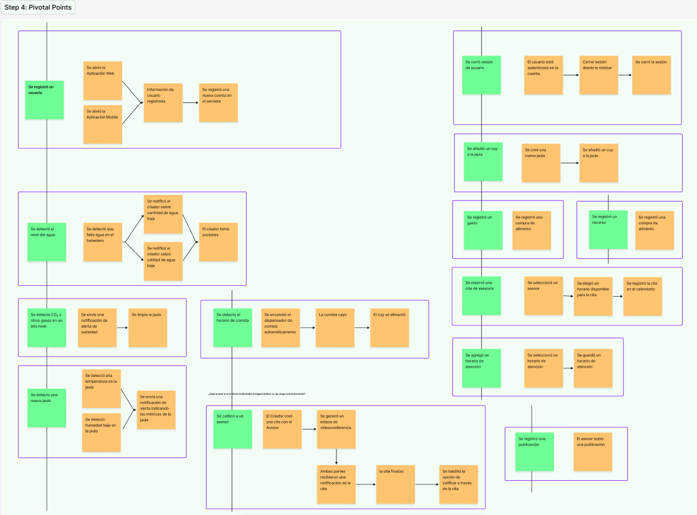
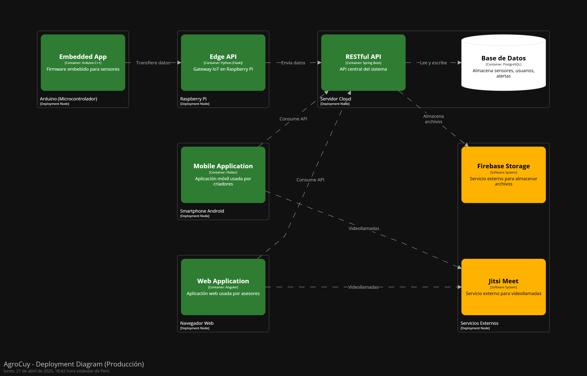

  

# **Universidad Peruana de Ciencias Aplicadas**
## Carrera de Ingeniería de Software

Ciclo: 2025 - 10

Curso: 1ASI0572 Desarrollo de Soluciones IoT

NRC: 2968

Profesor: León Baca, Marco Antonio

“Informe de Trabajo Final"

Startup: AgroTech

Producto: AgroCuy

Grupo: 4

|          Integrantes          |      Código      |
|:-----------------------------:|:-------------------:|
|   Cuadros Rodriguez, Juan Alejandro    |    u20221a359    |
|   Fiorella Jarama Peñaloza    |   u202120418  |
|  Lucas Coronel, Nadia Alessandra   |    U202120430    |
|   Moreno Vergara, Johan Raúl  |    u20201c105    |
|  Ramirez Mendez, Sebastian Andre   |    u20191e575    |

Abril 2025 

---

## Registro de Versiones Del Informe

<table>
  <tr>
    <th>Versión</th>
    <th>Fecha</th>
    <th>Autores</th>
    <th>Descripción de modificación</th>
  </tr>
  <tr>
    <td rowspan="5">TB1</td>
    <td rowspan="5">04/10/2025</td>
    <td>Cuadros Rodriguez, Juan Alejandro</td>
    <td rowspan="5">
      <strong>Capítulo I</strong>: Introducción 
      <strong>Capítulo II</strong>: Requirements Elicitation & Analysis 
      <strong>Capítulo III</strong>: Requirements Specification 
      <strong>Capítulo IV</strong>: Solution Software Design
    </td>
  </tr>
  <tr>
    <td>Fiorella Jarama Peñaloza</td>
  </tr>
  <tr>
    <td>Lucas Coronel, Nadia Alessandra</td>
  </tr>
  <tr>
    <td>Moreno Vergara, Johan Raúl</td>
  </tr>
  <tr>
    <td>Ramirez Mendez, Sebastian Andre</td>
  </tr>
</table>

## Project Report Collaboration Insights

### **Reporte de colaboración de la entrega del TB1:**

------

# Contenido

## [Capítulo I: Introducción](#capítulo-i-introducción)
- [1.1. Startup Profile](#11-startup-profile)
  - [1.1.1. Descripción de la Startup](#111-descripción-de-la-startup)
  - [1.1.2. Perfiles de integrantes del equipo](#112-perfiles-de-integrantes-del-equipo)
- [1.2. Solution Profile](#12-solution-profile)
  - [1.2.1. Antecedentes y problemática](#121-antecedentes-y-problemática)
  - [1.2.2. Lean UX Process](#122-lean-ux-process)
    - [1.2.2.1. Lean UX Problem Statements](#1221-lean-ux-problem-statements)
    - [1.2.2.2. Lean UX Assumptions](#1222-lean-ux-assumptions)
    - [1.2.2.3. Lean UX Hypothesis Statements](#1223-lean-ux-hypothesis-statements)
    - [1.2.2.4. Lean UX Canvas](#1224-lean-ux-canvas)
- [1.3. Segmentos objetivo](#13-segmentos-objetivo)

## [Capítulo II: Requirements Elicitation & Analysis](#capítulo-ii-requirements-elicitation--analysis)
- [2.1. Competidores](#21-competidores)
  - [2.1.1. Análisis competitivo](#211-análisis-competitivo)
  - [2.1.2. Estrategias y tácticas frente a competidores](#212-estrategias-y-tácticas-frente-a-competidores)
- [2.2. Entrevistas](#22-entrevistas)
  - [2.2.1. Diseño de entrevistas](#221-diseño-de-entrevistas)
  - [2.2.2. Registro de entrevistas](#222-registro-de-entrevistas)
  - [2.2.3. Análisis de entrevistas](#223-análisis-de-entrevistas)
- [2.3. Needfinding](#23-needfinding)
  - [2.3.1. User Personas](#231-user-personas)
  - [2.3.2. User Task Matrix](#232-user-task-matrix)
  - [2.3.3. User Journey Mapping](#233-user-journey-mapping)
  - [2.3.4. Empathy Mapping](#234-empathy-mapping)
  - [2.3.5. As-is Scenario Mapping](#235-as-is-scenario-mapping)
- [2.4. Ubiquitous Language](#24-ubiquitous-language)

## [Capítulo III: Requirements Specification](#capítulo-iii-requirements-specification)
- [3.1. To-Be Scenario Mapping](#31-to-be-scenario-mapping)
- [3.2. User Stories](#32-user-stories)
- [3.3. Impact Mapping](#33-impact-mapping)
- [3.4. Product Backlog](#34-product-backlog)

## [Capítulo IV: Solution Software Design](#capítulo-iv-solution-software-design)
- [4.1. Strategic-Level Domain-Driven Design](#41-strategic-level-domain-driven-design)
  - [4.1.1. EventStorming](#411-eventstorming)
    - [4.1.1.1. Candidate Context Discovery](#4111-candidate-context-discovery)
    - [4.1.1.2. Domain Message Flows Modeling](#4112-domain-message-flows-modeling)
    - [4.1.1.3. Bounded Context Canvases](#4113-bounded-context-canvases)
  - [4.1.2. Context Mapping](#412-context-mapping)
  - [4.1.3. Software Architecture](#413-software-architecture)
    - [4.1.3.1. System Landscape Diagram](#4131-system-landscape-diagram)
    - [4.1.3.2. Context Level Diagrams](#4132-context-level-diagrams)
    - [4.1.3.2. Container Level Diagrams](#4132-container-level-diagrams)
    - [4.1.3.3. Deployment Diagrams](#4133-deployment-diagrams)
- [4.2. Tactical-Level Domain-Driven Design](#42-tactical-level-domain-driven-design)
  - [4.2.X. Bounded Context: &lt;Bounded Context Name&gt;](#42x-bounded-context-name)
    - [4.2.X.1. Domain Layer](#42x1-domain-layer)
    - [4.2.X.2. Interface Layer](#42x2-interface-layer)
    - [4.2.X.3. Application Layer](#42x3-application-layer)
    - [4.2.X.4. Infrastructure Layer](#42x4-infrastructure-layer)
    - [4.2.X.5. Component Level Diagrams](#42x5-component-level-diagrams)
    - [4.2.X.6. Code Level Diagrams](#42x6-code-level-diagrams)
      - [4.2.X.6.1. Domain Layer Class Diagrams](#42x61-domain-layer-class-diagrams)
      - [4.2.X.6.2. Database Design Diagram](#42x62-database-design-diagram)

## [Capítulo V: Solution UI/UX Design](#capítulo-v-solution-uiux-design)
- [5.1. Style Guidelines](#51-style-guidelines)
  - [5.1.1. General Style Guidelines](#511-general-style-guidelines)
  - [5.1.2. Web, Mobile and IoT Style Guidelines](#512-web-mobile-and-iot-style-guidelines)
- [5.2. Information Architecture](#52-information-architecture)
  - [5.2.1. Organization Systems](#521-organization-systems)
  - [5.2.2. Labeling Systems](#522-labeling-systems)
  - [5.2.3. SEO Tags and Meta Tags](#523-seo-tags-and-meta-tags)
  - [5.2.4. Searching Systems](#524-searching-systems)
  - [5.2.5. Navigation Systems](#525-navigation-systems)
- [5.3. Landing Page UI Design](#53-landing-page-ui-design)
  - [5.3.1. Landing Page Wireframe](#531-landing-page-wireframe)
  - [5.3.2. Landing Page Mock-up](#532-landing-page-mock-up)
- [5.4. Applications UX/UI Design](#54-applications-uxui-design)
  - [5.4.1. Applications Wireframes](#541-applications-wireframes)
  - [5.4.2. Applications Wireflow Diagrams](#542-applications-wireflow-diagrams)
  - [5.4.2. Applications Mock-ups](#542-applications-mock-ups)
  - [5.4.3. Applications User Flow Diagrams](#543-applications-user-flow-diagrams)
- [5.5. Applications Prototyping](#55-applications-prototyping)

## [Capítulo VI: Product Implementation, Validation & Deployment](#capítulo-vi-product-implementation-validation--deployment)
- [6.1. Software Configuration Management](#61-software-configuration-management)
  - [6.1.1. Development Environment Configuration](#611-development-environment-configuration)
  - [6.1.2. Source Code Management](#612-source-code-management)
  - [6.1.3. Style Guide & Conventions](#613-style-guide--conventions)
  - [6.1.4. Deployment Configuration](#614-deployment-configuration)
- [6.2. Implementation](#62-implementation)
  - [6.2.X. Sprint n](#62x-sprint-n)
    - [6.2.X.1. Sprint Planning](#62x1-sprint-planning)
    - [6.2.X.2. Aspect Leaders and Collaborators](#62x2-aspect-leaders-and-collaborators)
    - [6.2.X.3. Sprint Backlog](#62x3-sprint-backlog)
    - [6.2.X.4. Development Evidence](#62x4-development-evidence)
    - [6.2.X.5. Testing Suite Evidence](#62x5-testing-suite-evidence)
    - [6.2.X.6. Execution Evidence](#62x6-execution-evidence)
    - [6.2.X.7. Services Documentation](#62x7-services-documentation)
    - [6.2.X.8. Software Deployment Evidence](#62x8-software-deployment-evidence)
    - [6.2.X.9. Team Collaboration Insights](#62x9-team-collaboration-insights)
- [6.3. Validation Interviews](#63-validation-interviews)
  - [6.3.1. Diseño de Entrevistas](#631-diseño-de-entrevistas)
  - [6.3.2. Registro de Entrevistas](#632-registro-de-entrevistas)
  - [6.3.3. Evaluaciones según heurísticas](#633-evaluaciones-según-heurísticas)
- [6.4. Video About-the-Product](#64-video-about-the-product)

## [Conclusiones](#conclusiones)
- [Conclusiones y recomendaciones](#conclusiones-y-recomendaciones)
- [Video About-the-Team](#video-about-the-team)
- [Bibliografía](#bibliografía)
- [Anexos](#anexos)

## Student Outcome

<table border="1" cellpadding="8" cellspacing="0">
  <tr>
    <th>Criterio específico</th>
    <th>Acciones realizadas</th>
    <th>Conclusiones</th>
  </tr>
  <tr>
    <td>Trabaja en equipo para proporcionar liderazgo en forma conjunta</td>
    <td>
      <strong>Apellidos, Nombre</strong> 
      <em>TB1</em> 
      <strong>Jarama Peñaloza, Fiorella</strong> 
      <em>TB1</em> 
      Me aseguré de que todos estuviéramos avanzando de forma constante, hice revisiones (reus) del trabajo del equipo y ofrecí apoyo cuando alguien se quedaba atrás. 
      <strong>Ramirez Mendez, Sebastián André</strong> 
      <em>TB1</em> 
      Me encargué de coordinar la estructura del documento y asegurar que cada sección tuviera coherencia, además de participar en la redacción de los antecedentes del proyecto y revisión técnica del contenido. 
      <strong>Moreno Vergara, Johan</strong> 
      <em>TB1</em> 
      Para esta entrega nos pusimos de acuerdo para tener reuniones para elegir el tema de nuestro proyecto y delegar responsabilidades. Además de una reunión para corroborar el correcto avance de cada uno de los miembros de nuestro equipo. 
       
      <strong>Apellidos, Nombre</strong> 
      <em>TB1</em> 
      …  
    </td>
    <td>
      Conclusiones Generales... 
    </td>
  </tr>
  <tr>
    <td>Crea un entorno colaborativo e inclusivo, establece metas, planifica tareas y cumple objetivos.</td>
    <td>
      <strong>Apellidos, Nombre</strong> 
      <em>TB1</em> 
      <strong>Jarama Peñaloza, Fiorella</strong> 
      <em>TB1</em> 
      Fomenté un ambiente donde todos pudieran participar, ayudé a organizar las tareas del equipo y propuse metas claras para cumplir con los entregables a tiempo. 
      <strong>Ramirez Mendez, Sebastian Andre</strong> 
      <em>TB1</em> 
      Propicié un entorno colaborativo asegurando la participación de todos los miembros, ayudé a definir metas claras, y coordiné la planificación de tareas para que se cumplieran los objetivos del equipo dentro de los plazos establecidos. 
      <strong>Moreno Vergara, Johan</strong> 
      <em>TB1</em> 
      Se establecieron fechas de entrega para cada tarea delegada, de esa forma aseguramos que se cumpla el objetivo de cada miembro de equipo y poder tener el trabajo en fechas específicas antes de la entrega. 
       
      <strong>Apellidos, Nombre</strong> 
      <em>TB1</em> 
      …  
    </td>
    <td>
       Conclusiones Generales... 
    </td>
  </tr>
</table>

## Capítulo I: Introducción 

## 1.1. Startup Profile

### 1.1.1. Descripción de la Startup

AgroTech nace con el objetivo de facilitar y modernizar la crianza de cuyes en el Perú, mediante la implementación de tecnologías IoT que automatizan y optimizan los procesos clave dentro de los criaderos. A través de nuestra aplicación AgroCuy, brindamos a los pequeños y medianos criadores una herramienta tecnológica que les permite gestionar, monitorear y controlar su producción desde cualquier lugar y en tiempo real, utilizando sus dispositivos móviles o computadoras.

La solución propuesta por AgroTech integra funcionalidades como alimentación automatizada, monitoreo ambiental con sensores de temperatura, humedad y gases, control de calidad del agua y riego automatizado. Esto permite a los usuarios garantizar un entorno saludable para los cuyes, mejorar su bienestar, reducir riesgos y aumentar la eficiencia operativa de sus granjas.

**Misión:**

Optimizar la crianza de cuyes en el Perú mediante herramientas avanzadas de automatización y monitoreo. De esta manera, contribuir al desarrollo sostenible de la producción ganadera y al bienestar animal a través de soluciones tecnológicas accesibles.

**Visión:**

Ser la plataforma tecnológica más utilizada por criadores de cuyes en el país, promoviendo la innovación, eficiencia y sostenibilidad en el sector ganadero. Asimismo, consolidarnos como referentes en el uso de IoT en la crianza animal y expandirnos hacia otras especies en el futuro.

  

_Imagen 1. Logo de la aplicación AgroCuy_

### 1.1.2. Perfiles de integrantes del equipo

<table>
  <tr>
    <th>
      
    </th>
    <td valign="top">
      
<b>Ramírez Méndez, Sebastián André</b>

      

        Soy una persona entusiasta que disfruta colaborar en equipo, y me caracterizo por ser transparente en mis objetivos y en mi enfoque de trabajo. Me enorgullece la capacidad que tengo para complementar a mi equipo en áreas donde puedan necesitar apoyo. Mi pasión por mi carrera me impulsa a desafiar mis habilidades y aspirar a alcanzar todo su potencial.
      

    </td>
  </tr>
  <tr>
    <th>
      
    </th>
    <td valign="top">
      
<b>Jarama Peñaloza, Fiorella</b>

      

        Mi nombre es Fiorella Jarama Peñaloza y soy estudiante de séptimo ciclo de Ingeniería de Software. Me considero una persona apasionada por la tecnología, curiosa y orientada al detalle. Tengo experiencia en Flutter, MySQL, APIs, y estoy en constante aprendizaje sobre Inteligencia Artificial. Mi objetivo es aplicar mis habilidades para desarrollar soluciones innovadoras y eficientes, contribuyendo a proyectos que tengan un impacto positivo y sostenible.
      

    </td>
  </tr>
  <tr>
    <th>
      
    </th>
    <td valign="top">
      
<b>Lucas Coronel, Nadia Alessandra</b>

      

        Mi nombre es Nadia Alessandra Lucas Coronel y soy estudiante de octavo ciclo de la carrera de Ingeniería de Software. Me considero una persona entusiasta, perseverante y responsable. Cuento con conocimientos en SQL, C++, Python, HTML, CSS, JavaScript, despligue y metodologías ágiles. Me comprometo a aplicar mis conocimientos de manera efectiva para contribuir al desarrollo de soluciones de software de alta calidad.
      

    </td>
  </tr>
  <tr>
    <th>
      
    </th>
    <td valign="top">
      
<b>Moreno Vergara, Johan Raúl</b>

      

        Me llamo Johan y soy estudiante de la carrera de Ingeniería de Software. Soy una persona bastante optimista y responsable. Me apasionan los temas de ciberseguridad e inteligencia artificial. Cuento con conocimientos en Python, SQL, ciberseguridad, entrenamiento de modelos de IA y algunos frameworks de desarrollo web.Dentro de mis hobbies está practicar artes marciales como el boxeo, Muay Thai y MMA. Me comprometo a apoyar a mi equipo y poner en práctica mis conocimientos.
      

    </td>
  </tr>
  <tr>
    <th>
      
    </th>
    <td valign="top">
      
<b>Cuadros Rodriguez, Juan Alejandro</b>

      

        Mi nombre es Juan Cuadros me considero una persona responsable, paciente y comprometida. Tengo conocimientos en los lenguajes de programación C/C++, Python y Java. Además de experiencia en gran manejo de datos usando SQL. También tengo conocimientos en Análisis de vulnerabilidades y explotación de datos. Estoy comprometido con el equipo y el proyecto.
      

    </td>
  </tr>
</table>

 

## 1.2. Solution Profile

### 1.2.1 Antecedentes y problemática

- **What:** El sector de la crianza de cuyes enfrenta desafíos en la gestión eficiente de las granjas, la falta de acceso a tecnologías adecuadas y la necesidad de mejorar el bienestar animal y la sostenibilidad de las prácticas agrícolas. 
- **Where:** Nos enfocaremos en todo el territorio nacional del Perú, especialmente en los departamentos donde se concentra la mayor parte del comercio y la actividad económica del país, y donde la crianza de cuyes es más prevalente
- **When:** Actualmente, el sector agropecuario se enfrenta a estos desafíos en la gestión de la crianza de cuyes. Con el crecimiento de la población en el país y la demanda de alimentos en aumento, se requiere una mayor eficiencia en la producción agrícola. Además, las preocupaciones ambientales y de bienestar animal están impulsando la necesidad de adoptar prácticas agrícolas más sostenibles y éticas.
- **Who:** AgroTech, como empresa líder en tecnología aplicada a la agricultura, asume la responsabilidad de liderar la innovación en la gestión de la crianza de cuyes. En este proceso, trabajamos en estrecha colaboración con expertos y asesores en la crianza de cuyes, quienes aportan su conocimiento especializado para desarrollar soluciones tecnológicas específicas y efectivas. Además, involucramos activamente a los criadores de cuyes, quienes son los beneficiarios directos de estas soluciones, asegurando que se adapten a sus necesidades y realidades específicas.
- **Why:** Para abordar estos desafíos y mejorar la gestión y productividad en la crianza de cuyes, garantizando el bienestar animal y promoviendo prácticas sostenibles en la industria agropecuaria. Además, se busca mejorar la rentabilidad de los agricultores y contribuir a la seguridad alimentaria peruana.
- **How:** Mediante el desarrollo de AgroCuy, una aplicación integral que combina asesoría especializada con herramientas IoT de automatización y monitoreo en tiempo real. Esta solución incluye: Sistemas de alimentación automatizada, con dispensadores controlados por horarios. Sensores ambientales IoT, que monitorean temperatura, humedad y gases como amoníaco y CO₂, garantizando un ambiente saludable. Sensores de calidad del agua, para asegurar una hidratación adecuada. Riego automatizado, que optimiza el uso de agua en función de las necesidades del entorno. Alertas y análisis predictivo, que permiten prevenir enfermedades y mejorar la toma de decisiones. Todo esto se controla desde dispositivos móviles o computadoras, permitiendo una gestión remota, inteligente y eficiente.
- **How much:** Se espera que AgroCuy tenga un impacto significativo en la optimización de las granjas de cuyes, elevando la productividad, reduciendo pérdidas por enfermedades y mejorando las condiciones de crianza. Esta innovación se alinea con los esfuerzos del Ministerio de Desarrollo Agrario y Riego (Midagri), que reportó un incremento del 20% en las crianzas de cuyes gracias a la adopción de nuevas tecnologías. Además, según datos del Midagri (2023), entre 2020 y 2021 se observó un crecimiento de 116 mil cuyes a nivel nacional, lo que evidencia una tendencia al alza en la producción. (Revisar [Anexo N°1: Gráfico de evolución de población de cuyes](#anexo-n1-gráfico-de-evolución-de-población-de-cuyes)). Nuestra aplicación busca responder a problemas comunes en el sector como la malnutrición, la falta de control sanitario y las malas condiciones ambientales, que afectan directamente la productividad de las granjas. (Revisar [Anexo N°2: Diagrama de problemas en la crianza de cuyes](#anexo-n2-diagrama-de-problemas-en-la-crianza-de-cuyes))

### 1.2.2 Lean UX Process.

#### 1.2.2.1. Lean UX Problem Statements.

***Problem Statement 1***

|Nuestro producto tiene como objetivo mejorar la gestión de granjas de cuyes en el Perú mediante soluciones IoT.|
| - |
|Hemos observado que los criadores de cuyes en Perú enfrentan dificultades para gestionar eficientemente sus granjas, debido a la falta de herramientas tecnológicas que les permitan monitorear variables críticas como temperatura, humedad o niveles de alimentación en tiempo real. Esto impacta negativamente en su productividad y en el bienestar de los animales|
|¿Podría nuestra aplicación AgroCuy, equipada con sensores IoT y sistemas de automatización, ayudar a los criadores de cuyes a mejorar la gestión de sus granjas y aumentar su productividad?|

***Problem Statement 2***

|Nuestro producto tiene como objetivo aumentar la rentabilidad de los criadores de cuyes en Perú a través del uso de tecnologías IoT.|
| - |
|Hemos observado que muchos criadores enfrentan pérdidas económicas por el mal uso de recursos como agua o alimento, y por la falta de detección temprana de enfermedades en sus animales.|
|¿Podría AgroCuy, mediante el uso de sensores inteligentes y alertas en tiempo real, ayudar a reducir costos operativos y mejorar la eficiencia, contribuyendo así a una mayor rentabilidad?|

***Problem Statement 3***

|Nuestro producto tiene como objetivo facilitar el acceso a mercados y mejorar la comercialización de los productos de cuy en Perú, apoyándose en tecnología IoT.|
| - |
|Hemos observado que muchos criadores de cuyes tienen poca trazabilidad de sus procesos de producción, lo que limita la confianza de los compradores y reduce sus oportunidades en el mercado formal.|
|¿Podría AgroCuy, al recopilar datos automatizados sobre las condiciones de crianza mediante sensores IoT, generar reportes que validen la calidad del producto y así ayudar a los criadores a acceder a nuevos mercados y mejorar su comercialización?|

#### 1.2.2.2. Lean UX Assumptions.

1. **¿Quién es el usuario?** 

   El usuario principal de nuestro producto es el criador de cuyes en Perú, particularmente aquellos que buscan modernizar sus métodos de crianza mediante la adopción de tecnologías innovadoras como el Internet de las Cosas (IoT). También forman parte del ecosistema otros actores clave como los trabajadores de las granjas que interactúan con los dispositivos IoT, los compradores que valoran la trazabilidad del producto, y los consumidores finales interesados en alimentos producidos bajo estándares de bienestar animal y sostenibilidad.

1. **¿Dónde encaja nuestro producto en su trabajo o vida?**

   AgroCuy se integra directamente en las actividades diarias del criador de cuyes, permitiéndole gestionar su granja de forma remota y automatizada gracias al uso de sensores y dispositivos IoT. Estos sensores monitorean en tiempo real parámetros vitales como temperatura, humedad, calidad del agua, y niveles de alimentación, enviando alertas y recomendaciones a través de la aplicación. Así, AgroCuy se convierte en un aliado constante del criador, brindándole mayor control, eficiencia y tranquilidad.

1. **¿Qué problemas tiene nuestro producto? ¿Resolver?**

   Actualmente, el producto está enfocado únicamente en la crianza de cuyes y aún no está adaptado para otros tipos de ganado. Sin embargo, AgroCuy aborda de forma precisa varios problemas comunes en la crianza de cuyes: 
   - Falta de monitoreo en tiempo real. 
   - Ineficiente uso de recursos como agua y alimento. 
   - Dificultad en la detección temprana de enfermedades. 
   - Gestión manual de registros de salud y reproducción. 
   - Bajo acceso a mercados y falta de trazabilidad. 
   Gracias al uso de IoT, nuestro producto ofrece una solución tecnológica completa que automatiza la supervisión de las granjas, mejora el bienestar animal, optimiza los recursos y reduce el impacto ambiental, mejorando así la rentabilidad y sostenibilidad del negocio.

1. **¿Cuándo y cómo es nuestro producto? ¿Usado?** 

   AgroCuy será utilizado diariamente por los criadores de cuyes a través de sus dispositivos móviles o computadoras. Los sensores instalados en las granjas estarán en funcionamiento continuo, recolectando datos y enviándolos a la plataforma en tiempo real. De esta manera, el usuario podrá recibir notificaciones instantáneas, visualizar reportes gráficos, y tomar decisiones informadas en cualquier momento y desde cualquier lugar con conexión a internet.

1. **¿Qué características son importantes?**

   Monitoreo ambiental con IoT: Sensores que registran condiciones como temperatura, humedad, y calidad del agua, esenciales para la salud de los cuyes.

   Alertas inteligentes: Notificaciones automáticas en caso de condiciones anómalas o necesidades de intervención.

   Análisis predictivo: Algoritmos que, con base en los datos recolectados por sensores, brindan recomendaciones personalizadas para optimizar la nutrición, salud y reproducción de los cuyes.

   Gestión automatizada: Herramientas para registrar automáticamente eventos como alimentación, vacunación, o mortalidad, evitando el uso de formatos físicos.

   Conexión con mercados: Trazabilidad basada en datos, que mejora la confianza del consumidor y abre nuevas oportunidades comerciales.

1. **¿Cómo debe verse nuestro producto y cómo comportarse?**

   AgroCuy debe tener una interfaz intuitiva y adaptable a distintos niveles de alfabetización digital, con visualizaciones claras de los datos que recogen los sensores IoT. El diseño debe ser limpio, atractivo y centrado en la experiencia del usuario. El sistema debe comportarse de forma fluida, con actualizaciones en tiempo real, alertas precisas y navegación sencilla. Además, debe garantizar altos estándares de seguridad para proteger tanto los datos de los usuarios como la información recopilada por los sensores.

#### 1.2.2.3. Lean UX Hypothesis Statements.

**Hypothesis Statement 1**

|Creemos que al proporcionar a los criadores de cuyes en Perú acceso a tecnologías avanzadas de Internet de las Cosas (IoT) y asesoramiento especializado a través de nuestra plataforma AgroCuy, mejorarán la eficiencia y la rentabilidad de sus granjas al optimizar el monitoreo ambiental y la salud animal.|
| - |
|Sabremos que esto es cierto…|
|Cuando se aprecie un incremento del 20% en la cantidad de solicitudes de asesorías relacionadas con el uso de sensores IoT y sistemas automatizados de alimentación durante los primeros 6 meses de lanzamiento.|

**Hypothesis Statement 2**

|Creemos que al promover prácticas agrícolas sostenibles y éticas en la crianza de cuyes en Perú mediante el monitoreo constante de los recursos a través de IoT, los criadores adoptarán un enfoque más responsable con el medio ambiente y mejorarán la calidad de vida de los cuyes.|
| - |
|Sabremos que esto es cierto…|
|Cuando proporcionemos recursos específicos sobre prácticas sostenibles apoyadas por el análisis de datos en tiempo real proporcionados por los sensores IoT, y evaluemos la adopción de estas prácticas por parte de los criadores, viendo un aumento del 15% en la implementación de prácticas sostenibles en el uso de agua, alimentación automatizada y calidad del aire dentro de los primeros 6 meses de lanzamiento.|

**Hypothesis Statement 3**

|Creemos que al facilitar el acceso a mercados y mejorar la comercialización de los productos de cuy en Perú, mediante la trazabilidad y calidad certificada proporcionada por el monitoreo IoT, los criadores aumentarán sus ventas y expandirán sus negocios.|
| - |
|Sabremos que esto es cierto…|
|Cuando los datos de trazabilidad y calidad de los productos de cuy generados a través de los dispositivos IoT sean utilizados para establecer conexiones con compradores y mercados, y evaluemos el impacto en las ventas de los criadores mediante un aumento del 25% en las ventas en los primeros 6 meses de uso de la aplicación.|

**Hypothesis Statement 4**

|Creemos que al ofrecer soluciones IoT que mejoren la gestión diaria de las granjas, los criadores podrán monitorear en tiempo real el estado de sus operaciones y obtener asesorías más personalizadas, lo que les permitirá aumentar la productividad y eficiencia.|
| - |
|Sabremos que esto es cierto…|
|Cuando se observe un aumento del 20% en el número de criadores que implementan sistemas de monitoreo IoT, como sensores de temperatura, humedad y salud animal, dentro de los primeros tres meses tras el lanzamiento. Además, mediremos la retroalimentación de los usuarios mediante encuestas regulares, y consideraremos que hemos tenido éxito si al menos el 70% de las respuestas son positivas en relación con la experiencia de uso y la mejora en la gestión de la granja.|

#### 1.2.2.4. Lean UX Canvas.

_Imagen 2. Lean UX Canvas_

## 1.3. Segmentos objetivo

Por el lado de los asesores, hemos considerado que estos tendrán experiencia en el campo y/o estudios universitarios en carreras como ingeniería agrónoma, medicina veterinaria, zootecnia, etc. Debido a que el plan de estudios de estas carreras es de mínimo 5 años a más, y necesitan cierto grado de experiencia para dar recomendaciones y planes de acción confiables, hemos decidido que el rango de edad será de 25 años hasta 65 años.

Los asesores tendrán el conocimiento necesario para implementar y utilizar tecnologías avanzadas como sensores IoT, sistemas automatizados de alimentación y monitoreo de salud animal, así como plataformas de gestión de datos. Ellos proporcionarán a los criadores de cuyes las herramientas para analizar información en tiempo real y realizar recomendaciones basadas en datos IoT, mejorando la productividad y eficiencia de las granjas.

Según el Ministerio de Desarrollo Agrario y Riego (2023), la crianza de cuyes es una alternativa para la generación de ingresos monetarios para más de 800,000 familias agrarias en el Perú, las cuales se ubican en su mayoría en la sierra del país. El consumo de carne de cuy se ha mantenido en el tiempo e incluso ha trascendido al mercado externo. Esta información destaca la importancia de los asesores en la crianza de cuyes, ya que su conocimiento y orientación, apoyados por tecnologías como el IoT, pueden ser fundamentales para el éxito y la sostenibilidad de los productores en este sector.

|**Segmento objetivo**|Asesores |
| :- | :- |
|**Edad**|25-65 años|
|**Ubicación**|Perú|
|**Sexo**|Masculino y Femenino|
|**Formación educativa**|Universitario o cualquier educación superior|
|**Poder adquisitivo**|Bajo, medio y alto|
|**Tecnologia Utilizada**|Uso de plataformas IoT para monitoreo y análisis de datos, sensores inteligentes para salud animal y gestión eficiente de recursos, asesoramiento basado en datos recolectados en tiempo real.|

Para delimitar el segmento objetivo de criadores de cuyes, nos basamos en el diagnóstico situacional de la crianza de cuyes en Cajamarca realizado en julio de 2004. Dicho diagnóstico menciona que el 44.6% de los productores tenían más de 50 años, sus esposas que conducían la crianza de cuyes tenían entre 31 a 50 años. Además, los hijos que vivían con los padres tenían entre 6 a 17 años. Por lo tanto, para el rango de edad de los criadores decidimos seleccionar desde los 18 años de edad hasta los 60 años para abarcar tanto a los padres que manejan la crianza como a los hijos mayores de edad que la apoyan.

El mismo diagnóstico señala que el grado de instrucción predominante en la familia es de educación primaria con un 65.6%, lo cual tomaremos en cuenta.

Los criadores de cuyes estarán cada vez más dispuestos a integrar tecnologías avanzadas como el Internet de las Cosas (IoT) para optimizar la gestión de sus granjas. A través de sensores IoT, podrán monitorear en tiempo real aspectos como la calidad del agua, la temperatura y la humedad dentro de las instalaciones, lo que les permitirá hacer ajustes automáticos para mejorar el ambiente y el bienestar de los cuyes. Esto, junto con el uso de dispositivos para controlar la alimentación y otros parámetros, les dará herramientas efectivas para aumentar su eficiencia y rentabilidad.

|**Segmento objetivo**|Criadores de cuyes|
| :- | :- |
|**Edad**|18-60 años|
|**Ubicación**|Perú|
|**Sexo**|Masculino y Femenino|
|**Formación educativa**|Educación primaria|
|**Poder adquisitivo**|Bajo y medio|
|**Tecnologia Utilizada**|Sensores IoT para monitoreo ambiental (temperatura, humedad, calidad del aire), dispositivos automatizados para alimentación, control remoto de las operaciones y plataformas móviles para gestionar la granja de manera eficiente.|

## Capítulo II: Requirements Elicitation & Analysis

## 2.1. Competidores

### 2.1.1. Análisis competitivo
<table>
  <tr>
    <th colspan="6" valign="top">Competitive Analysis Landscape</th>
  </tr>
  <tr>
    <td colspan="2" valign="top">¿Por qué llevar a cabo este análisis?</td>
    <td colspan="4" valign="top">Objetivo 1: Adquirir conocimiento acerca de las propuestas ofrecidas por nuestros competidores y obtener enseñanzas a partir de las áreas en las que presentan limitaciones. 
    Objetivo 2: Identificar los puntos fuertes y las limitaciones de nuestros competidores con el fin de formular una estrategia competitiva sólida y efectiva.
    </td>
  </tr>
  <tr>
    <td colspan="2" rowspan="2" valign="top">Empresa/App</td>
    <td valign="top">AgroConnect </td>
    <td valign="top">BestFarm</td>
    <td valign="top">CattleMax</td>
    <td valign="top">BarnTools</td>
  </tr>
  <tr>
    <td valign="top"></td>
    <td valign="top"></td>
    <td valign="top"></td>
    <td valign="top"></td>
  </tr>
  <tr>
    <td rowspan="2" valign="top">Perfil</td>
    <td valign="top">Overview</td>
    <td valign="top">Una aplicación integral desarrollada por AgroTech para mejorar la gestión de granjas de cuyes en el Perú. Ofrece asesoramiento especializado y herramientas tecnológicas para optimizar la alimentación, salud y sostenibilidad en la crianza de cuyes, empoderando a los granjeros a través de la innovación tecnológica.</td>
    <td valign="top">Plataforma integral de gestión agrícola que abarca una amplia gama de actividades agrícolas, incluyendo cultivos y ganadería.</td>
    <td valign="top">Aplicación especializada en la gestión de ganado. Está diseñada específicamente para ayudar a los ganaderos a llevar un registro detallado de su ganado, gestionar la salud y el seguimiento de la reproducción.</td>
    <td valign="top">BarnTools es una aplicación que se centra en la gestión de animales de granja en general, incluyendo ganado, aves de corral y otros animales. </td>
  </tr>
  <tr>
    <td valign="top">Ventaja competitiva ¿Qué valor ofrece a los clientes?</td>
    <td valign="top">La ventaja competitiva de AgroConnect es la integración completa de tecnología y asesoramiento especializado. Esto significa que no solo proporcionamos herramientas tecnológicas avanzadas a través de AgroConnect, sino que también ofrecemos orientación y asesoramiento específico para la crianza de cuyes.</td>
    <td valign="top">La ventaja competitiva de BestFarm radica en su enfoque de la gestión agrícola, que permite a los usuarios gestionar tanto cultivos como animales en una sola plataforma.</td>
    <td valign="top">La principal ventaja competitiva de CattleMax es que ofrece características y herramientas específicas para el ganado, lo que lo convierte en una opción sólida para ganaderos que buscan una solución dedicada.</td>
    <td valign="top">La ventaja competitiva de BarnTools radica en su capacidad para gestionar una variedad de animales de granja, lo que la hace adecuada para granjeros con múltiple variedad de ganado.</td>
  </tr>
  <tr>
    <td rowspan="2" valign="top">Perfil de Marketing</td>
    <td valign="top">Mercado objetivo</td>
    <td valign="top">El mercado objetivo de AgroConnect son los criadores de cuyes en Perú, así como otros actores involucrados en la cadena de producción y comercialización de productos cárnicos de cuy.</td>
    <td valign="top">El mercado objetivo de BestFarm incluye a agricultores y ganaderos que gestionan operaciones mixtas de cultivos y ganado.</td>
    <td valign="top">El mercado objetivo de CattleMax son los ganaderos y criadores de ganado de todas las escalas.</td>
    <td valign="top">El mercado objetivo de BarnTools son los granjeros y ganaderos que gestionan una variedad de animales</td>
  </tr>
  <tr>
    <td valign="top">Estrategias de marketing</td>
    <td valign="top">Campañas educativas en línea y fuera de línea para resaltar los beneficios de AgroConnet en términos de mejora de la productividad, bienestar animal y sostenibilidad en la crianza de cuyes.</td>
    <td valign="top">Promoción en ferias agrícolas y ganaderas para mostrar la versatilidad de la plataforma.</td>
    <td valign="top">Colaboración con asociaciones ganaderas y veterinarios especializados en ganado.</td>
    <td valign="top">Publicidad en revistas agrícolas y ganaderas</td>
  </tr>
  <tr>
    <td rowspan="3" valign="top">Perfil de Producto</td>
    <td valign="top">Productos & Servicios</td>
    <td valign="top">Plataforma integral de gestión para la crianza de cuyes. Ofreciendo una solución completa para la gestión eficiente de granjas de cuyes.</td>
    <td valign="top">Plataforma integral de gestión agrícola para cultivos y animales, planificación de cultivos, programación de tareas, seguimiento de salud, análisis de datos agrícolas</td>
    <td valign="top">Plataforma de gestión de ganado bovino, registro de animales, seguimiento de salud, programación de tareas, seguimiento de reproducción, gestión de gastos.</td>
    <td valign="top">Plataforma versátil para la gestión de animales de granja en general, registro de animales, seguimiento de salud, programación de tareas.</td>
  </tr>
  <tr>
    <td valign="top">Precios & Costos</td>
    <td valign="top">Modelo de suscripción mensual o anual. Los precios varían según la escala de la operación y las funcionalidades requeridas.</td>
    <td valign="top">BestFarm utiliza  precios basados en suscripción.</td>
    <td valign="top">CattleMax utiliza  precios basados en suscripción.</td>
    <td valign="top">BarnTools utiliza  precios basados en la suscripción.</td>
  </tr>
  <tr>
    <td valign="top">Canales de distribución (Web y/o Móvil)</td>
    <td valign="top">AgroConnect se distribuye principalmente a través de una plataforma web accesible desde cualquier navegador. También ofrece una aplicación móvil.</td>
    <td valign="top">BestFarm se distribuye a través de una plataforma web</td>
    <td valign="top">CattleMax se distribuye a través de una plataforma web y ofrece una aplicación móvil</td>
    <td valign="top">BarnTools se distribuye principalmente a través de una plataforma web accesible desde navegadores de computadoras de escritorio y dispositivos móviles.</td>
  </tr>
  <tr>
    <td rowspan="4" valign="top">Análisis SWOT</td>
    <td valign="top">Fortalezas</td>
    <td valign="top">- Integración completa de tecnología y asesoramiento especializado. 
    - Mejora del bienestar animal y la sostenibilidad en la crianza de cuyes. 
    - Plataforma integral que aborda múltiples aspectos de la gestión de granjas de cuyes. 
    - Potencial para expandirse hacia otros tipos de animales en el futuro.
    </td>
    <td valign="top">- Ofrece una plataforma integral para la gestión de cultivos y animales. 
    - Enfoque en la agricultura. 
    - Planificación y análisis de datos agrícolas.
    </td>
    <td valign="top">- Enfoque especializado en la gestión de ganado bovino. 
    - Herramientas específicas para ganado bovino. 
    - Plataforma web y aplicación móvil para mayor accesibilidad.
    </td>
    <td valign="top">- Versatilidad para gestionar una variedad de animales de granja. 
    - Registro de animales, seguimiento de salud y programación de tareas. 
    - Plataforma web y aplicación móvil para mayor accesibilidad.
    </td>
  </tr>
  <tr>
    <td valign="top">Debilidades</td>
    <td valign="top">– Posible resistencia al cambio por parte de algunos criadores de cuyes. 
    - Costos de implementación y acceso a tecnología en áreas rurales o remotas. 
    - Necesidad de una curva de aprendizaje para algunos usuarios menos familiarizados con la tecnología. 
    - Dependencia de la conectividad a internet para el funcionamiento óptimo de la plataforma.
    </td>
    <td valign="top">- Competencia en nichos de mercado más específicos. 
    - Puede ser percibido como demasiado complejo para usuarios con necesidades simples.
    </td>
    <td valign="top">- Limitado en términos de diversificación de servicios para otros tipos de animales.</td>
    <td valign="top">- Mayor competencia en el mercado de gestión de animales de granja.</td>
  </tr>
  <tr>
    <td valign="top">Oportunidades</td>
    <td valign="top">- Creciente demanda de soluciones tecnológicas en el sector agrícola. 
    - Aumento de la conciencia sobre el bienestar animal y la sostenibilidad. 
    - Posibilidad de colaboraciones con instituciones gubernamentales y organizaciones agrícolas para promover el uso de tecnología en la crianza de cuyes. 
    - Expansión a nuevos mercados regionales o internacionales.
    </td>
    <td valign="top">- Expansión hacia mercados agrícolas más amplios. 
    - Colaboración con proveedores de tecnología agrícola.
    </td>
    <td valign="top">- Expansión hacia otros nichos de mercado ganadero.</td>
    <td valign="top">- Colaboración con proveedores de tecnología agrícola.</td>
  </tr>
  <tr>
    <td valign="top">Amenazas</td>
    <td valign="top">- Competencia de otras soluciones tecnológicas en el mercado agrícola. 
    - Cambios en la regulación gubernamental que podrían afectar la industria de la crianza de cuyes.
    </td>
    <td valign="top">- Competidores especializados en áreas específicas de la agricultura</td>
    <td valign="top">- Cambios en las regulaciones ganaderas.</td>
    <td valign="top">- Competidores especializados en áreas específicas de la gestión de animales de granja.</td>
  </tr>
</table>

### 2.1.2. Estrategias y tácticas frente a competidores
**Estrategias:**

**Diferenciación del producto:** Destacaremos las características únicas de AgroConnect, como la integración completa de tecnología y asesoramiento especializado, para diferenciarnos claramente de otras soluciones en el mercado.

**Enfoque en el valor agregado:** Nos centraremos en comunicar y demostrar el valor agregado que AgroConnect ofrece a los criadores de cuyes, resaltando los beneficios tangibles como la mejora del bienestar animal, la eficiencia operativa y la sostenibilidad.

**Tácticas:**

**Marketing de contenido:** Crearemos contenido educativo y relevante sobre la crianza de cuyes, tecnología agrícola y prácticas sostenibles, para posicionarnos como líderes de pensamiento en el sector y atraer a clientes potenciales.

**Programas de prueba y demostraciones:** Ofreceremos programas de prueba gratuitos y demostraciones en granjas para permitir a los clientes experimentar directamente los beneficios de AgroConnect y generar confianza en nuestra solución.

**Desarrollo de alianzas estratégicas:** Buscaremos colaboraciones con instituciones agrícolas, asociaciones de criadores de cuyes y otras empresas del sector para ampliar nuestra red de clientes y aumentar la visibilidad de AgroConnect.

**Servicio al cliente excepcional:** Nos comprometemos a brindar un excelente servicio al cliente, proporcionando soporte técnico, capacitación y asistencia personalizada para garantizar la satisfacción y fidelidad de nuestros usuarios.

## 2.2. Entrevistas

### 2.2.1. Diseño de entrevistas

**Segmento: Asesor**
1. ¿Cuál es su experiencia trabajando en granjas y cuántos años lleva en este campo? ¿Ha utilizado o está familiarizado con sistemas que permiten monitorear o controlar automáticamente las condiciones dentro de una granja?

2. En su trabajo actual, ¿qué tipo de ayuda o asesoramiento brinda a los criadores? ¿Qué aspectos considera más importantes a tener en cuenta en una granja de cuyes?

3. ¿Cuáles considera que son los problemas más comunes que enfrentan los nuevos criadores de cuyes? ¿Cómo podría ayudar una herramienta que muestre información actualizada sobre el ambiente de la granja?

4. ¿Qué tipo de alertas o funciones automáticas cree que serían más útiles para usted como asesor o para los criadores? Por ejemplo: avisos por temperatura alta, humedad baja, falta de alimento, o reportes automáticos.

5. ¿Ha tenido alguna experiencia previa con tecnologías aplicadas al campo, como sensores, termómetros digitales o sistemas automáticos? ¿Qué impresión le dejaron?

6. ¿Qué tipo de información del ambiente de la granja considera más valiosa para el cuidado de los cuyes? Por ejemplo: temperatura, humedad, ventilación, calidad del aire, entre otros.

7. ¿Cómo cree que podría beneficiarse su trabajo si tuviera acceso desde su celular o computadora a datos en tiempo real sobre varias granjas que asesora?

8. Pensando en una herramienta como “AgroConnect”, ¿qué funciones le parecerían más útiles? Por ejemplo: ver historial de datos, recibir alertas, comparar granjas o generar reportes automáticos.

9. ¿Cree que los criadores estarían dispuestos a utilizar una plataforma digital sencilla si les ayudara a tener mejores resultados? ¿Qué factores cree que facilitarían su adopción?

10. ¿Qué tipo de capacitación o acompañamiento considera necesario para que los criadores puedan aprovechar este tipo de herramientas tecnológicas en su día a día?

**Segmento: Criador de cuyes**

1. ¿Cuántos cuyes cría actualmente y desde hace cuánto tiempo se dedica a esta actividad? ¿Cría algún otro tipo de animal además de cuyes?

2. En su día a día, ¿cuáles son los principales problemas o dificultades que enfrenta al cuidar su granja? Por ejemplo: cambios de temperatura, falta de alimento, enfermedades, organización del tiempo, etc.

3. ¿Lleva algún tipo de registro sobre el estado de salud, crecimiento o producción de sus cuyes? ¿Utiliza cuadernos, Excel u otra herramienta?

4. ¿Cómo se organiza para alimentar a los animales, controlar su salud y mantener las instalaciones limpias? ¿Cree que una herramienta que le avise con alarmas o recordatorios podría ayudarle en estas tareas?

5. ¿Qué información consulta normalmente para tomar decisiones en su granja? Por ejemplo: pronóstico del clima, consejos de otros criadores, experiencia personal, etc.

6. Si existiera un sistema que le informe automáticamente sobre la temperatura, humedad o actividad de los animales, ¿le parecería útil? ¿Qué información le gustaría recibir y cómo preferiría verla: por celular, mensajes de texto, o de otro modo?

7. ¿Ha usado alguna vez una aplicación o herramienta digital para gestionar su granja? ¿Cómo fue esa experiencia?

8. ¿Qué tipo de información o apoyo adicional le gustaría tener para mejorar su crianza de cuyes? Por ejemplo: alertas automáticas, consejos personalizados, videos educativos, etc.

9. ¿Le interesaría recibir orientación o ayuda de otros criadores con más experiencia a través de una aplicación o grupo en línea? ¿Cree que esa ayuda sería más útil si se basara en datos reales de su granja?

10. ¿Estaría dispuesto a probar una herramienta tecnológica si fuera sencilla de usar, le ayudara a ahorrar tiempo y mejorara la salud de sus animales? ¿Qué condiciones o garantías necesitaría para animarse a probarla?

### 2.2.2. Registro de entrevistas

**Link de las entrevistas:** [Ver entrevistas](https://upcedupe-my.sharepoint.com/:v:/g/personal/u202120430_upc_edu_pe/EfzTMIMyG21NhDYkWcIYIW4BL7pKsp-FbNONAAcnh6-dlg?nav=eyJyZWZlcnJhbEluZm8iOnsicmVmZXJyYWxBcHAiOiJPbmVEcml2ZUZvckJ1c2luZXNzIiwicmVmZXJyYWxBcHBQbGF0Zm9ybSI6IldlYiIsInJlZmVycmFsTW9kZSI6InZpZXciLCJyZWZlcnJhbFZpZXciOiJNeUZpbGVzTGlua0NvcHkifX0&e=E2ug3L)

**Entrevista N 1 - Asesor:**

**Entrevistador:** Juan Cuadros

**Entrevistado:** Daniela Flores

**Duración**: [00:00:08 – 00:06:00] (**5 minutos 52 segundos**)

_Imagen 3. Entrevista a Daniela Flores_

**Resumen:** 

Daniela proviene de una familia con una sólida tradición en la crianza de cuyes, acumulando más de ocho años de experiencia brindando asesoría técnica a diversas granjas. Es médica veterinaria de profesión, lo que respalda su conocimiento especializado en el bienestar animal. En la granja familiar, han comenzado a incorporar tecnología de monitoreo, como termohigrómetros digitales que permiten registrar datos y emitir alertas básicas, lo cual ha representado un avance importante en la gestión de las condiciones ambientales. Respecto a AgroConnect, Daniela considera que es una herramienta valiosa para fortalecer la interacción entre criadores y asesores técnicos. Además, sugiere que la plataforma podría potenciar aún más su utilidad si, luego de recolectar los datos de los sensores, se generara automáticamente un reporte que facilite el análisis y la toma de decisiones, optimizando así la asesoría y el manejo de las granjas.

**Entrevista N 2 - Asesor:** 

**Entrevistador:** Nadia Lucas

**Entrevistado:** Nayeli Chavez

**Duración**: [00:06:00 – 00:13:02] (**7 minutos 2 segundos**)

_Imagen 4. Entrevista a Nayeli Chavez_ 

**Resumen:**

Nayeli cuenta con dos años de experiencia como asesora técnica especializada en la crianza de cuyes, respaldada por su formación en Zootecnia en la Universidad Agraria La Molina. Desde su egreso, ha apoyado a pequeños y medianos productores altoandinos, brindando asesoría en cuatro pilares fundamentales: alimentación, sanidad, manejo reproductivo y cuidado ambiental.

Si bien no ha implementado sistemas de monitoreo en granjas, ha investigado soluciones tecnológicas empleadas en otros países como China, incluyendo sensores ambientales y plataformas automáticas. Considera que los cuyes son altamente sensibles a variaciones bruscas de temperatura, lo que puede derivar en pérdidas significativas.

Nayeli identifica como una gran necesidad la incorporación de herramientas que proporcionen datos en tiempo real sobre temperatura, humedad y ventilación, además de alertas ante condiciones extremas o escasez de alimento. Propone la generación de reportes automáticos con gráficos sencillos, notificaciones móviles ante incidentes, y funcionalidades como historial de datos, comparación entre granjas y asistencia para la gestión diaria.

En su experiencia, muchos criadores tienen temor de usar plataformas digitales, por lo que resalta la importancia de que estas sean intuitivas y demuestren mejoras tangibles en productividad. Recomienda acompañar la tecnología con capacitaciones prácticas realizadas en las propias granjas, con soporte técnico y materiales impresos, facilitando así la adopción tecnológica y la optimización del manejo de los cuyes.

**Criadores**

**Entrevista N 3 - Criador:**

**Entrevistador:** Johan Moreno

**Entrevistado:** Willy Valentin

**Duración**: [00:13:02 – 00:17:27] (**4 minutos 25 segundos**)

_Imagen 8. Entrevista a Willy Valentin_ 

**Resumen:**
Willy, un joven de 21 años de Lima, comparte la experiencia de su familia, que lleva aproximadamente 4 años criando cuyes, con una población actual de alrededor de 90 ejemplares, además de otros animales. Uno de los principales retos que enfrentan es la variabilidad climática, ya que tanto el calor excesivo como el frío afectan negativamente la crianza.

Su familiar gestiona la información de manera manual, utilizando cuadernos para el conteo de cuyes y el registro de compras de alimento. La limpieza de las jaulas se realiza de forma periódica cada dos días, momento en el cual también observan el estado general de los animales. Para tomar decisiones, se apoyan en datos climáticos consultados desde sus teléfonos móviles.

Willy considera que para su familia sería muy útil contar con una herramienta que muestre la temperatura ambiental y envíe notificaciones al respecto. Aunque no han utilizado aplicaciones para la gestión de la granja, están interesados en implementar una que facilite el monitoreo y la recepción de alertas en tiempo real.

Además, ve con buenos ojos que la plataforma incluya consejos, tutoriales y recomendaciones prácticas sobre la crianza, así como la posibilidad de conectar con otros criadores de distintas regiones para compartir experiencias, superando las limitaciones del contacto presencial actual.

**Entrevista N 4 - Criador:**

**Entrevistador:**  Fiorella Jarama 

**Entrevistado:** Claudia Ramos

**Duración**: [00:17:27 – 00:22:12] (**4 minutos 45 segundos**)

_Imagen 6. Entrevista a Claudia Ramos_

**Resumen:** 
Claudia Ramos, una criadora principiante de cuyes de 23 años con 6 meses de experiencia y 25 cuyes a su cuidado, compartió en la entrevista que enfrenta principalmente dificultades para organizar su tiempo y adaptarse a las condiciones climáticas que afectan a los animales. Actualmente no lleva un registro constante de salud o crecimiento, aunque ha intentado usar un cuaderno. Le gustaría contar con una herramienta tecnológica sencilla que le brinde recordatorios, alertas sobre temperatura y consejos personalizados, preferiblemente en forma de notificaciones en su celular. También valoraría mucho el acceso a videos explicativos y el apoyo de criadores con más experiencia, especialmente si los consejos se basan en datos reales de su granja. Claudia no ha utilizado aplicaciones específicas para la crianza, pero está abierta a probar alguna siempre que sea fácil de usar, segura y venga con una guía inicial.

**Entrevista N 5 - Criador:**

**Entrevistador:** Sebastian Ramirez

**Entrevistado:** Carla Pereyra

**Duración**: [00:22:12 – 00:25:40] (**3 minutos 28 segundos**)

_Imagen 7. Entrevista a Carla Pereyra_ 

**Resumen:**
Carla Pereyra, una criadora de cuyes con experiencia, actualmente está a cargo de 20 ejemplares. Nos compartió las necesidades que enfrenta en su labor y las mejoras que desearía implementar. En la actualidad, realiza el registro de sus cuyes de forma manual, utilizando un cuaderno, ya que aún no ha adoptado herramientas digitales. Le gustaría contar con alertas sobre la temperatura ambiental de sus animales, notificaciones relacionadas con su alimentación, y recibir asesoría de criadores especializados. Aunque nunca ha utilizado aplicaciones para esta actividad, está interesada en probar una que le ofrezca beneficios concretos para el cuidado de sus cuyes, y que le brinde confianza y respaldo en su uso.

### 2.2.3. Análisis de entrevistas

### Desafíos Relacionados con la Monitorización y el Uso de Sensores

#### Desafíos Identificados por Asesores Técnicos

| Desafíos en la crianza                  | Daniela Flores | Nayeli Chavez | Otros Asesores |
|-----------------------------------------|----------------|----------------|----------------|
| Gestión de la alimentación              | X              | X              | X              |
| Mantenimiento de condiciones ambientales| X              | X              | X              |
| Control de enfermedades                 | X              | X              | X              |
| Falta de datos en tiempo real           | X              | X              | X              |
| Dificultad para adopción tecnológica    |                | X              | X              |
| Capacitación limitada para criadores    |                | X              | X              |

_Imagen 11. Gráfico circular - Desafíos de Asesores_

- **Análisis:** Los asesores consideran esencial contar con herramientas que automaticen la captura y análisis de datos ambientales, lo cual mejoraría significativamente el control sanitario y la eficiencia de las granjas. La adopción tecnológica debe ir acompañada de capacitaciones.

---

#### Desafíos Identificados por Criadores

| Desafíos en la crianza                  | Carla Pereyra  | Willy Valentin | Claudia Ramos |
|-----------------------------------------|----------------|----------------|----------------|
| Registro manual de datos                | X              | X              | X              |
| Falta de monitoreo ambiental            | X              | X              | X              |
| Dependencia del clima sin control       | X              | X              | X              |
| Falta de alertas para toma de decisiones| X              | X              | X              |
| Limitado acceso a asesoría técnica      | X              |                | X              |
| Falta de experiencia en manejo          |                |                | X              |
| Deseo de conectarse con otros criadores |                | X              | X              |

_Imagen 12. Gráfico circular - Desafíos de Criadores_

- **Análisis:** Los criadores identifican que la falta de información en tiempo real limita su capacidad de reaccionar ante problemas. Están abiertos a soluciones digitales, siempre que estas sean accesibles, intuitivas, y les ofrezcan beneficios claros como alertas y conexión con otros criadores.

---

### Conclusión Integrada

Los desafíos compartidos por asesores y criadores giran en torno a la **falta de datos en tiempo real**, el **control ambiental insuficiente**, y la **necesidad de asistencia técnica** basada en información confiable. La implementación de sensores y plataformas de monitoreo es vista como una solución clave para **mejorar la toma de decisiones** y **reducir la incertidumbre** en la gestión diaria de las granjas de cuyes.

Esta información refuerza la propuesta de AgroConnect como una herramienta capaz de **automatizar el monitoreo**, **emitir alertas**, y **facilitar la colaboración** entre criadores y asesores, promoviendo una **crianza más eficiente y tecnológica**.

## 2.3. Needfinding

### 2.3.1. User Personas

Para la realización de las fichas de User Personas se han considerado los 2 segmentos objetivos: asesores y criadores de cuyes. Se elaborarán las fichas con la información recopilada de las entrevistas sobre su perfil.

**Segmento Asesor**

_Imagen 14. User Persona - Asesor_

**Segmento Criador**

_Imagen 15. User Persona - Criador_

### 2.3.2. User Task Matrix

<table>
  <tr>
    <th rowspan="2" valign="top"><b>Task Matrix</b></th>
    <th colspan="2" valign="top"><b>Asesores</b></th>
    <th colspan="2" valign="top"><b>Criadores</b></th>
  </tr>
  <tr>
    <td valign="top"><b>Frecuencia</b></td>
    <td valign="top"><b>Importancia</b></td>
    <td valign="top"><b>Frecuencia</b></td>
    <td valign="top"><b>Importancia</b></td>
  </tr>
  <tr>
    <td>Alimentar a los cuyes</td>
    <td>Nunca</td>
    <td>Ninguna</td>
    <td>Diaria</td>
    <td>Alta</td>
  </tr>
  <tr>
    <td>Proporcionar agua limpia</td>
    <td>Nunca</td>
    <td>Ninguna</td>
    <td>Diaria</td>
    <td>Alta</td>
  </tr>
  <tr>
    <td>Limpiar jaulas</td>
    <td>Nunca</td>
    <td>Ninguna</td>
    <td>Semanal</td>
    <td>Media</td>
  </tr>
  <tr>
    <td>Comprar suministros y alimentos</td>
    <td>Nunca</td>
    <td>Ninguna</td>
    <td>Mensual</td>
    <td>Media</td>
  </tr>
  <tr>
    <td>Vender cuyes</td>
    <td>Nunca</td>
    <td>Ninguna</td>
    <td>Mensual</td>
    <td>Alta</td>
  </tr>
  <tr>
    <td>Gestionar gastos y ganancias</td>
    <td>Mensual</td>
    <td>Media</td>
    <td>Mensual</td>
    <td>Alta</td>
  </tr>
  <tr>
    <td>Monitorear la salud y el bienestar de los cuyes</td>
    <td>Mensual</td>
    <td>Alta</td>
    <td>Siempre</td>
    <td>Alta</td>
  </tr>
  <tr>
    <td>Investigar sobre nuevas prácticas y tecnologías para la crianza de cuyes</td>
    <td>Mensual</td>
    <td>Media</td>
    <td>Casi Nunca</td>
    <td>Baja</td>
  </tr>
  <tr>
    <td>Realizar seguimiento y evaluación de progreso de granjas</td>
    <td>Semanal</td>
    <td>Alta</td>
    <td>Semanal</td>
    <td>Alta</td>
  </tr>
  <tr>
    <td>Participar de sesiones de asesoramiento para recibir información actualizada</td>
    <td>Mensual</td>
    <td>Media</td>
    <td>Mensual</td>
    <td>Media</td>
  </tr>
  <tr>
    <td>Resolver problemas específicos en las granjas</td>
    <td>Según necesidad</td>
    <td>Muy Alta</td>
    <td>Según necesidad</td>
    <td>Muy Alta</td>
  </tr>
  <tr>
    <td>Desarrollar y/o asistir a sesiones de capacitación sobre técnicas de crianza</td>
    <td>A veces</td>
    <td>Alta</td>
    <td>A veces</td>
    <td>Media</td>
  </tr>
  <tr>
    <td>Elaborar y/o leer informes de progreso con recomendaciones</td>
    <td>Trimestral</td>
    <td>Alta</td>
    <td>Trimestral</td>
    <td>Alta</td>
  </tr>
  <tr>
    <td>Evaluar las condiciones y necesidades de las granjas de forma presencial</td>
    <td>Casi nunca</td>
    <td>Alta</td>
    <td>Diaria</td>
    <td>Media</td>
  </tr>
</table>

 
A partir del User Task Matrix, resaltaremos las tareas de mayor trascendencia. Entre ellas tenemos ‘monitorear la salud y bienestar de los cuyes’ ya que los criadores están pendientes constantemente de la salud de los cuyes viendo comportamientos inusuales y posibles enfermedades para comunicárselo a los asesores quienes otorgarían consejos sobre el accionar ante una posible enfermedad o comportamiento inusual. Esta tarea es fundamental para que haya una producción exitosa y sin contratiempos.

Asimismo, la tarea de ‘realizar seguimiento y evaluación de progreso de granjas’ es fundamental por el mismo motivo porque permite una mejora continua en el rendimiento de las granjas.

Por otro lado, las principales diferencias entre ambos segmentos radican en las actividades diarias dentro del criadero ya que solo participan los criadores para asegurarse de la salud y crecimiento de los cuyes. Por lo tanto, los criadores están monitoreando constantemente las condiciones de sus granjas, mientras que los asesores tienen que separar una fecha para realizar esto de forma presencial.

Finalmente, la principal coincidencia encontrada es que tanto los asesores como los criadores deben estar preparados para solucionar problemas específicos cuando estos aparezcan.

### 2.3.3. User Journey Mapping

Para el segmento de los asesores especializados, se ha considerado desde el momento en que reciben una solicitud de servicio por parte de un criador de cuyes hasta el seguimiento de los avances con respecto a los cambios planteados.
Por otro lado, para el segmento de criadores de cuyes se tomó en cuenta desde la búsqueda inicial de información y contactos de asesores hasta la implementación de nuevos conocimientos y el análisis de resultados obtenidos.

**Segmento Asesor**

_Imagen 16. User Journey Map - Asesor_

**Segmento Criador**

_Imagen 17. User Journey Map - Criador_

### 2.3.4. Empathy Mapping

En esta sección, se desarrollaron los Empathy Maps de cada segmento objetivo. Se utilizó una plantilla de EXPressia que contiene los apartados que debe tener el Empathy Map junto a preguntas que se respondieron conforme a lo identificado de nuestro segmento objetivo para desarrollar este artefacto.

**Segmento Asesor**

_Imagen 18. Empathy Map - Asesor_

**Segmento Criador**

_Imagen 19. Empathy Map - Criador_

### 2.3.5. As-is Scenario Mapping.

**Segmento: Asesor**

|**Phases**|**Búsqueda de de trabajo**|**Publicar su experiencia en el rubro** |**Comunicación con el ganadero**|**Asesorar al ganadero**|
| :- | :- | :- | :- | :- |
|**Doing**|- Busca la manera de llegar a más público, creándose  foros de difusión, cuentas de instagram,etc.Para que así más personas adquieran sus servicios.|- Habiendo creado su perfil, empieza a publicar información acerca de él, la experiencia que tiene en el campo, el rubro con el que se especializa, entre otros datos relevantes que ayuden a captar el interés del cliente.|-Se comunica con el ganadero mediante whatsapp, instagram o en llamadas cortas explicando los beneficios de su servicio.|- Mediante whatsapp y luego de haber llegado a un acuerdo se reúne con el ganador para poder asesorar en lo que necesita|
|**Thinking**|- "Necesito que me contraten para poder generar ingresos."|- "Espero que la información que publique interese a los clientes."|- "Es importante comunicarse con la persona, sin embargo no llegó a comprender que exactamente desea."|- "El asesoramiento que brinda al ganadero ha sido no tan eficiente pero sí eficaz."|
|**Feeling**|
-Estresado por no saber donde debo posicionarme para poder buscar trabajo. 

- Decepcionado por no conocer una página o aplicación que me brinde la facilidad de conectar con mis clientes.
|
- Preocupado sobre qué dirán las personas al ver lo que ofrezco.

- Tímido al publicar mi información en mi feed.
|
- Satisfecho por haber conseguido un cliente dispuesto a contratarme.

- Confundido porque el cliente no detalla bien qué servicio  desea  de mí.
|
- Satisfecho de haber culminado mi asesoramiento continuo al cliente.

-Frustrado por el tiempo que me demore en asesorar debido a la gran cantidad de herramientas que he usado.
|

**Segmento: Criador**

|**Phases**|**Búsqueda de Información y Asesoramiento**|**Comunicación con el Asesor** |**Registro de Datos y Asesoramiento**|**Uso Continuo**|
| :- | :- | :- | :- | :- |
|**Doing**|- Busca información sobre la crianza de cuyes en línea y en libros especializados.|- Contacta a un asesor a través de la aplicación para obtener asesoramiento sobre la crianza de su ganado de cuyes.|
- Proporciona detalles sobre su ganado de cuyes, como la cantidad, la salud, la alimentación y otros aspectos relevantes, al asesor. 

- Recibe asesoramiento y recomendaciones del asesor.
|- Mantiene una comunicación regular con el asesor para recibir orientación continua sobre la crianza de su ganado de cuyes.|
|**Thinking**|- "Necesito encontrar información precisa y útil para mejorar la crianza de mi ganado de cuyes."|- "Espero que el asesor tenga el conocimiento necesario para ayudarme."|- "Es importante proporcionar datos precisos para recibir un asesoramiento efectivo."|- "La relación continua con el asesor es clave para el éxito de mi ganado de cuyes."|
|**Feeling**|
- Motivado por mejorar la salud y la productividad de su ganado de cuyes.

`- Interesado en aprender más sobre la crianza de cuyes
|
- Optimista sobre la posibilidad de recibir asesoramiento valioso del asesor.

- Satisfecho al establecer una comunicación efectiva.
|
- Satisfecho por recibir recomendaciones que benefician a su ganado de cuyes. 

- Responsable de seguir las recomendaciones del asesor.
|
- Satisfecho con la relación continua con el asesor. 

- Comprometido con mejorar su ganadería de cuyes a largo plazo.
|

## 2.4. Ubiquitous Language.

En esta sección, se definirán términos utilizados a lo largo del proyecto para que se pueda comprender para todos los miembros del equipo y agentes interesados. 

- **Guinea pig breeder** (Criador de cuyes): Persona dedicada a la crianza y producción de cuyes con el fin de obtener carne y otros productos derivados de estos animales.
- **Ganadero** (Rancher): Individuo dedicado a la crianza de animales. En este contexto, es otra forma de llamar a los criadores de cuyes, pero de forma más general. Los ganaderos son responsables del cuidado diario de los cuyes, incluida la alimentación, el manejo del hábitat y la reproducción.
- **Advisor** (Asesor): En el contexto del proyecto, es una persona con experiencia y conocimientos especializados en la crianza de cuyes y prácticas agrícolas relacionadas. Su papel es brindar apoyo personalizado para resolver desafíos específicos que enfrentan los criadores en el cuidado de los cuyes.
- **Guinea pig farm** (Granja de cuyes): Instalación destinada a la cría y manejo de cuyes, equipada con las infraestructuras necesarias para su cuidado y reproducción.
- **Animal welfare** (Bienestar animal): Estado de salud física y psicológica de los cuyes que garantiza su crecimiento óptimo, garantizado mediante prácticas de crianza adecuadas que respetan sus necesidades naturales.
- **Sustainable agricultural practices** (Prácticas agrícolas sostenibles): Técnicas y métodos de producción que preservan los recursos naturales y minimizan el impacto ambiental negativo, contribuyendo a la conservación a largo plazo del medio ambiente y los ecosistemas.

- **Self-sustainable** (Auto-sustentable): En el contexto de la crianza de cuyes, se refiere a la práctica de consumir los cuyes criados en la granja principalmente para satisfacer las necesidades alimenticias de los criadores y sus familias. En lugar de venderlos para generar ingresos adicionales.

- **Shed** (Galpón): Es el ambiente donde se construyen o colocan las pozas o jaulas para criar a los cuyes, lo que permite un mejor control de los animales.

- **Cage** (Jaula): Espacio donde vive un grupo de cuyes normalmente construidos de madera o mallas metálicas.

- **Resources** (Recursos): Elementos físicos necesarios para la crianza de cuyes como el alimento que consumen los cuyes, la medicina para los cuyes enfermos, o recursos de producción como pueden ser las pieles de los cuyes.

- **Expenses** (Gastos): Inversiones de dinero del criador para cubrir las necesidades de la crianza como puede ser la compra de los alimentos de los cuyes.

- **Review** (Reseña): Evaluación del desempeño de un asesor durante una cita. Consta de calificación (con rango de 0 a 5 estrellas) y de un comentario opcional.

- **Appointment** (Cita): Encuentro programado entre el criador y el asesor con el objetivo de recibir asistencia técnica en desafíos en la crianza, y con el objetivo de recibir recomendaciones.

## Capítulo III: Requirements Specification

### 3.1. To-Be Scenario Mapping  
**Segmento: Asesor**  
 

| **Phases** | **Registro y personalización del perfil** | **Revisión del estado de la granja** | **Comunicación con el criador** | **Asesoramiento remoto** |
| :- | :- | :- | :- | :- |
| **Doing** | - Ingreso a la app “AgroCuy” y me registro como asesor especializado. - Personalizo mi perfil con experiencia, especialidades y horarios disponibles para asesorías. | - Accedo al dashboard del criador para revisar en tiempo real el estado del agua, temperatura, humedad y dispensadores de comida en cada jaula. - Verifico alertas activas generadas por el sistema de monitoreo. | - Recibo una solicitud de asesoría del criador junto a las alertas y el estado de su granja. - Le escribo dentro de la misma app para coordinar una videollamada. | - Realizo la videollamada programada directamente desde AgroCuy. - Le doy recomendaciones con base en los datos que observé previamente. - Sugiero acciones para mejorar la crianza según lo monitoreado. |
| **Thinking** | "Qué útil que pueda mostrar mi experiencia desde el inicio." | "Puedo tener una visión clara de lo que pasa en la granja sin estar presente." | "Todo lo que necesito para comunicarme con el criador está en la misma app." | "El monitoreo en tiempo real me permite dar asesorías más precisas y útiles." |
| **Feeling** | 
- Seguro de que los criadores verán mi perfil y querrán contactarme.

- Orgulloso de mostrar mis logros en el área.
 | 
- Confiado por poder detectar problemas sin tener que estar físicamente en la granja.

- Tranquilo gracias a los datos que ya están organizados.
 | 
- Cómodo porque la app me facilita la coordinación.

- Satisfecho al ver que el criador puede explicarme su situación con datos.
 | 
- Orgulloso de brindar soluciones efectivas desde cualquier lugar.

- Inspirado al ver cómo la tecnología mejora mi labor como asesor.
 |

## 3.1. To-Be Scenario Mapping  
**Segmento: Criadores**  
 

| **Phases** | **Instalación y Configuración Inicial** | **Monitoreo del estado de la granja** | **Consulta con el asesor** | **Seguimiento continuo** |
| :- | :- | :- | :- | :- |
| **Doing** | - Instalo la app “AgroCuy” y configuro los sensores en cada jaula. - Registro las jaulas, cuyes por jaula, tipo de alimentación y horarios de dispensadores. | - Reviso en tiempo real desde la app el estado del agua, temperatura y comida de cada jaula. - Recibo alertas si falta agua, está contaminada o si hay condiciones fuera del rango ideal. | - Solicito asesoría con un técnico disponible desde la sección de “Consultas”. - Envío automáticamente los datos recolectados por los sensores al asesor. | - Aplico las recomendaciones dadas por el asesor. - Continúo revisando el estado diario de mi granja desde la app. - Reprogramo videollamadas si vuelven a surgir alertas. |
| **Thinking** | "Qué útil que la app me ayude desde el inicio a organizar mis jaulas y sensores." | "Es genial ver todo el estado de mi granja desde el celular, sin tener que estar entrando a cada jaula." | "Puedo obtener ayuda personalizada y rápida gracias a que el asesor ve lo mismo que yo." | "Con esta app puedo llevar un control constante y profesional sin ser un experto." |
| **Feeling** | 
- Motivado al ver que puedo automatizar partes importantes de mi granja.

- Seguro al configurar sensores correctamente.
 | 
- Tranquilo al ver que todo está bajo control o cuando se me alerta a tiempo.

- Confiado en que tengo visibilidad de lo que pasa con mis cuyes.
 | 
- Satisfecho de poder contactar a un asesor y recibir consejos sin salir de casa.

- Agradecido por el soporte que tengo en tiempo real.
 | 
- Comprometido a seguir mejorando mi crianza.

- Contento de ver resultados positivos gracias al monitoreo y el acompañamiento técnico.
 |

## 3.2. User Stories

Se identificaron las siguientes épicas que se componen de las historias de usuario, ahora con foco en el monitoreo de la granja de cuyes.

<table> <tr><th><b>Epic ID</b></th><th><b>Epic</b></th><th><b>User story ID</b></th><th><b>User stories</b></th></tr> <tr><td rowspan="10"><b>E01</b></td><td rowspan="10">Sistema de búsqueda y programación de citas con asesores y calificaciones</td><td>US01</td><td>Visualización del catálogo de asesores</td></tr> <tr><td>US02</td><td>Visualización de información de un asesor</td></tr> <tr><td>US03</td><td>Visualización de horarios de asesores</td></tr> <tr><td>US04</td><td>Programación de citas con asesores</td></tr> <tr><td>US05</td><td>Visualización de información del criador de cuyes</td></tr> <tr><td>US06</td><td>Notificación de citas al asesor</td></tr> <tr><td>US07</td><td>Notificación de citas al criador</td></tr> <tr><td>US08</td><td>Calificación al asesor luego de una cita</td></tr> <tr><td>US14</td><td>Separación de fechas disponibles para asesoría</td></tr> <tr><td>US31</td><td>Visualización de calendario</td></tr><tr><td rowspan="2"><b>E02</b></td><td rowspan="2">Publicaciones en la aplicación</td><td>US09</td><td>Gestión de publicaciones de asesores</td></tr> <tr><td>US10</td><td>Visualización de publicaciones de los asesores</td></tr><tr><td rowspan="3"><b>E03</b></td><td rowspan="3">Sistema integral de registro y seguimiento animal</td><td>US11</td><td>Gestión de jaulas de cuyes</td></tr> <tr><td>US12</td><td>Registro de información de animales</td></tr> <tr><td>US13</td><td>Visualización y edición de información de animales</td></tr> <tr><td rowspan="2"><b>E04</b></td><td rowspan="2">Gestión de granja</td><td>US15</td><td>Gestión de recursos de la granja</td></tr> <tr><td>US16</td><td>Gestión de gastos realizados</td></tr> <tr><td rowspan="2"><b>E05</b></td><td rowspan="2">Eficiencia y seguridad de aplicación</td><td>US17</td><td>Seguridad de información</td></tr> <tr><td>US18</td><td>Disponibilidad y confiabilidad</td></tr> <tr><td rowspan="3"><b>E06</b></td><td rowspan="3">Registro, acceso a la aplicación y datos personales</td><td>US19</td><td>Registro de un usuario nuevo</td></tr> <tr><td>US20</td><td>Inicio de sesión</td></tr> <tr><td>US21</td><td>Recuperación de contraseña</td></tr> <tr><td rowspan="6"><b>E07</b></td><td rowspan="6">Visualización de una Landing Page estática</td><td>US22</td><td>Visualización de Navbar y Footer</td></tr> <tr><td>US23</td><td>Visualización de sección de inicio</td></tr> <tr><td>US24</td><td>Visualización de sección “Acerca De”</td></tr> <tr><td>US25</td><td>Visualización de sección “Sobre Nosotros”</td></tr> <tr><td>US26</td><td>Visualización de sección “Características”</td></tr> <tr><td>US27</td><td>Visualización de sección “Contacto”</td></tr> <tr><td rowspan="7"><b>E08</b></td><td rowspan="7">Funcionalidades con APIs</td><td>US28</td><td>Uso de un API para videollamadas</td></tr> <tr><td>US29</td><td>Uso de un API para alojar imágenes</td></tr> <tr><td>US32</td><td>Uso de nuestra API para gestionar usuarios</td></tr> <tr><td>US33</td><td>Uso de nuestra API para manejar recursos y gastos</td></tr> <tr><td>US34</td><td>Uso de nuestra API para manejar la reserva de citas entre asesores y criadores</td></tr> <tr><td>US35</td><td>Uso de nuestra API para manejar las jaulas y animales</td></tr> <tr><td>US36</td><td>Integración con API para monitorear sensores de granja (IoT)</td></tr> <tr><td rowspan="7"><b>E09</b></td><td rowspan="7">Monitoreo inteligente mediante IoT</td><td>US37</td><td>Recepción de alertas cuando los parámetros ambientales (temperatura, humedad, CO₂, agua) exceden los rangos aceptables.</td></tr> <tr><td>US38</td><td>Visualización de gráficas históricas de parámetros ambientales para análisis de comportamiento.</td></tr> <tr><td>US39</td><td>Configuración personalizada por el criador de los rangos aceptables de temperatura, humedad, nivel de CO₂ y estado del agua.</td></tr><tr><td>US40</td><td>Detección automática de agua en mal estado o escasez, con alertas para el criador.</td></tr> <tr><td>US41</td><td>Activación y programación de dispensación automática de alimento en horarios establecidos.</td></tr>
<tr><td>US42</td><td>Alerta de necesidad de limpieza cuando se detecta un nivel alto de CO₂ o condiciones desfavorables.</td></tr> </table>

|**Epic / Story ID**|**Título**|**Descripción**|**Criterios de Aceptación**|**Relacionado con (Epic ID)**|
| :- | :- | :- | :- | :- |
|US01|Visualización del catálogo de asesores|**Como** criador de cuyes **quiero** explorar un catálogo de asesores **para** conocer quiénes me pueden apoyar con asesorías|
**Escenario 1: Explorar catálogo de asesores**

**Given** el criador quiere explorar el catálogo de asesores.

**And** se encuentra en el apartado de “Asesores”.

**When** seleccione el botón “Catálogo de asesores”.

**Then** el sistema le mostrará una lista de todos los asesores disponibles en la aplicación.

**Escenario 2: Filtrar búsqueda de asesores**

**Given** el criador quiere personalizar su búsqueda.

**And** se encuentra en el apartado de “Asesores”.

**When** seleccione el botón de filtros.

**Then** el sistema** le permitirá filtrar el catálogo de asesores por ubicación, experiencia o reputación.

**Escenario 3: Ver mis asesores**

**Given** el criador desea ver los asesores a los que les solicitó un servicio para recibir una mentoría.

**And** se encuentra en el apartado de “Asesores”.

**When** haga clic en el botón “Mis Asesores”

**Then** el sistema le mostrará una lista de todos los asesores a los que ha solicitado una cita.
|E01|
|US02|Visualización de información de un asesor|**Como** criador de cuyes **quiero** ver la información de un asesor **para** tomar una decisión informada antes de separar una cita|
**Escenario 1: Ver información de un asesor** 

**Given** el criador quiere ver información de un asesor.

**And se** encuentra en el apartado de “Asesores”.

**When** seleccione al cuadro de un asesor.

**Then** el sistema le mostrará la información del asesor como nombre, experiencia, calificación y reseñas.

**Escenario 2: Fallar al visualizar la información del asesor**

**Given** el criador quiere ver información relevante del asesor.

**And se** encuentra en el apartado de “Asesores”

**When** seleccione al cuadro de un asesor.

**And** se encuentre con un error al cargar la información.

**Then** el sistema le mostrará un mensaje de error de carga.
|E01|
|US03|Visualización de horarios de asesores|**Como** criador de cuyes **quiero** ver los horarios disponibles de los asesores **para** seleccionar un horario que se ajuste a mi agenda.|
**Escenario 1: Visualizar horarios disponibles**

**Given** el criador desea visualizar los horarios disponibles de un asesor elegido.

**And** se encuentra viendo la información del perfil de un asesor.

**When** haga clic en el botón “Reservar Cita”

**Then** el sistema le mostrará una interfaz con los horarios disponibles del asesor

**Escenario 2: Fallar al intentar visualizar horarios.**

**Given** el criador desea visualizar los horarios disponibles del asesor elegido.

**And** se encuentra viendo la información del perfil de un asesor.

**When** haga clic en el botón “Reservar Cita”

**And** el asesor no tenga horarios disponibles

**Then** el sistema le mostrará un mensaje de error “El asesor no tiene horarios disponibles”.
|E01|
|US04|Programación de citas con asesores|**Como** criador de cuyes **quiero** programar una cita con un asesor **para** recibir orientación personalizada sobre la crianza de cuyes|
**Escenario 1: Programar cita**

**Given** el criador desea programar una cita.

**And** se encuentra en el apartado de “Horarios Disponibles” del perfil de un asesor.

**When** seleccione un horario disponible

**And** complete los campos solicitados.

**And** haga clic en el botón “Reservar Cita”

**Then** el sistema le mostrará un mensaje de confirmación.

**Escenario 2: Fallar al programar cita**

**Given** el criador desea programar una cita.

**And** se encuentra en el apartado de “Horarios Disponibles” del perfil de un asesor.

**When** seleccione un horario disponible

**And** se encuentra un error técnico o de conexión que impide completar la programación.

**Then** el sistema le mostrará un mensaje de error sugiriendo contactar con soporte.
|E01|
|US05|Visualización de información del criador de cuyes|**Como** asesor **quiero** tener información de la granja del criador de cuyes **para** planificar los temas de la asesoría|
**Escenario 1: Ver información del criador**

**Given** el asesor desea ver información del criador de cuyes con el que tendrá una asesoría

**And** se encuentra en la sección de “Mis Citas” .

**And** observa que tiene una cita programada con un criador.

**When** haga clic en la card de la cita.

**Then** el sistema le permitirá ver información de la granja del criador como número de jaulas y número de cuyes, como también información del criador como nombre, edad y localización.

**Escenario 2: Fallar al acceder a la información del criador**

**Given** el asesor desea ver información del criador de cuyes con el que tendrá una asesoría

**And** se encuentra en la sección de “Mis Citas” .

**And** observa que tiene una cita programada con un criador.

**When** haga clic en la card de la cita.

**And** se encuentre con un error al cargar la información.

**Then** el sistema le mostrará un mensaje de error indicando que hubo un error de carga.
|E01|
|US06|Notificación de citas al asesor|**Como** asesor**, quiero** recibir notificaciones de citas programadas por los criadores **para** mantenerme al tanto de mis ofertas laborales.|
**Escenario 1: Ver notificaciones de cita programadas por criadores**

**Given** el asesor desea ver sus notificaciones de citas programadas.

**When** se encuentre en el apartado de “Notificaciones”

**Then** el sistema le mostrará un mensaje que describe brevemente la solicitud.

**Scenario 2: Aceptar notificación de cita programada con el criador**

**Given** que el asesor decide cerrar la notificación para liberar espacio y permitir la visualización de otras notificaciones.

**And** se encuentra en la sección de "Notificaciones" del sistema.

**When** haga clic en el botón "Aceptar" dentro de la notificación correspondiente a la cita programada con el criador.

**Then** el sistema eliminará la notificación de la lista.
|E03|
|US07|Notificación de citas al criador|**Como** criador de cuyes **quiero** recibir notificaciones referentes al estado de mis citas **para** mantenerme al tanto de las asesorías que he solicitado.|
**Escenario 1: Ver notificaciones de cita programadas con los asesores**

**Given** el criador desea ver sus notificaciones de citas programadas.

**When** se encuentre en el apartado de “Notificaciones”

**Then** el sistema le mostrará un mensaje que describe brevemente la solicitud.

**Scenario 2: Aceptar notificación de cita programada con el asesor**

**Given** que el criador decide cerrar la notificación para liberar espacio y permitir la visualización de otras notificaciones.

**And** se encuentra en la sección de "Notificaciones" del sistema.

**When** haga clic en el botón "Aceptar" dentro de la notificación correspondiente a la cita programada con el asesor.

**Then** el sistema eliminará la notificación de la lista de notificaciones.

|E01|
|US08|Calificación del asesor luego de una cita|**Como** criador de cuyes **quiero** calificar al asesor luego de la consulta **para** ayudar a otros criadores a tomar una decisión informada antes de separar una cita.|
**Escenario 1: Calificar al asesor**

**Given** el criador desea hacer un feedback referente al servicio del asesor.

**And** se encuentra en la vista de calificación del servicio.

**When** haga clic en el botón “Calificar Servicio”

**Then** el sistema le permitirá asignarle un número de estrellas y reseñar el servicio del asesor.

**Escenario 2: Omitir Calificación**

**Given** el criador no desea dar feedback al asesor referente al servicio.

**And** se encuentra en la vista de calificación del servicio.

**When** haga clic en el botón “Omitir calificación”

**Then** el sistema le permitirá omitir la reseña.
|E01|
|US09|Gestión de publicaciones de asesores|**Como** asesor **quiero** hacer publicaciones referentes a mis trabajos **para** que los criadores tengan más confianza en mí.|
**Escenario 1: Crear una nueva publicación**

**Given** el asesor desea crear una publicación.

**And** está en el apartado de "Mis Publicaciones".

**When** hace clic en el botón "Crear Publicación" de la Sidebar.

**Then** se le redirige a un formulario donde puede ingresar el contenido de su nueva publicación.

**And** después de completar el contenido, hace clic en el botón "Publicar".

**Then** el sistema le mostrará un mensaje de confirmación.

**Escenario 2: Editar una publicación existente**

**Given** el asesor desea editar una publicación existente.

**And** está en el apartado de "Mis Publicaciones" de la Sidebar.

**And** tiene una publicación previamente creada.

**When** selecciona la opción de editar en la publicación que desea modificar.

**Then** se le redirige al formulario de edición donde puede modificar el contenido de la publicación.

**And** después de realizar los cambios deseados, hace clic en el botón "Guardar Cambios".

**Then** el sistema le mostrará un mensaje de confirmación y los cambios se reflejan en la publicación actualizada.

**Escenario 3: Eliminar una publicación existente**

**Given** el asesor desea eliminar una publicación existente.

**And** está en el apartado de "Mis Publicaciones" de la Sidebar.

**And** tiene una publicación previamente creada.

**When** selecciona la opción de eliminar en la publicación que desea borrar.

**Then** el sistema le mostrará un mensaje de confirmación solicitando la confirmación de la eliminación.

**And** después de confirmar, la publicación se elimina de su perfil y ya no está disponible para los criadores.
|E02|
|US10|Visualización de publicaciones de los asesores|**Como** criador de cuyes **quiero** poder ver las publicaciones de la comunidad de asesores **para** obtener información útil y, si es necesario, solicitar asesoramiento en base a esas publicaciones.|
**Escenario 1: Visualizar publicaciones de asesores**

**Given** el criador desea ver las publicaciones de la comunidad

**When** haga clic en el botón “Publicaciones” de la Sidebar.

**Then** el sistema le mostrará una lista de las últimas publicaciones de la comunidad de asesores.
|E02|
|US11|Gestión de jaulas de cuyes|**Como** criador de cuyes **quiero** poder registrar una jaula en la plataforma **para** poder almacenar y gestionar mis cuyes de manera efectiva, garantizando su seguridad y bienestar.|
**Escenario 1: Registro exitoso de la jaula**

**Given** que el criador desea registrar su galón.

**And** se encuentra en el apartado "Mis Animales".

**When** haga clic en el botón "Registrar Jaula".

**And** completa el formulario con la información requerida de la jaula.

**And** hace clic en el botón "Registrar".

**Then** el sistema le mostrará un mensaje del registro exitoso de la jaula.

**Escenario 2: Eliminar jaula**

**Given** que el criador desea eliminar su galón.

**And** se encuentra en el apartado "Mis Animales".

**When** haga clic en el botón "Borrar" de la jaula deseada.

**Then** el sistema le mostrará un mensaje de confirmación solicitando la confirmación de la eliminación.

**And** después de confirmar, la jaula se elimina.
|E03|
|US12|Registro de información de animales|**Como** criador de cuyes **quiero** contar con un sistema de registro de animales **para** almacenar información básica sobre cada animal, incluyendo su número de identificación, nombre, raza, género, peso y fecha de nacimiento.|
**Escenario 1: Registrar un nuevo animal**

**Given** el criador desea registrar un cuy en su galpón.

**And** se encuentra en la jaula deseada

**When** haga clic en el botón ”Nuevo cuy”

**And** ingresa la información básica del animal, incluyendo su número de identificación, número de galpón, raza, género y fecha de nacimiento.

**And** haga clic “Registrar”

**Then** el sistema le mostrará una confirmación del registro.

**Escenario 2: Fallar en el registro de animal**

**Given** el criador desea registrar un cuy en su galpón.

**And** se encuentra en la jaula deseada

**When** haga clic en el botón ”Nuevo cuy”

**And i**ntenta ingresar la información del animal pero deja en blanco algunos campos obligatorios para el registro**.**

**And** haga clic “Registrar”.

**Then** el sistema le mostrará un mensaje de error.
|E03|
|US13|Visualización y edición de información de animales|**Como** criador de cuyes **quiero** acceder a la información de un animal **para** visualizar o actualizar su información registrada.|
**Escenario 1: Visualizar la información de un animal registrado**

**Given** el criador tiene varios cuyes registrados en la aplicación y desea visualizar la información de uno en específico.

**And** se encuentra en el apartado de “Mis Animales”

**When** haga clic en “Ver” de una jaula

**And** seleccione el card de un cuy  específico.

**Then** el sistema le mostrará la información detallada del cuy.

**Escenario 2: Actualizar información de un animal registrado**

**Given** el criador tiene varios cuyes registrados en la aplicación y desea editar la información de uno en específico.

**And** se encuentra viendo la información detallada de un cuy 

**When** haga clic en “Editar”

**And** realiza cambios en la información del cuy.

**Then** el sistema actualizará la información detallada del cuy.

|E03|
|US14|Separación de fechas disponibles para asesoría|**Como** asesor, **quiero** poder seleccionar y separar las fechas y horas en las que estoy disponible para ofrecer asesorías **para** que los usuarios interesados puedan ver mis horarios disponibles y agendar una cita en un momento conveniente.|
**Escenario 1: Registrar disponibilidad para asesorías**

**Given** el asesor desea registrar sus fechas y horas disponibles para asesorías.

**And**  está visualizando la página de "Horario disponible"

**When** haga clic en el botón “Registrar nueva fecha”

**And**  complete los datos del nuevo horario disponible que tiene el asesor

**Then** el sistema actualizará y guardará las fechas y horas seleccionadas como disponibles.

**Escenario 2: Eliminar horario de disponibilidad para asesorías**

**Given** el asesor desea eliminar un horario de disponibilidad para asesorías

**And** está visualizando la página de "Horario disponible"

**When** haga clic en el botón “Eliminar” junto al horario que desea eliminar

**And** confirme la eliminación del horario

**Then** el sistema actualizará y eliminará el horario de disponibilidad seleccionado

|E01|
|US15|Gestión de recursos de la granja|**Como** criador de cuyes **quiero** registrar el inventario de mi granja **para** tener un control sobre los recursos esenciales como alimentos y medicamentos.|
**Escenario 1: Registrar de nuevo ingreso de recursos en el inventario**

**Given** el criador ha recibido el pedido de recursos por parte del proveedor y desea registrar esto en su inventario.

**And** se encuentra en el apartado de “Mi Granja” de la Sidebar.

**And** ingresa a la sección de “Gestión de Recursos” del apartado de “Mi Granja”.

**When** haga clic en el botón “Nuevo Recurso”

**And** ingresa los detalles de nombre y tipo de recurso, fecha, cantidad y observación.

**Then** el sistema mostrará una confirmación.

**Escenario 2: Ver recursos**

**Given** el criador desea ver los recursos que posee.

**And** se encuentra en el apartado de “Mi Granja” de la Sidebar.

**When** haga clic en el botón “Gestión de Recursos”.

**Then** el sistema le permitirá visualizar sus recursos que incluyen datos como el nombre del recurso, el tipo de recurso (alimento, medicina, cultivo u otro) y la fecha en el que fue registrado este recurso.

**Escenario 2: Filtrar recursos**

**Given** el creador desea ver un recurso de un tipo en específico.

**And** se encuentra en la sección de “Gestión de Recursos”del apartado de “Mi Granja”.

**When** seleccione el tipo de recurso que sea filtrar (todos, alimento, medicina, cultivo)

**And** haga clic en el botón “Filtrar”

**Then** el sistema le mostrará una lista de todos los recursos que pertenezcan a ese tipo.

**Escenario 3: Editar recurso**

**Escenario 4: Eliminar recurso**
|E04|
|US16|Gestión de gastos realizados|**Como** criador de cuyes **quiero** registrar gastos relacionados con mi negocio **para** tener un control y poder tomar decisiones financieras que serán útiles para tener una mejor rentabilidad.|
**Escenario 1: Registrar gasto**

**Given** el criador desea registrar los gastos que ha realizado.

**And** se encuentra en el apartado de “Mi Granja” de la Sidebar.

**And** ingresa a la sección de “Gestión de Gastos”del apartado de “Mi Granja”.

**When** haga clic en el botón “Nuevo Gasto”

**And** ingrese datos como el precio, tipo de gasto, fecha y demás campos.

**Then** el sistema registrará correctamente los detalles del gasto.

**Escenario 2: Ver gasto registrado**

**Given** el criador desea ver un gasto ya registrado.

**And** se encuentra en el apartado de “Mi Granja” de la Sidebar.

**When** haga clic en el botón “Gestión de gastos”

**Then** el sistema le permitirá visualizar sus gastos.

**Escenario 3: Filtrar gasto**

**Given** el criador desea ver un recurso de un tipo en específico.

**And** se encuentra en la sección de “Gestión de Gastos”del apartado de “Mi Granja”.

**When** seleccione el tipo de gasto que desea filtrar (todos, salud, alimento, Mantenimiento de criadero)

**And** haga clic en el botón “Filtrar”

**Then** el sistema le mostrará una lista de todos los recursos que pertenezcan a ese tipo.

**Escenario 3: Editar gasto**

**Escenario 4: Eliminar gasto**
|E04|
|US17|Seguridad de información|**Como** usuario **quiero** que la aplicación cumpla con los estándares de seguridad **para** proteger mi información registrada.|
**Escenario 1: Registro de un nuevo usuario con verificación de seguridad (sign-up)**

**Dado que** el usuario desea registrarse

**Cuando** el sistema recibe una solicitud POST con los datos del nuevo usuario a la API

**Entonces** se registrará el nuevo usuario

**Y** brindará respuesta a la petición realizada

**Escenario 2: Inicio de sesión del usuario con verificación de seguridad exitoso (sign-in)**

**Dado** que el usuario desea iniciar sesión de forma segura

**Cuando** el sistema recibe una solicitud POST con las credenciales de inicio de sesión del usuario (correo electrónico y contraseña) a la API

**Entonces** se verificarán las credenciales

**Y** la API responde con un código de estado 200 y el token de autenticación válido

**Escenario 3: Inicio de sesión del usuario con verificación de seguridad fallido (sign-in)**

**Dado** que el usuario desea iniciar sesión de forma segura

**Cuando** el sistema recibe una solicitud POST con las credenciales de inicio de sesión del usuario (correo electrónico y contraseña) a la API

**Entonces** se verificarán las credenciales

**Y** la API responde con un código de estado 400 indicando que no se encontró un usuario con las credenciales ingresadas
|E05|
|US18|Disponibilidad y confiabilidad|**Como** usuario **quiero** que la aplicación esté disponible siempre **para** acceder a ella en cualquier momento y sin interrupciones.|
**Escenario 1: Acceso a la aplicación en todo momento**

**Given** el usuario desea usar la aplicación en cualquier instante.

**When** ingrese a la aplicación.

**Then** la aplicación se encuentra disponible y funcional.

**Escenario 2: Acceso a la aplicación sin interrupciones**

**Given** el usuario desea usar la aplicación en cualquier instante.

**When** ingresa a la aplicación.

**Then** la aplicación carga rápidamente y controla el tráfico para que la experiencia sea fluida.
|E05|
|US19|Registro de un usuario nuevo|**Como** usuario **quiero** registrarme **para** acceder a las funciones de usuario.|
**Escenario 1: Registro de cuenta por formulario**

**Given** el usuario desea registrarse en la aplicación.

**And** se encuentra en el apartado de “Registrarse”.

**When** complete el formulario de registro con su información personal.

**And** seleccione su rol en la aplicación entre “Criador” o “Asesor”

**And** los datos** sean correctos según las validaciones establecidas.

**Then** la cuenta se creará.

**Escenario 2: Registro incorrecto de cuenta**

**Given** el usuario se encuentra en el apartado de “Registrarse”.

**When** ingrese los datos solicitados de manera errónea.

**Then** la cuenta no se creará.

**And** recibirá un mensaje indicando el error.
|E06|
|US20|Inicio de sesión|**Como** usuario **quiero** acceder a mi cuenta registrada **para** acceder a las funciones de usuario.|
**Escenario 1: Inicio de sesión exitoso**

**Given** el usuario desea acceder a su cuenta registrada. 

**And** se encuentra en el apartado de “Iniciar Sesión”.

**When** introduzca sus credenciales correctamente.

**Then** será redireccionado a su vista de usuario.

**Escenario 2: Inicio de sesión fallido**

**Given** el usuario desea acceder a su cuenta registrada. 

**And** se encuentra en el apartado de “Iniciar Sesión”.

**When** introduzca sus credenciales incorrectamente.

**Then** no se le permitirá acceso a su cuenta.

**And** recibirá un mensaje indicando el error.

**Escenario 3: Bloqueo de sesión por exceso de intentos**

**Given** el usuario desea acceder a su cuenta registrada. 

**And** se encuentra en el apartado de “Iniciar sesión”.

**When** introduzca sus credenciales incorrectamente.

**And** siga errando hasta alcanzar el número máximo de intentos permitidos (tres intentos).

**Then** recibirá un mensaje que le informe que ha excedido el número de intentos permitidos.

**And** su cuenta será bloqueada temporalmente.
|E06|
|US21|Recuperación de contraseña|**Como** usuario **quiero** poder recuperar mi contraseña **para** acceder a mi cuenta.|
**Escenario 1: Recuperación de contraseña**

**Given** el usuario olvidó su contraseña

**When** se dirija a la sección de “Inicio de sesión”

**And** seleccione “olvidé mi contraseña”

**And** coloque su correo vinculado a la cuenta.

**Then** se le enviará un correo para que cambie su contraseña.
|E06|
|US22|Visualización de Navbar y Footer|**Como** potencial usuario **quiero** navegar con facilidad **para** movilizarme a través de la página y conocer sobre la aplicación.|
**Escenario 1: Visualización de Navbar y Footer**

**Given** el usuario desea conocer sobre la aplicación.

**When** ingresa al Landing Page,

**Then** se mostrará el Navbar y Footer que permitirá al usuario navegar con facilidad.
|E07|
|US23|Visualización de sección de inicio|**Como** potencial usuario **quiero** acceder a una página de inicio **para** conocer la idea principal de la aplicación y ver un diseño agradable.|
**Escenario 1: Visualización de página de inicio**

**Given** el usuario desea conocer sobre la aplicación.

**When** ingresa al Landing Page.

**Then** se mostrará la página inicial sencilla que da a entender la idea principal.
|E07|
|US24|Visualización de sección “Acerca De”|**Como** potencial usuario **quiero** acceder a una página sobre el problema que resuelve **para** conocer el propósito de la aplicación.|
**Escenario 1: Visualización de página Acerca De**

**Given** el usuario desea conocer sobre el problema que resuelve la aplicación

**When** ingresa al Landing Page

**And** ingresa a la sección Acerca De

**Then** se mostrará la página Acerca De, en la que se detalla la problemática que resolverá la aplicación.
|E07|
|US25|Visualización de sección “Sobre Nosotros”|**Como** potencial usuario **quiero** acceder a una página sobre la startup **para** conocer el propósito de la empresa detrás de la aplicación.|
**Escenario 1: Visualización de página Sobre Nosotros**

**Given** el usuario desea conocer sobre la empresa detrás de la aplicación.

**When** ingresa al Landing Page

**And** ingresa a la sección Sobre Nosotros

**Then** se mostrará la página Sobre Nosotros, en la que detalla información sobre la startup, su misión y visión.
|E07|
|US26|Visualización de sección “Características”|**Como** potencial usuario **quiero** acceder a una página sobre las características **para** conocer las principales funcionalidades de la aplicación.|
**Escenario 1: Visualización de página Características**

**Given** el usuario desea conocer sobre las características de la aplicación

**When** ingresa al Landing Page

**And** ingresa a la sección Características

**Then** se mostrará la página Características en la que detalla información sobre las funcionalidades principales que ofrece la aplicación.
|E07|
|US27|Visualización de sección “Contacto”|**Como** potencial usuario **quiero** acceder a una página de contacto **para** poder contactar con la empresa en caso tenga algún problema, duda o sugerencia.|
**Escenario 1: Visualización de página Contacto**

**Given** el usuario desea contactar con el área de soporte de la empresa

**When** ingresa al Landing Page

**And** ingresa a la sección Contacto

**Then** se mostrará la página Contacto, en la que se muestra los medios de contacto que puede usar el usuario para hacer consultas.
|E07|
|US28|Uso de un API para videollamadas|**Como** desarrollador **quiero** integrar la creación de videollamadas utilizando la API de Jitsi Meet **para** facilitar las asesorías en la aplicación**	|
**Escenario 1: Creación de videollamada**

**Given** el usuario tiene una asesoría pendiente

**When** seleccione la opción de ingresar a la asesoría

**Then** el sistema lo redireccionará a un enlace con la videollamada de Google Meet para que el usuario acceda a su asesoría

|E08|
|US29|Uso de un API para alojar imágenes|**Como** desarrollador **quiero** integrar la API de almacenamiento de Firebase **para** que los usuarios puedan subir y visualizar sus imágenes de foto de perfil y publicaciones.|
**Escenario 1: Subir imágenes**

**Given** el usuario desea subir una imagen en nuestra plataforma

**When** se reciba la imagen en el formato compatible

**Then** el sistema sube la imagen usando la API del almacenamiento de Firebase para generar el enlace de visualización

|E08|
|US31|Visualización de calendario|**Como** usuario **quiero** visualizar un calendario **para** ver de forma agradable y ordenada las asesorías programadas que tengo.|
**Escenario 1: Visualizar calendario como criador**

**Given** el criador ha separado una o más asesorías

**When** ingrese a la sección Calendario del Sidebar

**Then** se mostrará un calendario que muestra las citas programadas con los asesores en las fechas correspondientes

**Escenario 2: Visualizar calendario como asesor**

**Given** el asesor tiene programada una o más asesorías

**When** ingrese a la sección Calendario del Sidebar

**Then** se mostrará un calendario que muestra las citas programadas con los criadores en las fechas correspondientes
|E01|
|US32|Uso de nuestra API para gestionar usuarios|**Como** desarrollador **quiero** integrar un API **para** gestionar la información de los usuarios en la base de datos, de manera que pueda realizar operaciones CRUD (Crear, Leer, Actualizar, Borrar) a través de solicitudes HTTP.|
**Escenario 1: Integrar un API para manejar las solicitudes HTTP de los usuarios y notificaciones**

**Given** el desarrollador tiene acceso a la documentación de la API y las credenciales necesarias para realizar la integración.

**When** el desarrollador envía una solicitud de tipo GET, POST o PUT con los datos solicitados del usuario o notificación a la API.

**Then** La API responde con un código de estado correspondiente (200 OK o 201 Created)

**And** se realiza la operación solicitada.

**Escenario 2: Manejar errores en la Integración de API para Solicitudes HTTP de usuarios y notificaciones**

**Given** el desarrollador tiene acceso a la documentación de la API y las credenciales necesarias para realizar la integración

**When** el desarrollador envía una solicitud de tipo GET, POST, PUT o DELETE con los datos solicitados del usuario o notificación a la API

**And** ocurre un error.

**Then** la API responde con un código de estado correspondiente al error (400 Bad Request, 401 Unauthorized, 403 Forbidden, 404 Not Found, 500 Internal Server Error).

**And** el sistema proporciona un mensaje de error descriptivo que ayuda al desarrollador a identificar y corregir el problema.
|E08|
|US33|Uso de nuestra API para gestionar publicaciones|**Como** desarrollador **quiero** integrar un API **para** gestionar la información de las publicaciones de asesores en la base de datos, de manera que pueda realizar operaciones CRUD (Crear, Leer, Actualizar, Borrar) a través de solicitudes HTTP.|
**Escenario 1: Integrar un API para manejar las solicitudes HTTP de las publicaciones**

**Given** el desarrollador tiene acceso a la documentación de la API y las credenciales necesarias para realizar la integración.

**When** el desarrollador envía una solicitud de tipo GET, POST o DELETE con los datos solicitados de la publicación a la API.

**Then** La API responde con un código de estado correspondiente (200 OK o 201 Created) y se realiza la operación solicitada.

**Escenario 2: Manejar errores en la Integración de API para Solicitudes HTTP de publicaciones**

**Given** el desarrollador tiene acceso a la documentación de la API y las credenciales necesarias para realizar la integración

**When** el desarrollador envía una solicitud de tipo GET, POST o DELETE con los datos solicitados de la publicación a la API y ocurre un error.

**Then** la API responde con un código de estado correspondiente al error (400 Bad Request, 401 Unauthorized, 403 Forbidden, 404 Not Found, 500 Internal Server Error).

**And** el sistema captura el error y proporciona un mensaje de error descriptivo que ayuda al desarrollador a identificar y corregir el problema.
|E08|
|US34|Uso de nuestra API para manejar recursos y gastos|**Como** desarrollador **quiero** integrar un API **para** gestionar la información de los recursos y gastos de los criadores en la base de datos, de manera que pueda realizar operaciones CRUD (Crear, Leer, Actualizar, Borrar) a través de solicitudes HTTP.|
**Escenario 1: Integrar un API para manejar las solicitudes HTTP de los recursos o gastos**

**Given** el desarrollador tiene acceso a la documentación de la API y las credenciales necesarias para realizar la integración.

**When** el desarrollador envía una solicitud de tipo GET, POST, PUT o DELETE con los datos solicitados del recurso o gasto a la API.

**Then** La API responde con un código de estado correspondiente (200 OK o 201 Created)  y se realiza la operación solicitada.

**Escenario 2: Manejar errores en la Integración de API para Solicitudes HTTP de recursos o gastos**

**Given** el desarrollador tiene acceso a la documentación de la API y las credenciales necesarias para realizar la integración

**When** el desarrollador envía una solicitud de tipo GET, POST, PUT o DELETE con los datos solicitados del recurso o gasto a la API y ocurre un error.

**Then** la API responde con un código de estado correspondiente al error (400 Bad Request, 401 Unauthorized, 403 Forbidden, 404 Not Found, 500 Internal Server Error).

**And** el sistema captura el error y proporciona un mensaje de error descriptivo que ayuda al desarrollador a identificar y corregir el problema.
|E08|
|US35|Uso de nuestra API para manejar la reserva de citas entre asesores y criadores|**Como** desarrollador **quiero** integrar un API **para** gestionar la información de las citas entre asesores y criadores en la base de datos, de manera que pueda realizar operaciones CRUD (Crear, Leer, Actualizar, Borrar) a través de solicitudes HTTP.|
**Escenario 1: Integrar un API para manejar las solicitudes HTTP de las citas y horarios disponibles de asesores**

**Given** el desarrollador tiene acceso a la documentación de la API y las credenciales necesarias para realizar la integración.

**When** el desarrollador envía una solicitud de tipo GET, POST, PUT o DELETE con los datos solicitados de una cita entre un asesor y un criador a la API.

**Then** La API responde con un código de estado correspondiente (200 OK o 201 Created)  y se realiza la operación solicitada.

**Escenario 2: Manejar errores en la Integración de API para Solicitudes HTTP de citas y horarios disponibles de asesores**

**Given** el desarrollador tiene acceso a la documentación de la API y las credenciales necesarias para realizar la integración

**When** el desarrollador envía una solicitud de tipo GET, POST, PUT o DELETE con los datos solicitados de de una cita entre un asesor y un criador a la API y ocurre un error.

**Then** la API responde con un código de estado correspondiente al error (400 Bad Request, 401 Unauthorized, 403 Forbidden, 404 Not Found, 500 Internal Server Error).

**And** el sistema captura el error y proporciona un mensaje de error descriptivo que ayuda al desarrollador a identificar y corregir el problema.
|E08|
|US36|Uso de nuestra API para manejar las jaulas y animales|**Como** desarrollador **quiero** integrar un API **para** gestionar la información de las jaulas y los animales de los criadores en la base de datos, de manera que pueda realizar operaciones CRUD (Crear, Leer, Actualizar, Borrar) a través de solicitudes HTTP.|
**Escenario 1: Integrar un API para manejar las solicitudes HTTP de las jaulas o animales**

**Given** el desarrollador tiene acceso a la documentación de la API y las credenciales necesarias para realizar la integración

**When** el desarrollador envía una solicitud de tipo GET, POST, PUT o DELETE con los datos solicitados de la jaula o animal a la API.

**Then** La API responde con un código de estado correspondiente (200 OK o 201 Created)  y se realiza la operación solicitada.

**Escenario 2: Manejar errores en la Integración de API para Solicitudes HTTP de jaulas o animales**

**Given** el desarrollador tiene acceso a la documentación de la API y las credenciales necesarias para realizar la integración

**When** el desarrollador envía una solicitud de tipo GET, POST, PUT o DELETE con los datos solicitados de la jaula o animal a la API y ocurre un error.

**Then** la API responde con un código de estado correspondiente al error (400 Bad Request, 401 Unauthorized, 403 Forbidden, 404 Not Found, 500 Internal Server Error).

**And** el sistema captura el error y proporciona un mensaje de error descriptivo que ayuda al desarrollador a identificar y corregir el problema.
|E08| 
|US37|Integración con API para monitorear sensores de granja (IoT)|**Como** desarrollador **quiero** conectar sensores IoT mediante una API **para** monitorear en tiempo real los parámetros ambientales dentro de la granja.|
**Escenario 1: Integración exitosa con sensores IoT**

**Given** el desarrollador tiene acceso a la API y los sensores IoT están correctamente instalados.

**When** se realiza una solicitud GET para obtener los datos de los sensores.

**Then** el sistema muestra la información en tiempo real de temperatura, humedad, CO₂ y estado del agua.

**Escenario 2: Fallo en la conexión con sensores IoT**

**Given** los sensores IoT están desconectados o mal configurados.

**When** el sistema intenta conectarse a la API de sensores.

**Then** se muestra un mensaje de error indicando que no se pueden recuperar los datos y se sugiere verificar la conexión.
|E09|
|US38|Recepción de alertas cuando los parámetros ambientales (temperatura, humedad, CO₂, agua) exceden los rangos aceptables|**Como** criador **quiero** recibir alertas automáticas **para** saber cuándo los parámetros ambientales están fuera de los rangos normales.|
**Escenario 1: Parámetro excede el rango**

**Given** los sensores están midiendo parámetros ambientales en tiempo real.

**When** un valor supera el límite configurado.

**Then** se genera una alerta visual y sonora en el sistema y se envía una notificación al criador.
|E09|
|US39|Visualización de gráficas históricas de parámetros ambientales para análisis de comportamiento|**Como** criador **quiero** ver gráficas históricas **para** analizar el comportamiento ambiental y tomar mejores decisiones.|
**Escenario 1: Acceso a datos históricos**

**Given** hay datos almacenados sobre los parámetros de la granja.

**When** el criador accede al módulo de gráficas.

**Then** se muestran líneas de tiempo con valores de temperatura, humedad, CO₂ y agua por fecha y hora.
|E09|
|US40|Configuración personalizada por el criador de los rangos aceptables de temperatura, humedad, nivel de CO₂ y estado del agua|**Como** criador **quiero** personalizar los valores de los rangos aceptables **para** que las alertas se ajusten a las necesidades de mi granja.|
**Escenario 1: Configuración de rangos**

**Given** el criador accede a la sección de configuración.

**When** el criador introduce nuevos valores límite para los parámetros.

**Then** el sistema guarda la configuración y la utiliza para generar futuras alertas.
|E09|
|US41|Detección automática de agua en mal estado o escasez, con alertas para el criador|**Como** criador **quiero** que el sistema detecte cuando el agua está en mal estado o hay escasez **para** recibir una alerta inmediata.|
**Escenario 1: Detección de agua en mal estado**

**Given** hay sensores que monitorean la calidad del agua.

**When** se detecta un valor anormal.

**Then** se genera una alerta que indica el problema y se sugiere una acción.
|E09|
|US42|Activación y programación de dispensación automática de alimento en horarios establecidos|**Como** criador **quiero** programar horarios automáticos de dispensación de alimento **para** asegurar que los animales coman a tiempo sin intervención manual.|
**Escenario 1: Programación de horarios**

**Given** el criador configura los horarios desde la interfaz.

**When** se alcanza la hora programada.

**Then** se activa automáticamente el dispensador y se registra la acción.
|E09|
|US43|Alerta de necesidad de limpieza cuando se detecta un nivel alto de CO₂ o condiciones desfavorables|**Como** criador **quiero** recibir alertas de limpieza **para** mantener un ambiente saludable cuando los niveles de CO₂ u otras condiciones lo indiquen.|
**Escenario 1: Activación de alerta de limpieza**

**Given** el sistema monitorea niveles de CO₂ en tiempo real.

**When** se supera el umbral de CO₂ permitido.

**Then** se emite una alerta que sugiere realizar una limpieza del espacio afectado.
|E09|

## 3.3. Impact Mapping

Este mapa de impacto permite visualizar cómo las funcionalidades del sistema contribuyen a los objetivos del criador y asesor, conectando necesidades clave con acciones del sistema y entregables concretos. A continuación, se presentan los distintos segmentos del mapa clasificados por área funcional.

**Segmento: Criador**

 
 _Imagen 20. impact map - criador_

 **Segmento: Asesor**

 
 _Imagen 21. impact map - asesor_

## 3.4. Product Backlog

Para trabajar el Product Backlog, se utilizó la herramienta Trello, la cual se encuentra en el siguiente enlace:

🔗 [Ver tablero en Trello](https://trello.com/b/J5cnOwWT/product-backlog)

 
 _Imagen 22. Product Backlog_

|**# Orden**|**User Story Id**|**Título**|**Descripción**|**Story Points (1/2/3/5/8)**|
| :- | :- | :- | :- | :- |
|1|US22|Visualización de Navbar y Footer|**Como** potencial usuario **quiero** navegar con facilidad **para** movilizarme a través de la página y conocer sobre la aplicación.|2|
|2|US23|Visualización de sección de inicio|**Como** potencial usuario **quiero** acceder a una página de inicio **para** conocer la idea principal de la aplicación y ver un diseño agradable.|1|
|3|US24|Visualización de sección “Acerca De”|**Como** potencial usuario **quiero** acceder a una página sobre el problema que resuelve **para** conocer el propósito de la aplicación.|2|
|4|US25|Visualización de sección “Sobre Nosotros”|**Como** potencial usuario **quiere** acceder a una página sobre la startup **para** conocer el propósito de la empresa detrás de la aplicación.|2|
|5|US26|Visualización de sección “Características”|**Como** potencial usuario **quiero** acceder a una página sobre las características **para** conocer las principales funcionalidades de la aplicación.|2|
|6|US27|Visualización de sección “Contacto”|**Como** potencial usuario **quiero** acceder a una página de contacto **para** poder contactar con la empresa en caso tenga algún problema, duda o sugerencia.|2|
|7|US32|Uso de nuestra API para gestionar usuarios|**Como** desarrollador **quiero** integrar un API **para** gestionar la información de los usuarios en la base de datos, de manera que pueda realizar operaciones CRUD (Crear, Leer, Actualizar, Borrar) a través de solicitudes HTTP. |5|
|8|US33|Uso de nuestra API para manejar recursos y gastos|**Como** desarrollador **quiero** integrar un API **para** gestionar la información de los recursos y gastos de criadores en la base de datos, de manera que pueda realizar operaciones CRUD (Crear, Leer, Actualizar, Borrar) a través de solicitudes HTTP. |5|
|9|US34|Uso de nuestra API para gestionar publicaciones|**Como** desarrollador **quiero** integrar un API **para** gestionar la información de las publicaciones de asesores en la base de datos, de manera que pueda realizar operaciones CRUD (Crear, Leer, Actualizar, Borrar) a través de solicitudes HTTP. |5|
|10|US35|Uso de nuestra API para manejar la reserva de citas entre asesores y criadores|**Como** desarrollador **quiero** integrar un API **para** gestionar la información de las citas entre asesores y criadores en la base de datos, de manera que pueda realizar operaciones CRUD (Crear, Leer, Actualizar, Borrar) a través de solicitudes HTTP. |5|
|11|US29|Uso de un API para alojar imágenes|**Como** desarrollador **quiero** integrar la API de almacenamiento de Firebase **para** que los usuarios puedan subir y visualizar sus imágenes de foto de perfil y publicaciones.|5|
|12|US36|Uso de la API para manejar las jaulas y animales|**Como** desarrollador **quiero** conectar sensores IoT mediante una API **para** monitorear en tiempo real los parámetros ambientales dentro de la granja.|5|
|13|US28|Uso de un API para videollamadas|**Como** desarrollador **quiero** integrar la creación de videollamadas utilizando la API de Jitsi Meet **para** facilitar las asesorías en la aplicación.|5|
|14|37| Integración con API para monitorear sensores de granja (IoT)|**Como** desarrollador **quiero** integrar la API de almacenamiento de Firebase **para** que los usuarios puedan subir y visualizar sus imágenes de foto de perfil y publicaciones.|5|
|15|US01|Visualización del catálogo de asesores|**Como** criador de cuyes **quiero** explorar el catálogo de asesores **para** conocer quiénes me pueden apoyar con asesorías.|5|
|16|US02|Visualización de información de un asesor|**Como** criador de cuyes **quiero** tener acceso a la información de un asesor **para** tomar una decisión informada antes de separar una cita.|3|
|17|US03|Visualización de horarios de asesores|**Como** criador de cuyes **quiero** ver los horarios disponibles de los asesores **para** seleccionar un horario que se ajuste a mi agenda.|3|
|18|US04|Programación de citas con asesores|**Como** criador de cuyes **quiero** poder programar una cita con un asesor **para** recibir orientación personalizada|8|
|19|US05|Visualización de información del criador de cuyes|**Como** asesor **quiero** tener tener información de la granja del criador de cuyes **para** planificar los temas de la asesoría.|5|
|20|US06|Notificación de citas al asesor|**Como** asesor, **quiero** recibir notificaciones de citas programadas por los criadores **para** mantenerme al tanto de mis ofertas laborales.|3|
|21|US07|Notificación de citas al criador|**Como** criador de cuyes **quiero** recibir notificaciones referentes al estado de mis citas **para** mantenerme al tanto de mi solicitud.|3|
|22|US08|Calificación al asesor luego de una cita|**Como** criador de cuyes **quiero** calificar al asesor luego de consulta **para** ayudar a otros criadores a tomar una decisión informada antes de separar una cita.|5|
|23|US09|Gestión de publicaciones de asesores|**Como** asesor **quiero** hacer publicaciones **para** tener una mayor visibilidad.|5|
|24|US10|Visualización de publicaciones de los asesores|**Como** criador de cuyes **quiero** poder ver las publicaciones de la comunidad de asesores **para** obtener información útil y, si es necesario, solicitar asesoramiento en base a esas publicaciones.|3|
|25|US11|Gestión de jaulas de cuyes|**Como** criador de cuyes **quiero** poder registrar una jaula en la plataforma **para** poder gestionar la información de mis cuyes de manera organizada.|3|
|26|US12|Registro de información de un animal|**Como** criador de cuyes **quiero** contar con un sistema de registro de animales **para** almacenar información básica sobre cada animal, incluyendo su número de identificación, nombre, raza, género, peso y fecha de nacimiento.|3|
|27|US13|Visualización y edición de información de animales|**Como** criador de cuyes **quiero** acceder a la información de un animal **para** visualizar o actualizar su información registrada.|5|
|28|US14|Separación de fechas disponibles para asesoría|**Como** asesor **quiero** poder seleccionar y separar las fechas y horas en las que estoy disponible para ofrecer asesorías **para** que los usuarios interesados puedan ver mis horarios disponibles y agendar una cita en un momento conveniente.|3|
|29|US15|Gestión de recursos de la granja|**Como** criador de cuyes **quiero** gestionar los recursos de mi granja **para** tener un control sobre los recursos esenciales como alimentos y medicamentos.|5|
|30|US16|Gestión de gastos realizados|**Como** criador de cuyes **quiero** gestionar los gastos relacionados con mi negocio **para** tener un control y poder tomar decisiones financieras que serán útiles para tener una mejor rentabilidad.|5|
|34|US17|Seguridad de información|**Como** usuario **quiero** que la aplicación cumpla con los estándares de seguridad **para** proteger mi información registrada.|5|
|35|US18|Disponibilidad y confiabilidad|**Como** usuario **quiero** que la aplicación esté disponible siempre **para** acceder a ella en cualquier momento y sin interrupciones.|3|
|31|US19|Registro de un usuario nuevo|**Como** usuario **quiero** registrarme **para** acceder a las funciones de usuario.|3|
|32|US20|Inicio de sesión|**Como** usuario **quiero** acceder a mi cuenta registrada **para** acceder a las funciones de usuario.|3|
|33|US21|Recuperación de contraseña|**Como** usuario **quiero** poder recuperar mi contraseña **para** acceder a mi cuenta.|5|
|32|US31|Visualización de calendario|**Como** usuario **quiero** visualizar un calendario **para** ver de forma agradable y ordenada las asesorías programadas que tengo.|3|
|33|US38|Recepción de alertas cuando los parámetros ambientales (temperatura, humedad, CO₂, agua) exceden los rangos aceptables|**Como** criador **quiero** recibir alertas automáticas **para** saber cuándo los parámetros ambientales están fuera de los rangos normales.|3|
|34|US39|Visualización de gráficas históricas de parámetros ambientales para análisis de comportamiento|**Como** criador **quiero** ver gráficas históricas **para** analizar el comportamiento ambiental y tomar mejores decisiones.|5|
|35|US40|Configuración personalizada por el criador de los rangos aceptables de temperatura, humedad, nivel de CO₂ y estado del agua|**Como** criador **quiero** personalizar los valores de los rangos aceptables **para** que las alertas se ajusten a las necesidades de mi granja.|5|
|36|US41|Detección automática de agua en mal estado o escasez, con alertas para el criador|**Como** criador **quiero** que el sistema detecte cuando el agua está en mal estado o hay escasez **para** recibir una alerta inmediata.|5|
|37|US42|Activación y programación de dispensación automática de alimento en horarios establecidos|**Como** criador **quiero** programar horarios automáticos de dispensación de alimento **para** asegurar que los animales coman a tiempo sin intervención manual.|5|
|38|US43|Alerta de necesidad de limpieza cuando se detecta un nivel alto de CO₂ o condiciones desfavorables|**Como** criador **quiero** recibir alertas de limpieza **para** mantener un ambiente saludable cuando los niveles de CO₂ u otras condiciones lo indiquen.|5|
## Capítulo IV: Solution Software Design
## 4.1. Strategic-Level Domain-Driven Design. 
### 4.1.1. EventStorming. 

Realizamos nuestro proceso de event storming a través de la herramienta Figma, donde trazamos todo el recorrido del sistema. Iniciamos con la fase inicial de Unstructured Exploration, en la cual discutimos y contrastamos nuestras ideas respecto a los eventos clave del dominio, guiándonos por las sugerencias recomendadas y centrandonos en el objetivo numero uno de nuestro proyecto. Asimismo, tomamos en cuenta diversos aspectos al elegir los eventos, tales como su importancia, recurrencia y momento de ocurrencia.

🔗 [Ver Figma](https://www.figma.com/design/bBQCiFvraA0jM3SFmloKWi/Event-Storming---IoT?node-id=0-1&t=uHqde6eWHW5RX70z-1)

 

**Step 1: Unstructured Exploration**

Iniciamos con una exploración libre del dominio, donde cada integrante propuso eventos clave desde su perspectiva. Esta etapa nos permitió intercambiar ideas, descubrir puntos relevantes y construir una comprensión compartida del proceso. Para seleccionar los eventos, consideramos criterios como relevancia, frecuencia y temporalidad.

 
 
 
 

**Step 2: Timelines**

En esta fase organizamos los eventos del dominio de forma cronológica. Esto nos permitió visualizar el flujo completo del sistema, identificar el orden natural de los eventos y comprender mejor cómo interactúan los actores dentro del proceso de crianza de cuyes.

 
 
 
 

**Step 3: Paint Points**

Detectamos los puntos críticos o problemáticos que enfrentan tanto los criadores como el sistema actual. Estos incluían desde la falta de alertas oportunas sobre condiciones ambientales, hasta la dificultad de acceso a asesoría en tiempo real para criadores principiantes.

 
 
 
 

**Step 4: Pivotal Points**

Identificamos los momentos clave que marcan cambios importantes dentro del proceso, como el momento en que se detecta un problema ambiental o cuando se solicita ayuda a un experto. Estos puntos nos ayudaron a definir posibles mejoras de alto impacto.

 
 
 
 

**Step 5: Commands**

Aquí definimos las acciones que los usuarios o el sistema pueden ejecutar, como "Registrar Alerta", "Consultar Experto", o "Actualizar Condiciones de Jaula". Cada comando representa una intención concreta que da lugar a eventos en el dominio.

 
 
 
 

**Step 6: Policies**

Establecimos las reglas de negocio que deben ejecutarse de forma automática ante ciertos eventos. Por ejemplo, si se detecta una temperatura fuera del rango, se activa una política que genera y envía una alerta al criador correspondiente.

 
 
 
 

**Step 7: Read Models**

Diseñamos los modelos de lectura que permitirán consultar el estado de la jaula, historial de alertas, perfiles de expertos y más. Estos modelos están optimizados para las necesidades de visualización de los usuarios dentro de la app.

 
 
 
 

**Step 8: External Systems**

Identificamos los sistemas externos que interactúan con AgroCuy, como servicios de notificación (por ejemplo, Firebase para el envío de alertas), APIs de sensores, o incluso plataformas externas para aprendizaje y asesoramiento remoto.

 
 
 
 

**Step 9: Aggregates**

Por último, definimos los aggregates, que representan los límites consistentes del dominio. Un ejemplo claro fue el aggregate de AlertaDeMonitoreoDeJaula, que encapsula la lógica de generación y notificación de alertas por condiciones anómalas en las jaulas. Este aggregate centraliza todo el comportamiento relacionado con el monitoreo ambiental, siendo clave para garantizar una crianza automatizada y segura.

#### 4.1.1.1 Candidate Context Discovery.

**Identificación de Valores del Negocio:**  

Analizamos los aspectos fundamentales del negocio: el monitoreo automatizado de variables ambientales, el control de dispensadores de comida en horarios definidos, la detección de condiciones del agua, la gestión de jaulas y distribución de cuyes, y la comunicación entre criadores y asesores técnicos. Estos valores permiten una crianza más eficiente, segura y con acompañamiento personalizado, promoviendo buenas prácticas en la comunidad agropecuaria.

**Identificación de Funcionalidades Clave:**  

A partir de estos valores, identificamos funcionalidades esenciales para el sistema:

- Gestión de alertas ambientales (temperatura, humedad, calidad del agua).
- Control de dispensadores de comida por horario.
- Gestión de jaulas y cantidad de cuyes por jaula.
- Notificación de agua insuficiente o en mal estado.
- Videollamadas entre criadores y asesores técnicos.
- Calendario de disponibilidad de asesores y solicitud de citas.
- Confirmación y gestión de citas por parte de los asesores.
- Gestión de cuentas para criadores y asesores.
- Reportes visuales y estado en tiempo real.
- Publicaciones.

**Priorización de Contextos:**  

La priorización de bounded contexts nos ayudó a enfocar el diseño del sistema en torno a lo que realmente sostiene el valor de AgroCuy. Al distinguir los núcleos del dominio, pudimos aislar lógicas críticas que deben evolucionar de forma independiente y con alta cohesión.

**Contextos Identificados:**

1. **Security:** gestiona la autenticación y perfiles de criadores y asesores técnicos.  
2. **Monitoring:** monitorea las condiciones dentro de las jaulas y emite alertas cuando se detectan situaciones críticas.  
3. **Breeding:** permite gestionar la cantidad de cuyes por jaula, el estado del agua y el uso de dispensadores automáticos de comida.  
4. **Consulting:** facilita la interacción entre criadores y asesores mediante videollamadas, programación de citas y gestión de disponibilidad.  
5. **Publication:** facilita que los asesores técnicos publiquen contenido relacionado a su experiencia o conocimientos, permitiendo visibilizar su perfil y atraer a potenciales criadores interesados en su asesoría.

**Bounded Context Security**
  

**Bounded Context Monitoring**
    

**Bounded Context Breeding**
    

**Bounded Context Consulting**
    

**Bounded Context Publication**
    

#### 4.1.1.2 Domain Message Flows Modeling.

Este gráfico muestra cómo el usuario interactúa con el sistema para monitorear a sus cuyes. A través de la interfaz web/app, se solicita información del criadero y los parámetros medidos, la cual es obtenida desde sensores IoT. Si se detecta un valor fuera de rango, se activa una alerta y se notifica al usuario en tiempo real.

**Monitoreo**

**Seguridad**

**Brending**

**Consulta**

#### 4.1.1.3 Bounded Context Canvases. 

En este canvas definimos el Bounded Context del sistema de monitoreo para criaderos de cuyes, donde detallamos su propósito, comunicaciones, decisiones clave y lenguaje ubicuo. Representa cómo interactúan sensores, usuarios y alertas dentro del sistema.

**Monitoreo**

**Seguridad**

**Brending**

**Consulta**

### **4.1.2. Context Mapping**

Una vez definidos nuestros Bounded Contexts, realizamos el mapeo de sus relaciones para comprender cómo se comunican dentro del sistema de AgroCuy y asignar los patrones adecuados según su interacción.

– <strong>Security</strong> provee autenticación y manejo de perfiles tanto para criadores como para asesores técnicos. Es utilizado por los demás contextos, pero no depende de ninguno. Esta relación fue clasificada como <strong>Shared Kernel</strong>, ya que su lógica y entidades clave deben ser consistentes y compartidas de forma controlada.

– <strong>Monitoring</strong> detecta situaciones como falta de agua o comida, y genera alertas críticas. Esta información es consumida por <strong>Breeding</strong> para tomar decisiones sobre el manejo de jaulas. Dado que Breeding depende del lenguaje de eventos generado por Monitoring, aplicamos el patrón <strong>Conformist</strong>.

– <strong>Consulting</strong> se encarga de la programación de citas, videollamadas y disponibilidad de asesores. Su interacción con <strong>Security</strong> (para acceder al perfil del asesor o criador) sigue el patrón <strong>Customer–Supplier</strong>, ya que Consulting consume datos que Security expone.

– <strong>Publication</strong> se encargar de la gestion de publicaciones de asesores para mayor visibilidad. Su interacción con <strong>Security</strong> (para acceder al perfil del asesor o criador) sigue el patrón <strong>Customer–Supplier</strong>, ya que Consulting consume datos que Security expone.

– Además, la comunicación entre <strong>Breeding</strong> y <strong>Monitoring</strong> también puede considerarse como <strong>Published Language</strong> en algunos escenarios, cuando ambos deben interpretar eventos de forma coherente (por ejemplo, para emitir alertas o automatizar los dispensadores).

Este mapeo nos ayuda a establecer relaciones claras entre los contextos, identificar dependencias y definir una arquitectura que mantenga separadas las responsabilidades de cada módulo en AgroCuy.

**Bounded Context All - Vista Completa**
    

### 4.1.3. Software Architecture

#### 4.1.3.1. Software Architecture System Landscape Diagram

El presente diagrama representa la vista de *System Landscape* de la solución **AgroCuy**, la cual forma parte de un ecosistema tecnológico orientado a mejorar la crianza y gestión de cuyes a través del uso de tecnologías web, móviles y dispositivos IoT (Arduino).

Esta vista tiene como propósito mostrar los diferentes sistemas de software, dispositivos físicos y usuarios que interactúan entre sí para dar soporte completo a la automatización y asesoramiento de granjas de cuyes.

La plataforma **AgroCuy** actúa como sistema central de integración, permitiendo que los **criadores de cuyes** (*Breeder*) puedan gestionar sus granjas, visualizar datos recolectados en tiempo real y recibir asesoramiento técnico remoto. Del mismo modo, los **asesores técnicos** (*Advisor*) se conectan al sistema para brindar soporte a distancia.

Además, el sistema se integra con:

- **Jitsi Meet**: para generar enlaces de videollamadas donde se llevan a cabo sesiones de asesoría remota.
- **Firebase Storage**: para el almacenamiento de imágenes u otros archivos multimedia relevantes a la gestión de la granja.
- **Módulo IoT (Arduino + sensores)**: proporciona la capacidad de recolección automatizada de datos del entorno (temperatura, humedad, etc.) y eventualmente el control de dispositivos como ventiladores o dispensadores automáticos.
- **Aplicación móvil AgroCuy**: actúa como interfaz directa entre el criador y la plataforma, permitiéndole recibir alertas y monitorear condiciones de su granja desde cualquier lugar.

Este *System Landscape* ofrece una visión clara del entorno digital y físico de AgroCuy, destacando su enfoque integral al combinar asesoría especializada con automatización, en beneficio de los productores rurales.

#### **4.1.3.2. Software Architecture Context Level Diagrams**

El diagrama de contexto presenta una vista de alto nivel del sistema **AgroCuy**, mostrando su relación con los actores humanos y sistemas externos que lo rodean. Este diagrama representa el primer nivel del modelo C4 (Context Diagram), enfocado en identificar **quiénes usan la plataforma y cómo interactúan con ella**, sin entrar aún en los componentes internos.

**AgroCuy** es una plataforma diseñada para brindar apoyo a criadores de cuyes mediante asesoría remota, visualización de datos en tiempo real y automatización mediante sensores IoT conectados a dispositivos Arduino. Desde esta vista, se destaca la interacción directa entre los siguientes elementos:

- **Criador de cuyes (Breeder):** usuario principal del sistema, que accede a AgroCuy para recibir alertas, visualizar datos del entorno de su granja, y comunicarse con asesores técnicos.
- **Asesor técnico (Advisor):** profesional que brinda soporte y seguimiento al criador a través del sistema.
- **Sistema de videollamadas (Jitsi Meet):** se usa para agendar y generar reuniones de asesoramiento entre criador y asesor.
- **Módulo IoT (Arduino + sensores):** dispositivo que recolecta datos de la granja y los transmite hacia AgroCuy para su visualización y análisis.
- **Aplicación móvil AgroCuy:** interfaz móvil que permite al criador interactuar fácilmente con la plataforma desde su dispositivo.

Esta vista facilita comprender el **alcance del sistema**, sus **límites** y las **interacciones clave** que permiten su funcionamiento, sirviendo como punto de partida para niveles de detalle más específicos como el Container Diagram.

#### 4.1.3.3. Software Architecture Container Level Diagrams

El Container Diagram representa la segunda capa del modelo C4 para la solución **AgroCuy**, y muestra cómo se estructura el sistema como un conjunto de contenedores: aplicaciones móviles, aplicaciones web, APIs, bases de datos y componentes IoT. Cada contenedor tiene una responsabilidad clara, y se comunica con otros contenedores o sistemas externos mediante interfaces bien definidas, principalmente a través de servicios RESTful.

Esta vista es fundamental para comprender la arquitectura técnica de alto nivel y los puntos de integración del sistema.

### Contenedores principales del sistema AgroCuy

<table border="1" cellpadding="6" cellspacing="0">
  <thead>
    <tr>
      <th>Contenedor</th>
      <th>Tecnología</th>
      <th>Descripción</th>
    </tr>
  </thead>
  <tbody>
    <tr>
      <td>Web Application</td>
      <td>Angular</td>
      <td>Aplicación web utilizada por asesores técnicos para gestionar usuarios y monitorear granjas.</td>
    </tr>
    <tr>
      <td>Mobile Application</td>
      <td>Flutter</td>
      <td>Aplicación móvil para criadores, que permite recibir notificaciones y ver información del criadero.</td>
    </tr>
    <tr>
      <td>RESTful API</td>
      <td>Spring Boot</td>
      <td>API central que expone los servicios de negocio: autenticación, sensores, usuarios.</td>
    </tr>
    <tr>
      <td>Base de Datos</td>
      <td>PostgreSQL</td>
      <td>Repositorio de datos que almacena información de sensores, usuarios, alertas y configuraciones.</td>
    </tr>
    <tr>
      <td>Edge API</td>
      <td>Python (Flask)</td>
      <td>API embebida en Raspberry que conecta sensores con la nube.</td>
    </tr>
    <tr>
      <td>Embedded App</td>
      <td>Arduino C++</td>
      <td>Firmware instalado en microcontroladores Arduino que recolecta datos del entorno y los envía.</td>
    </tr>
  </tbody>
</table>

### Sistemas externos integrados

<table border="1" cellpadding="6" cellspacing="0">
  <thead>
    <tr>
      <th>Sistema Externo</th>
      <th>Descripción</th>
    </tr>
  </thead>
  <tbody>
    <tr>
      <td>Firebase Storage</td>
      <td>Servicio externo para almacenar archivos, imágenes y documentos generados.</td>
    </tr>
    <tr>
      <td>Jitsi Meet</td>
      <td>Plataforma de videollamadas utilizada para asesoramiento remoto.</td>
    </tr>
  </tbody>
</table>

#### 4.1.3.4. Software Architecture Deployment Diagrams

El Deployment Diagram muestra cómo se distribuyen físicamente los contenedores de la solución AgroCuy en los distintos nodos del entorno de producción. Este diagrama refleja la arquitectura de despliegue real de los componentes, incluyendo servidores, dispositivos IoT, navegadores web, aplicaciones móviles y servicios externos. 

El objetivo es evidenciar dónde y cómo se ejecutan los elementos del sistema en la infraestructura final, asegurando su conectividad, interoperabilidad y funcionamiento distribuido.

### Nodos de despliegue y componentes

<table>
  <thead>
    <tr>
      <th><strong>Nodo</strong></th>
      <th><strong>Contenedores/Sistemas desplegados</strong></th>
    </tr>
  </thead>
  <tbody>
    <tr>
      <td>Servidor Cloud</td>
      <td>RESTful API, Base de Datos</td>
    </tr>
    <tr>
      <td>Raspberry Pi</td>
      <td>Edge API (Gateway IoT)</td>
    </tr>
    <tr>
      <td>Arduino (Microcontrolador)</td>
      <td>Embedded App (Firmware para sensores)</td>
    </tr>
    <tr>
      <td>Navegador Web</td>
      <td>Web Application (Angular)</td>
    </tr>
    <tr>
      <td>Smartphone Android</td>
      <td>Mobile Application (Flutter)</td>
    </tr>
    <tr>
      <td>Servicios Externos</td>
      <td>Firebase Storage, Jitsi Meet</td>
    </tr>
  </tbody>
</table>

## 4.2. Tactical-Level Domain-Driven Design

  

### 4.2.1. Bounded Context: Security
### 4.2.1.1. Domain Layer
A continuación, se presenta la organización del Domain Layer siguiendo la estructura: Aggregate, Value Objects, Domain Services y Repositories, con todos los elementos organizados en tablas independientes.
 

## Aggregate

<table>
  <thead>
    <tr>
      <th>Entidad</th>
      <th>Atributos Clave</th>
      <th>Value Objects Asociados</th>
      <th>Métodos / Reglas</th>
    </tr>
  </thead>
  <tbody>
    <tr>
      <td>Usuario</td>
      <td>id, nombre, email, contraseña, tipoPerfil, roles, granjas</td>
      <td>Rol, Permiso, Perfil</td>
      <td>
        autenticarUsuario() 
        asignarRol() 
        agregarGranja() 
        definirTipoPerfil() 
        obtenerPerfil() 
        validarPerfilUnico() 
        esAsesor() 
        esCriador()
      </td>
    </tr>
  </tbody>
</table>

---

## Value Objects

<table>
  <thead>
    <tr>
      <th>VO</th>
      <th>Atributos</th>
      <th>Descripción</th>
    </tr>
  </thead>
  <tbody>
    <tr>
      <td>Rol</td>
      <td>id, nombre, permisos</td>
      <td>Define conjunto de permisos asignables a un usuario</td>
    </tr>
    <tr>
      <td>Permiso</td>
      <td>id, nombre, descripcion</td>
      <td>Acción específica que puede ejecutar un usuario</td>
    </tr>
    <tr>
      <td>Perfil</td>
      <td>nombre, email, tipoPerfil, especialidad, ubicacion</td>
      <td>Datos públicos del usuario expuestos a otros contextos</td>
    </tr>
  </tbody>
</table>

---

## Domain Services

<table>
  <thead>
    <tr>
      <th>Servicio</th>
      <th>Métodos</th>
      <th>Responsabilidad</th>
    </tr>
  </thead>
  <tbody>
    <tr>
      <td>SecurityManagementService</td>
      <td>
        autenticarUsuario() 
        registrarUsuario() 
        asignarRol() 
        validarPermiso() 
        obtenerPerfil() 
        listarUsuariosPorTipo()
      </td>
      <td>Orquestación de operaciones de seguridad</td>
    </tr>
  </tbody>
</table>

---

## Repositories

<table>
  <thead>
    <tr><th>Repositorio</th><th>Métodos</th><th>Entidad</th></tr>
  </thead>
  <tbody>
    <tr>
      <td>UserRepository</td>
      <td>
        findById(), 
        findByEmail(), 
        findByTipoPerfil(), 
        save(), 
        deleteById()
      </td>
      <td>Usuario</td>
    </tr>
    <tr>
      <td>RolRepository</td>
      <td>
        findByNombre(), 
        save(), 
        deleteById()
      </td>
      <td>Rol</td>
    </tr>
    <tr>
      <td>PermisoRepository</td>
      <td>
        findByNombre(), 
        save(), 
        deleteById()
      </td>
      <td>Permiso</td>
    </tr>
  </tbody>
</table>

### 4.2.1.2. Interface Layer

En esta sección, presentamos la Capa de Interfaz de nuestra plataforma de AgroConnect para la gestión de seguridad. Representa el punto de entrada para las interacciones entre los usuarios (criadores y asesores técnicos) y el sistema. Está compuesta por una serie de controladores que manejan las peticiones entrantes de los usuarios y devuelven las respuestas adecuadas, permitiendo una comunicación efectiva entre la plataforma y sus usuarios o bounded contexts consumidores.

El contexto de esta capa incluye cuatro controladores principales: `UserController`, `SensorController`, `PermissionController` y `GranjaController`. Estos controladores son responsables de gestionar operaciones sobre usuarios, autenticación, sensores, permisos y granjas vinculadas.

## Controladores

<table border="1" style="width:100%; text-align:left;">
  <tr>
    <th style="width:50%;">UserController</th>
    <th style="width:50%;">PermissionController</th>
  </tr>
  <tr>
    <td>
      + authenticateUser(email, password): TokenDto 
      + registerUser(usuarioDto): ResponseEntity 
      + getAllUsers(): List&lt;UsuarioDto&gt; 
      + updateUser(id, usuarioDto): UsuarioDto 
      + deleteUser(id): ResponseEntity 
      + getPerfilUsuario(id): PerfilDto 
      + getUsuariosPorTipo(tipoPerfil): List&lt;UsuarioDto&gt;
    </td>
    <td>
      + getAllPermissions(): List&lt;PermisoDto&gt; 
      + assignPermissionToUser(userId, permisoId): ResponseEntity 
      + removePermissionFromUser(userId, permisoId): ResponseEntity
    </td>
  </tr>
</table>

 

<table border="1" style="width:100%; text-align:left;">
  <tr>
    <th style="width:50%;">SensorController</th>
    <th style="width:50%;">GranjaController</th>
  </tr>
  <tr>
    <td>
      + getAllSensors(): List&lt;SensorDto&gt; 
      + addSensor(sensorDto): ResponseEntity 
      + updateSensor(id, sensorDto): SensorDto 
      + deleteSensor(id): ResponseEntity
    </td>
    <td>
      + getGranjasByUsuario(usuarioId): List&lt;GranjaDto&gt; 
      + addGranja(granjaDto): ResponseEntity 
      + updateGranja(id, granjaDto): GranjaDto 
      + deleteGranja(id): ResponseEntity
    </td>
  </tr>
</table>

### 4.2.1.3. Application Layer

En esta sección, se presenta la Capa de Aplicación (Application Layer) del contexto de Seguridad de AgroConnect. Esta capa actúa como intermediaria entre la lógica de dominio y la infraestructura, orquestando el flujo de datos para realizar operaciones como el registro, autenticación y manejo de perfiles.

Se definen tanto Command Handlers como Event Handlers, los cuales coordinan los servicios relevantes para ejecutar acciones específicas del sistema, como asignar roles, generar perfiles o responder a eventos de login/logout.

---

## Handlers

<table border="1" style="width:100%; text-align:left; background-color:#ffffe0;">
  <tr>
    <th style="width:50%;">UserRegistrationCommandHandler</th>
    <th style="width:50%;">AssignRoleCommandHandler</th>
  </tr>
  <tr>
    <td>
      + userService: UserService 
      + handle(RegisterUserCommand command): Usuario
    </td>
    <td>
      + userService: UserService 
      + handle(AssignRoleCommand command): void
    </td>
  </tr>
</table>

 

<table border="1" style="width:100%; text-align:left; background-color:#ffffe0;">
  <tr>
    <th style="width:50%;">ProfileRequestedEventHandler</th>
    <th style="width:50%;">UserLogoutEventHandler</th>
  </tr>
  <tr>
    <td>
      + userService: UserService 
      + handle(ProfileRequestedEvent event): Perfil
    </td>
    <td>
      + authService: AuthService 
      + handle(UserLoggedOutEvent event): void
    </td>
  </tr>
</table>

### 4.2.1.4. Infrastructure Layer

En esta sección, se presenta la Capa de Infraestructura (Infrastructure Layer) dentro del contexto de Seguridad de AgroConnect. Esta capa proporciona los componentes técnicos y de soporte que permiten la interacción con bases de datos, servicios de autenticación y almacenamiento de perfiles. 

Su función principal es implementar los contratos definidos en el dominio y permitir la persistencia de los datos relacionados con usuarios, roles, permisos y sensores. Además, se asegura de que la lógica de seguridad y autenticación funcione correctamente en conjunto con tecnologías como Spring Security y OAuth 2.0.

Los repositorios definidos en esta capa utilizan frameworks como Spring Data JPA para la persistencia, y representan un puente entre la lógica de negocio y el almacenamiento físico de datos.
 
## Repositorios

<table border="1" style="width:100%; text-align:left;">
  <tr>
    <th style="width:50%;">UserRepository</th>
    <th style="width:50%;">RoleRepository</th>
  </tr>
  <tr>
    <td>
      + findById(userId: UUID): Usuario 
      + findByEmail(email: String): Usuario 
      + findByTipoPerfil(tipoPerfil: Enum): List&lt;Usuario&gt; 
      + save(usuario: Usuario): void 
      + deleteById(userId: UUID): void
    </td>
    <td>
      + findByNombre(nombre: String): Rol 
      + save(rol: Rol): void 
      + deleteById(rolId: UUID): void
    </td>
  </tr>
</table>

 

<table border="1" style="width:100%; text-align:left;">
  <tr>
    <th style="width:50%;">PermisoRepository</th>
    <th style="width:50%;">SensorRepository</th>
  </tr>
  <tr>
    <td>
      + findByNombre(nombre: String): Permiso 
      + save(permiso: Permiso): void 
      + deleteById(permisoId: UUID): void
    </td>
    <td>
      + findById(sensorId: UUID): Sensor 
      + findByTipo(tipo: String): List&lt;Sensor&gt; 
      + save(sensor: Sensor): void 
      + deleteById(sensorId: UUID): void
    </td>
  </tr>
</table>

### 4.2.1.5. Bounded Context Software Architecture Component Level Diagrams

### 4.2.1.6. Bounded Context Software Architecture Code Level Diagrams

### 4.2.1.6.1. Bounded Context Domain Layer Class Diagrams
En esta sección se presenta el diagrama de diseño de base de datos del contexto de seguridad. El modelo de datos refleja la estructura de las entidades y sus relaciones a través de claves primarias y foráneas. Este diseño asegura la integridad referencial entre los usuarios, roles, permisos y sensores.

### 4.2.1.6.2. Bounded Context Database Design Diagram

El sistema diferencia principalmente entre dos tipos de usuarios: **criadores** y **asesores técnicos**, cada uno con **niveles de acceso diferenciados**. Los criadores están vinculados directamente con las **granjas**, las cuales agrupan sensores físicos que recolectan información clave sobre las condiciones de crianza de los cuyes. Por su parte, los asesores técnicos pueden acceder a información crítica a través de permisos específicos y validaciones de seguridad.

  

### 4.2.2. Bounded Context: Monitoring

#### 4.2.2.1. Domain Layer

A continuación, se presenta la organización del Domain Layer para el Bounded Context "Monitoring", siguiendo la estructura: Aggregate, Value Objects, Domain Services y Repositories, con todos los elementos organizados en tablas independientes.

 

##### Aggregate

| Entidad         | Atributos Clave                                          | Métodos                |
|------------------|----------------------------------------------------------|------------------------|
| MonitoringEvent  | id, type (EventType), message, severity (SeverityLevel), createdAt | alertIfCritical(), isRelevantEvent() |

---

##### Value Objects

| VO             | Atributos               | Descripción                                                                 |
|----------------|--------------------------|------------------------------------------------------------------------------|
| EventType      | name                     | Tipo de evento generado en el sistema (AnimalHealth, CageTemp, AppointmentMissed) |
| SeverityLevel  | CRITICAL, WARNING, INFO  | Clasificación del nivel de importancia de cada evento monitoreado           |

---

##### Domain Services

| Servicio           | Métodos                                                                                   | Responsabilidad                                                      |
|--------------------|--------------------------------------------------------------------------------------------|----------------------------------------------------------------------|
| MonitoringService  | registrarEvento(), obtenerEventosCriticos(), filtrarPorTipo(), enviarAlertaSiEsNecesario() | Gestiona la lógica de registro y clasificación de eventos relevantes |

---

##### Repositories

| Repositorio               | Métodos                                                       | Entidad          |
|---------------------------|----------------------------------------------------------------|------------------|
| MonitoringEventRepository | findAll(), findBySeverity(), findByType(), save(), deleteById() | MonitoringEvent  |

---

#### 4.2.2.2. Interface Layer

La capa de interfaz define los puntos de entrada HTTP para registrar nuevos eventos del sistema, consultar alertas críticas y filtrar eventos por tipo o nivel de severidad.

##### Controladores

| Controlador           | Operaciones                                                                                               |
|-----------------------|-----------------------------------------------------------------------------------------------------------|
| MonitoringController  | + registerEvent(eventDto)  + getAllEvents()  + getEventsByType(type)  + getCriticalEvents()  + deleteEvent(id) |

---

#### 4.2.2.3. Application Layer

Esta capa orquesta la ejecución de los casos de uso de monitoreo, incluyendo el registro de eventos, recuperación de registros y ejecución de alertas ante eventos críticos.

##### Handlers

| Handler                          | Método                                        | Descripción                                                             |
|----------------------------------|-----------------------------------------------|-------------------------------------------------------------------------|
| RegisterEventCommandHandler      | handle(RegisterEventCommand)                 | Registra un nuevo evento de monitoreo                                   |
| GetCriticalEventsQueryHandler    | handle(GetCriticalEventsQuery)               | Obtiene todos los eventos con severidad CRITICAL                        |
| GetEventsByTypeQueryHandler      | handle(GetEventsByTypeQuery)                 | Filtra los eventos según su tipo                                        |
| DeleteEventCommandHandler        | handle(DeleteEventCommand)                   | Elimina un evento registrado                                            |

---

#### 4.2.2.4. Infrastructure Layer

Esta capa proporciona acceso a persistencia e integración con otros contextos que emiten eventos relevantes. Implementa los contratos definidos en el dominio y comunica la lógica de monitoreo con la base de datos o servicios externos.

##### Repositorios

| Repositorio               | Métodos                                                                   |
|---------------------------|----------------------------------------------------------------------------|
| MonitoringEventRepository | findAll(), findByType(type), findBySeverity(level), save(event), deleteById(id) |

---

#### 4.2.2.5. Bounded Context Software Architecture Component Level Diagrams

---

#### 4.2.2.6. Bounded Context Software Architecture Code Level Diagrams

##### 4.2.2.6.1. Bounded Context Domain Layer Class Diagrams

---

##### 4.2.2.6.2. Bounded Context Database Design Diagram

  

### 4.2.3. Bounded Context: Consulting <Bounded Context Consulting>
### 4.2.3.1. Domain Layer
A continuación, se presenta la organización del Domain Layer siguiendo la estructura: Aggregate, Value Objects, Domain Services y Repositories, con todos los elementos organizados en tablas independientes.

## Aggregate

<table>
  <thead>
    <tr><th>Entidad</th><th>Atributos Clave</th><th>Métodos</th></tr>
  </thead>
  <tbody>
    <tr>
      <td> Asesoria </td>
      <td>
        id, date, status, title, breederId, advisor_id
      </td>
      <td>
        getAppointment(),
        updateAppointment()
      </td>
    </tr>
  </tbody>
</table>

---

## Value Objects

<table>
  <thead>
    <tr>
      <th>VO</th>
      <th>Atributos</th>
      <th>Descripción</th>
    </tr>
  </thead>
  <tbody>
    <tr>
      <td><code>DateAppointment.java</code></td>
      <td><code>date</code></td>
      <td>Define la fecha de cada cita</td>
    </tr>
    <tr>
      <td><code>Status.java</code></td>
      <td><code>PENDIENTE, TERMINADO</code></td>
      <td>Define el estatus de cada cita</td>
    </tr>
  </tbody>
</table>

---

## Domain Services

<table>
  <thead>
    <tr><th>Servicio</th><th>Métodos</th><th>Responsabilidad</th></tr>
  </thead>
  <tbody>
    <tr>
      <td>ConsultingCommandService</td>
      <td>
        CreateConsultingCommand(), 
        UpdateConsultingCommand (), 
        DeleteConsultingCommand()
      </td>
      <td>Este servicio define la lógica para crear, actualizar y eliminar publicaciones a partir de comandos específicos, siguiendo el patrón Command Handler en una arquitectura orientada al dominio (DDD)</td>
    </tr>
    <tr>
      <td>ConsultingQueryService</td>
      <td>
        GetAllConsultingQuery(), 
        GetConsultingByIdQuery(), 
        GetConsultingByAdvisorIdQuery()
      </td>
      <td>Este servicio representa el módulo de consultas (Query Service) del patrón CQRS, y se encarga de recuperar publicaciones mediante distintos criterios (todas, por ID o por asesor), sin modificar el estado del sistema.</td>
    </tr>
  </tbody>
</table>

---

## Repositories

<table> <thead> <tr> <th>Repositorio</th> <th>Métodos</th> <th>Entidad</th> </tr> </thead> <tbody> <tr> <td>ConsultingRepository</td> <td> save(Consulting consulting),  findById(Long id),  findAll(),  deleteById(Long id),  findAllByAdvisorId(Long advisorId),  findAllByBreederId(Long farmerId) </td> <td>Consulting</td> </tr> </tbody> </table>

### 4.2.3.2. Interface Layer
Esta capa expone las funcionalidades del contexto Assessment a través de un controlador principal. Este controlador gestiona las operaciones CRUD y las consultas disponibles.

<table border="1" style="width:100%; text-align:left;"> <tr> <th style="width:50%;">ConsultingController</th> </tr> <tr> <td> + createConsulting(resource): ResponseEntity&lt;ConsultingResource&gt;  + getAllConsultings(): ResponseEntity&lt;List&lt;ConsultingResource&gt;&gt;  + getConsultingById(consultingId): ResponseEntity&lt;ConsultingResource&gt;  + getConsultingsByAdvisorId(advisorId): ResponseEntity&lt;List&lt;ConsultingResource&gt;&gt;  + getConsultingsByFarmerId(farmerId): ResponseEntity&lt;List&lt;ConsultingResource&gt;&gt;  + updateConsulting(consultingId, resource): ResponseEntity&lt;ConsultingResource&gt;  + deleteConsulting(consultingId): ResponseEntity&lt;Void&gt; </td> </tr> </table>

### 4.2.3.3. Application Layer

La Capa de Aplicación se encarga de orquestar la ejecución de los casos de uso definidos en el dominio. En esta sección se describen los servicios de comandos y consultas (handlers) que procesan los distintos flujos relacionados con la gestión de consultorías.

<table border="1" style="width:100%; text-align:left;"> <tr> <th style="width:50%;">ConsultingCommandServiceImpl</th> </tr> <tr> <td> + handle(CreateConsultingCommand command): Long </td> <td> Crea una nueva consultoría entre un asesor técnico y un criador, y la guarda en la base de datos. </td> </tr> <tr> <td> + handle(UpdateConsultingCommand command): Long </td> <td> Actualiza el contenido, fecha o detalles de una consultoría existente. </td> </tr> <tr> <td> + handle(DeleteConsultingCommand command): void </td> <td> Elimina una consultoría del sistema si existe. </td> </tr> </table>   <table border="1" style="width:100%; text-align:left;"> <tr> <th style="width:50%;">ConsultingQueryServiceImpl</th> </tr> <tr> <td> + handle(GetAllConsultingsQuery query): List&lt;Consulting&gt; </td> <td> Recupera la lista completa de consultorías registradas. </td> </tr> <tr> <td> + handle(GetConsultingByIdQuery query): Optional&lt;Consulting&gt; </td> <td> Obtiene una consultoría específica según su identificador único. </td> </tr> <tr> <td> + handle(GetConsultingsByAdvisorIdQuery query): List&lt;Consulting&gt; </td> <td> Devuelve todas las consultorías asociadas a un asesor técnico específico. </td> </tr> <tr> <td> + handle(GetConsultingsByFarmerIdQuery query): List&lt;Consulting&gt; </td> <td> Devuelve todas las consultorías asociadas a un criador específico. </td> </tr> </table>

### 4.2.3.4. Infrastructure Layer
<table> <thead> <tr><th>Repositorio</th><th>Métodos</th><th>Entidad</th></tr> </thead> <tbody> <tr> <td>ConsultingRepository</td> <td> findAllByAdvisorId()  findAllByFarmerId() </td> <td>Consulting</td> </tr> </tbody> </table>

### 4.2.3.5. Bounded Context Software Architecture Component Level Diagrams

### 4.2.3.6. Bounded Context Software Architecture Code Level Diagrams

### 4.2.3.6.1. Bounded Context Domain Layer Class Diagrams

### 4.2.3.6.2. Bounded Context Database Design Diagram

  

### 4.2.X. Bounded Context: <Bounded Context Name>
### 4.2.X.1. Domain Layer
### 4.2.X.2. Interface Layer
### 4.2.X.3. Application Layer
### 4.2.X.4. Infrastructure Layer
### 4.2.X.5. Bounded Context Software Architecture Component Level Diagrams
### 4.2.X.6. Bounded Context Software Architecture Code Level Diagrams
### 4.2.X.6.1. Bounded Context Domain Layer Class Diagrams
### 4.2.X.6.2. Bounded Context Database Design Diagram
  

### 4.2.5. Bounded Context: Publication

### 4.2.5.1. Domain Layer

A continuación, se presenta la organización del Domain Layer siguiendo la estructura: Aggregate, Value Objects, Domain Services y Repositories, con todos los elementos organizados en tablas independientes.

 

## Aggregate

<table>
  <thead>
    <tr><th>Entidad</th><th>Atributos Clave</th><th>Métodos</th></tr>
  </thead>
  <tbody>
    <tr>
      <td> Publication </td>
      <td>
        title, description, image, advisor_id
      </td>
      <td>
        updatePublicationContent()
      </td>
    </tr>
  </tbody>
</table>

---

## Value Objects

<table>
  <thead>
    <tr><th>VO</th><th>Atributos</th><th>Descripción</th></tr>
  </thead>
  <tbody>
    <tr>
      <td>PublicationContent.java</td>
      <td>title, descrition, image</td>
      <td>Define el contenido de cada publicación</td>
    </tr>
  </tbody>
</table>

---

## Domain Services

<table>
  <thead>
    <tr><th>Servicio</th><th>Métodos</th><th>Responsabilidad</th></tr>
  </thead>
  <tbody>
    <tr>
      <td>PublicationCommandService</td>
      <td>
        CreatePublicationCommand(), 
        UpdatePublicationCommand (), 
        DeletePublicationCommand()
      </td>
      <td>Este servicio define la lógica para crear, actualizar y eliminar publicaciones a partir de comandos específicos, siguiendo el patrón Command Handler en una arquitectura orientada al dominio (DDD)</td>
    </tr>
    <tr>
      <td>PublicationQueryService</td>
      <td>
        GetAllPublicationsQuery(), 
        GetPublicationByIdQuery(), 
        GetPublicationsByAdvisorIdQuery()
      </td>
      <td>Este servicio representa el módulo de consultas (Query Service) del patrón CQRS, y se encarga de recuperar publicaciones mediante distintos criterios (todas, por ID o por asesor), sin modificar el estado del sistema.</td>
    </tr>
  </tbody>
</table>

### 4.2.5.2. Interface Layer

En esta sección se describe la Capa de Interfaz de la plataforma AgroConnect, específicamente para la gestión de publicaciones. Se destaca el controlador PublicationsController, que permite a los asesores técnicos publicar contenido relacionado a su experiencia o conocimientos, lo cual contribuye a visibilizar su perfil profesional y atraer a potenciales criadores interesados en sus servicios.

El contexto de esta capa incluye un controlador principal: `PublicationsController`

## Controladores

<table border="1" style="width:100%; text-align:left;">
  <tr>
    <th style="width:50%;">PublicationsController</th>
  </tr>
  <tr>
    <td>
      + createPublication(resource): ResponseEntity<-PublicationResource> 
      + getAllPublications(): ResponseEntity<-List<-PublicationResource>> 
      + getPublicationById(publicationId): ResponseEntity<-PublicationResource> 
      + updatePublication(publicationId, resource): ResponseEntity<-PublicationResource> 
      + deletePublication(publicationId): ResponseEntity 
    </td>
  </tr>
</table>

### 4.2.5.3. Application Layer

La Capa de Aplicación se encarga de orquestar la ejecución de los casos de uso definidos en el dominio. En esta sección se describen los servicios de comandos y consultas (handlers) que procesan los distintos flujos relacionados con la gestión de publicaciones.

---

## Handlers

<table border="1" style="width:100%; text-align:left;">
  <tr>
    <th style="width:50%;">PublicationCommandServiceImpl</th>
  </tr>
  <tr>
    <td>
      + handle(CreatePublicationCommand command): Long
    </td>
    <td>
      Crea una nueva publicación asociada a un asesor y la guarda en la base de datos.
    </td>
  </tr>
  <tr>
    <td>
      + handle(UpdatePublicationCommand command): Long
    </td>
    <td>
      Actualiza el contenido, título o imagen de una publicación existente.
    </td>
  </tr>
  <tr>
    <td>
      + handle(DeletePublicationCommand command): void
    </td>
    <td>
      Elimina una publicación del repositorio si existe.
    </td>
  </tr>
</table>

 

<table border="1" style="width:100%; text-align:left;">
  <tr>
    <th style="width:50%;">PublicationQueryServiceImpl</th>
  </tr>
  <tr>
    <td>
      + handle(GetAllPublicationsQuery query): List&lt;Publication&gt;
    </td>
    <td>
      Recupera la lista completa de publicaciones registradas.
    </td>
  </tr>
  <tr>
    <td>
      + handle(GetPublicationByIdQuery query): Optional&lt;Publication&gt;
    </td>
    <td>
      Obtiene una publicación específica según su identificador único.
    </td>
  </tr>
  <tr>
    <td>
      + handle(GetPublicationsByAdvisorIdQuery query): List&lt;Publication&gt;
    </td>
    <td>
      Devuelve todas las publicaciones asociadas a un asesor técnico específico.
    </td>
  </tr>
</table>

### 4.2.5.4. Infrastructure Layer

En esta sección se describe la Capa de Infraestructura de la funcionalidad de publicaciones en la plataforma AgroConnect. Esta capa se encarga de la persistencia de datos, es decir, de comunicar el dominio con el sistema de almacenamiento (base de datos). Aquí se encuentran los repositorios JPA, que permiten ejecutar operaciones CRUD de forma declarativa sobre las entidades del dominio.

#### Repositories

<table>
  <thead>
    <tr><th>Repositorio</th><th>Métodos</th><th>Entidad</th></tr>
  </thead>
  <tbody>
    <tr>
      <td>PublicationRepository</td>
      <td>
        findAllByAdvisorId()
      </td>
      <td>Repository</td>
    </tr>
  </tbody>
</table>

### 4.2.5.5. Bounded Context Software Architecture Component Level Diagrams

### 4.2.5.6. Bounded Context Software Architecture Code Level Diagrams

### 4.2.5.6.1. Bounded Context Domain Layer Class Diagrams

### 4.2.5.6.2. Bounded Context Database Design Diagram

  
  

# Conclusiones

## Avance de Conclusiones y recomendaciones

* La implementación del proceso Lean UX permitió a AgroTech identificar objetivos clave, competidores y necesidades del mercado. Desde la definición de problemas hasta la creación del Lean UX canvas, cada paso mejoró la eficiencia y agilidad en el desarrollo de AgroConnect.

* AgroTech ha realizado un análisis exhaustivo de sus competidores, así como entrevistas y actividades de needfinding para comprender las necesidades de sus usuarios. Lo anteriormente desarrollado se realizó en el capítulo II, dónde se realizó dicha investigación y análisis que aportaron con la creación de una solución como lo es AgroConnect, para que satisfaga las necesidades reales de sus usuarios.

* Los requisitos iniciales del proyecto se identificaron mediante herramientas como empathy mappings, user personas y user stories, que ayudaron a diseñar una experiencia de usuario satisfactoria y optimizar el desarrollo de la aplicación a través de un product backlog priorizado.

# Bibliografía

* Aguilar, G., Bustamante, J., Bazán, V. y Falcón, N. (2011). Diagnóstico situacional de la crianza de cuyes en una zona de Cajamarca. _Revista de Investigaciones Veterinarias del Perú, 22_(1), 09-14. http://www.scielo.org.pe/scielo.php?script=sci_arttext&pid=S1609-91172011000100002&lng=es&tlng=es

* Guerra, C. (2009). _Manual técnico de crianza de cuyes_. Cedepas. https://www.cedepas.org.pe/sites/default/files/manual_tecnico_de_crianza_de_cuyes.pdf

* Instituto Nacional de Innovación Agraria. (23 de enero de 2023). Razas de cuyes del INIA mejoran un 20% la productividad de la crianza familiar y consumo de carne. _El Peruano_. https://www.elperuano.pe/noticia/225260-razas-de-cuyes-del-inia-mejoran-un-20-la-productividad-de-la-crianza-familiar-y-consumo-de-carne

* Luque, R. (2023). _Meta Tags | Las 7 más importantes en SEO_. SEOcrawl. https://seocrawl.com/meta-tags/

* Ministerio de Desarrollo Agrario y Riego. (2023). _Cadena productiva de cuyes_. https://cdn.www.gob.pe/uploads/document/file/4061856/Cadena%20productiva%20de%20cuy.pdf

* SENASA. (2019). _Cajamarca es el principal productor de cuy en el Perú_. https://www.senasa.gob.pe/senasacontigo/cajamarca-es-el-principal-productor-de-cuy-en-el-peru/

# Anexos

### Anexo N°1: EventStorming - Figma

https://www.figma.com/design/bBQCiFvraA0jM3SFmloKWi/Event-Storming---IoT?node-id=0-1&t=uHqde6eWHW5RX70z-1 

### Anexo N°2: Video Entrevistas - TB1

https://upcedupe-my.sharepoint.com/:v:/g/personal/u202120430_upc_edu_pe/EfzTMIMyG21NhDYkWcIYIW4Bqez_n89UYtLGVZP2rhv7wg?nav=eyJyZWZlcnJhbEluZm8iOnsicmVmZXJyYWxBcHAiOiJPbmVEcml2ZUZvckJ1c2luZXNzIiwicmVmZXJyYWxBcHBQbGF0Zm9ybSI6IldlYiIsInJlZmVycmFsTW9kZSI6InZpZXciLCJyZWZlcnJhbFZpZXciOiJNeUZpbGVzTGlua0NvcHkifX0&e=PqnF4I 

### Anexo N°3: Video Exposicion - TB1